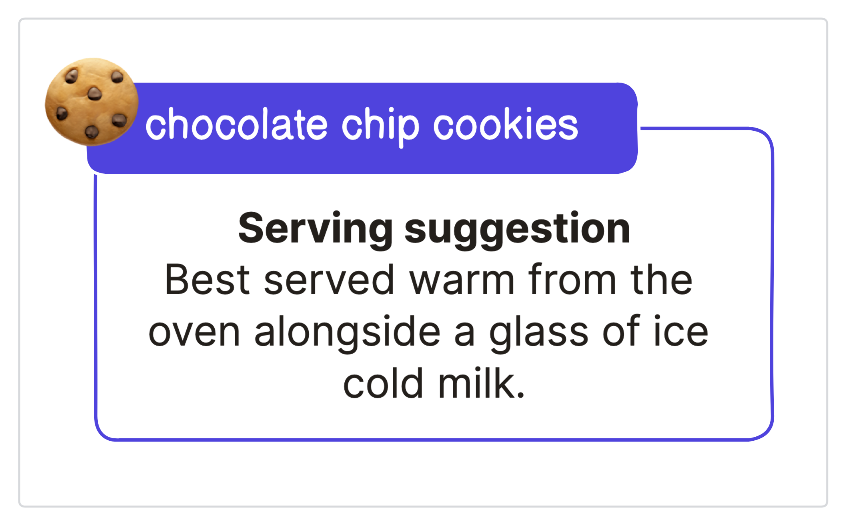
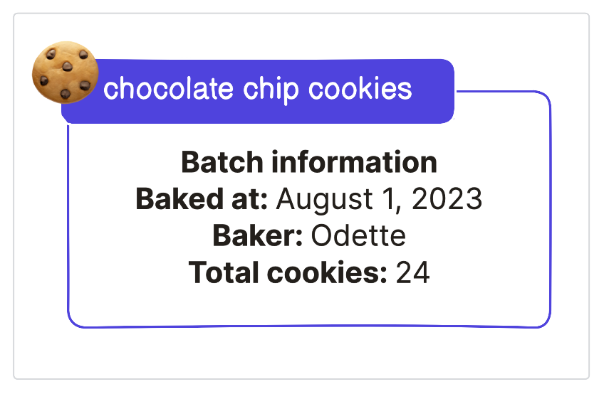
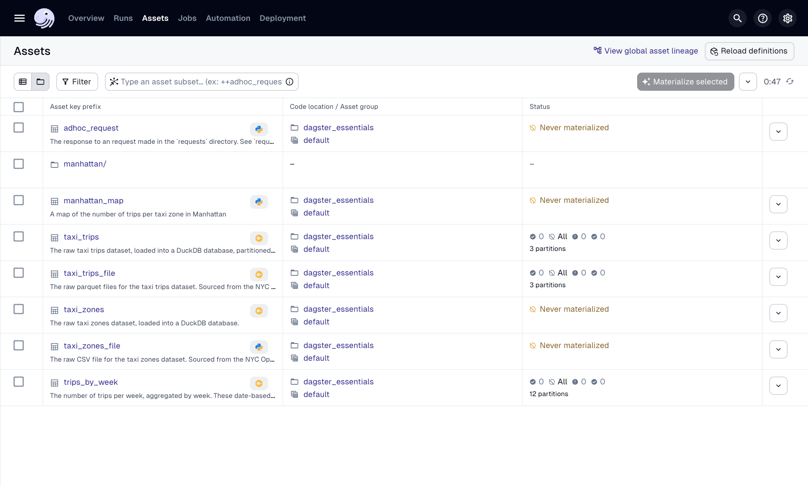
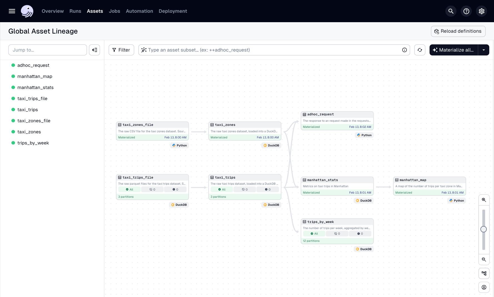
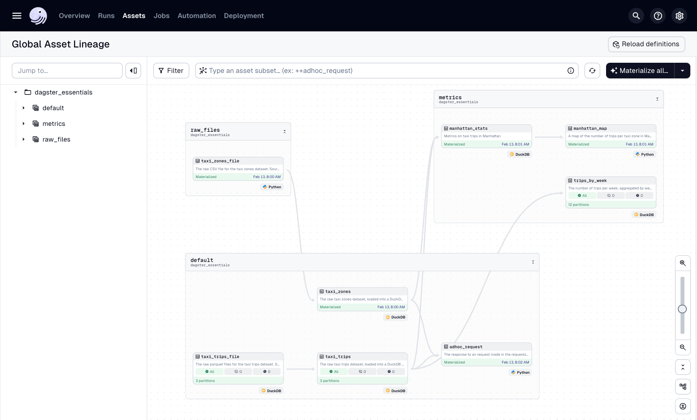
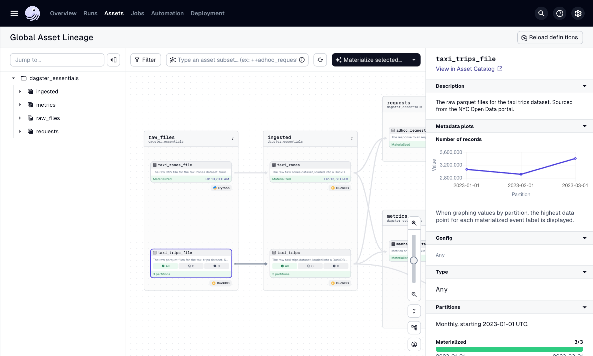
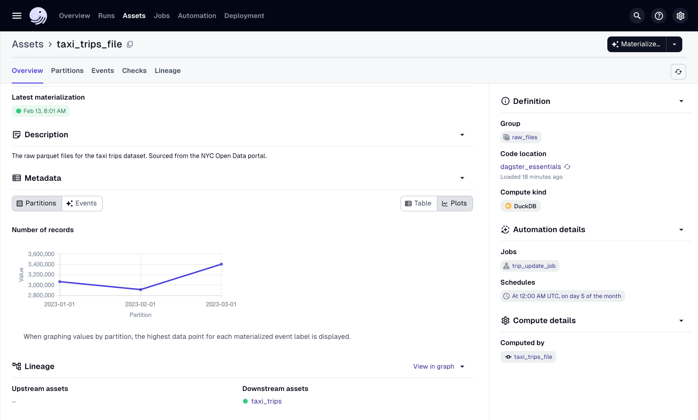
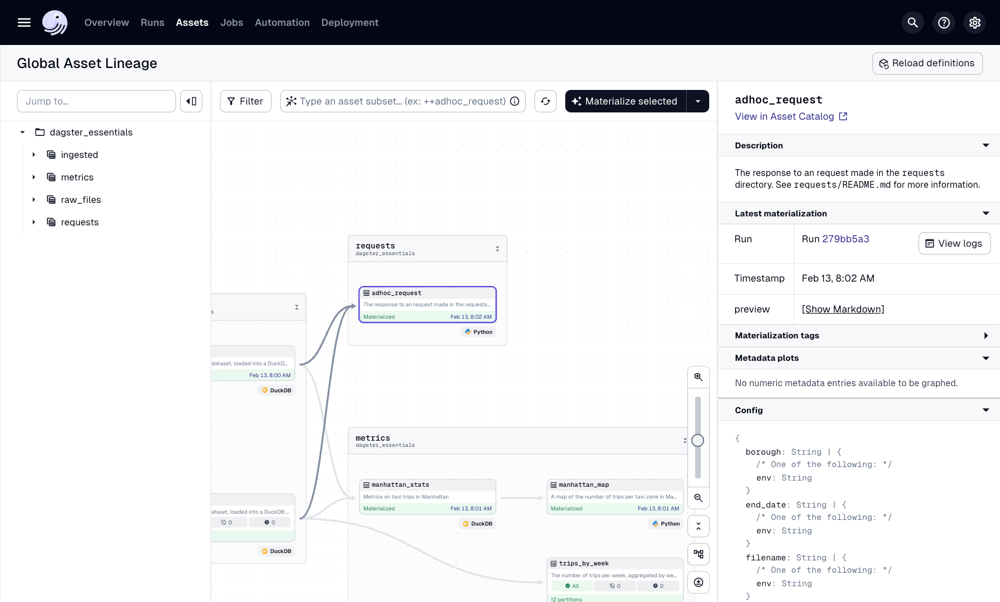
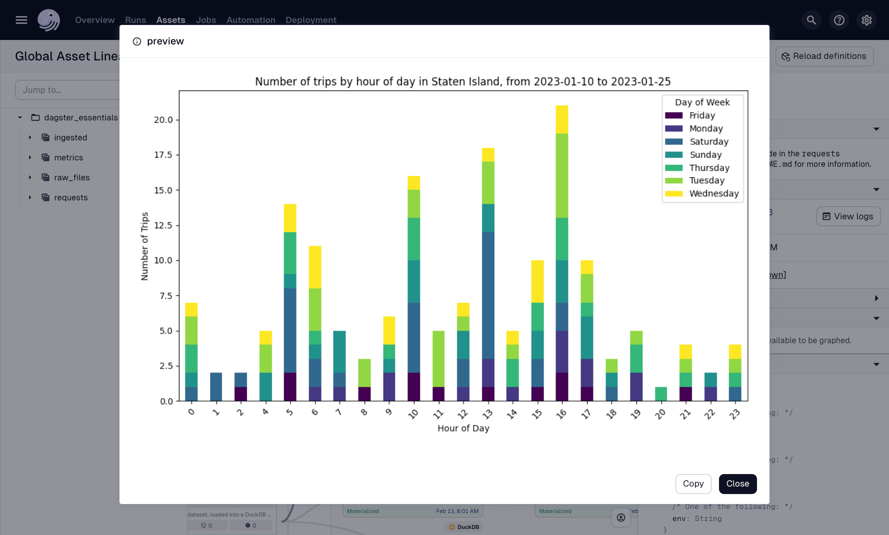
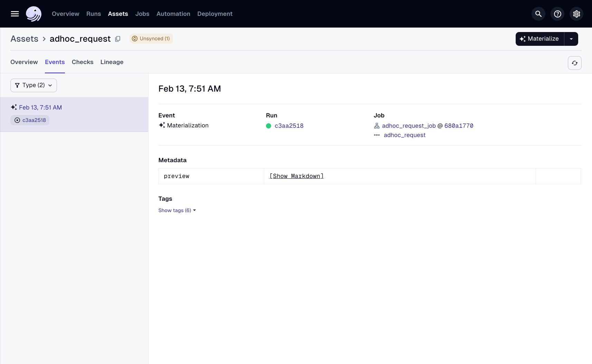

# 개요

야심찬 학생 여러분, 추가 학점을 받으신 것을 환영합니다!

이 시점에서 여러분은 두 개의 작동하는 데이터 파이프라인을 가지고 있습니다. 하나는 이 과정의 강의를 통해 점진적으로 구축한 것이고, 다른 하나는 과정 최종 프로젝트에서 구축한 것입니다. 엔드 투 엔드 데이터 파이프라인을 구축하는 것은 유용한 기술이지만, 한 단계 더 발전할 수 있는 또 다른 기술이 있습니다. **메타데이터**, 즉 다른 데이터에 대한 정보를 제공하는 데이터를 사용하면 파이프라인을 문서화하고 다른 사람들이 쉽게 이해할 수 있도록 할 수 있습니다.

이 강의에서는 다음을 다룰 것입니다:

- 메타데이터란 무엇이며 사용의 이점
    
- 정의 메타데이터
    
- 구체화 메타데이터
    
- UI에서 메타데이터를 찾는 방법
    

# 메타데이터란 무엇입니까?

Dagster의 핵심 이점 중 두 가지는 엔지니어 간의 협업과 자산의 교차 기능 공유입니다. 팀이 한 명뿐이더라도 파이프라인 문서화는 디버깅에 도움이 되고 코드를 작성한 지 몇 달 후에 컨텍스트를 제공하는 데 도움이 됩니다.

이 강의에서는 정의 메타데이터와 **구체화**의 두 가지 유형의 메타데이터를 다룰 것입니다. 각 유형을 설명하기 위해 쿠키 예시로 돌아갈 것입니다.

---

## 정의 메타데이터

_정의_ 
메타데이터는 정의상 고정되거나 자주 변경되지 않는 정보입니다.  <br>  <br>쿠키의 맥락에서 정의 메타데이터 조각은 다음과 같은 서빙 제안일 수 있습니다.



---

## 구체화 메타데이터

_구체화_ 
메타데이터는 동적이며, 이는 정보가 작업 발생 후 변경됨을 의미합니다.  <br>  <br>쿠키의 맥락에서 구체화 메타데이터는 쿠키가 구워진 날짜, 누가 구웠는지, 배치에 몇 개의 쿠키가 있는지일 수 있습니다.



---

## Dagster와 어떻게 관련됩니까?

자산을 설명하기 위해 정의 메타데이터를 사용하면 팀과 미래의 자신에게 컨텍스트를 쉽게 제공할 수 있습니다. 이 메타데이터는 자산에 대한 설명, 자산 유형 및 조직 데이터의 큰 그림에 어떻게 들어맞는지일 수 있습니다.

그런 다음 런타임에 메타데이터를 사용하여 처리된 레코드 수 또는 구체화가 발생한 시점과 같은 구체화에 대한 정보를 표시할 수 있습니다.

정의 메타데이터부터 시작하여 자산에 설명을 추가하고 그룹에 추가하는 과정을 안내해 드리겠습니다.

# 정의 메타데이터 - 자산 설명

정의된 자산 설명은 Dagster UI에서 자산과 함께 표시됩니다. 자산 설명을 추가하는 두 가지 방법이 있습니다.

- Python 독스트링 사용
    
- 자산 데코레이터의 `description` 매개변수 사용
    

---

## 독스트링 사용

이 과정을 진행하면서 자산에 모두 **독스트링**이 포함되어 있음을 눈치챘을 수도 있습니다. [Python 독스트링 또는 문서화 문자열](https://www.datacamp.com/tutorial/docstrings-python)은 클래스, 모듈, 함수 또는 메서드 정의에 대한 문서를 코드 자체에 포함합니다. 코드 주석도 유사한 목적을 제공하지만, 독스트링은 [`help`](https://www.google.com/search?q=%5Bhttps://docs.python.org/3/library/functions.html%23help)와](https://www.google.com/search?q=https://docs.python.org/3/library/functions.html%23help)%EC%99%80) 같은 내장 Python 기능을 지원합니다.

독스트링은 객체 정의의 첫 번째 문으로 삼중 따옴표 (`"""`)로 둘러싸인 문자열을 포함하여 정의됩니다. 예를 들어:

```python
import dagster as dg

@dg.asset
def taxi_zones_file() -> None:
    """
      The raw CSV file for the taxi zones dataset. Sourced from the NYC Open Data portal.
    """
    raw_taxi_zones = requests.get(
        "https://community-engineering-artifacts.s3.us-west-2.amazonaws.com/dagster-university/data/taxi_zones.csv"
    )

    with open(constants.TAXI_ZONES_FILE_PATH, "wb") as output_file:
        output_file.write(raw_taxi_zones.content)
```

---

## description 매개변수 사용

자산에 설명을 추가하는 또 다른 방법은 `description` 매개변수와 함께 자산 데코레이터를 사용하는 것입니다. **참고:** 이렇게 하면 Dagster UI의 모든 독스트링이 재정의됩니다.

예를 들어:

```python
import dagster as dg

@dg.asset(
    description="The raw CSV file for the taxi zones dataset. Sourced from the NYC Open Data portal."
)
def taxi_zones_file() -> None:
    """
      This will not show in the Dagster UI
    """
    raw_taxi_zones = requests.get(
        "https://community-engineering-artifacts.s3.us-west-2.amazonaws.com/dagster-university/data/taxi_zones.csv"
    )

    with open(constants.TAXI_ZONES_FILE_PATH, "wb") as output_file:
        output_file.write(raw_taxi_zones.content)
```

---

## Dagster UI의 자산 설명

이제 자산 설명을 정의하는 방법을 이해했으므로 Dagster UI에서 살펴보겠습니다.

자산 페이지
**Assets** 탭의 각 자산에 대해 설명은 각 자산 키 아래에 표시됩니다.



전역 자산 계보
**Global Asset Lineage** 페이지에서 설명은 DAG의 각 자산 상자에 포함됩니다.



# 정의 메타데이터 - 자산 그룹

시간이 지남에 따라 더 많은 자산을 추가할수록 자산 간의 유사성이 더 분명해질 가능성이 높습니다. 예를 들어, 여러 자산이 dbt 또는 데이터 변환과 관련될 수 있는 반면, 다른 자산은 원시 CSV 데이터 추출에 중점을 둘 수 있습니다. 이들은 논리적으로 **자산 그룹**으로 분류될 수 있습니다.

자산 그룹은 자산을 깔끔하게 정리하고 UI에서 추적을 단순화하는 방법입니다. 또한 자산 그룹은 자산 목록을 지정하는 대신 자산 그룹을 참조할 수 있으므로 작업에 대한 자산을 더 쉽게 선택할 수 있습니다.

Dagster에서 자산 그룹을 지정하는 두 가지 방법이 있습니다.

- 모듈의 모든 자산에
    
- 개별 자산에
    

---

## 참고 사항

자산을 그룹에 추가할 때 다음 사항을 염두에 두십시오.

- 자산이 그룹의 구성원이 아니면 `default`라는 그룹에 배치됩니다.
    
- 단일 자산은 한 번에 하나의 그룹에만 속할 수 있습니다.
    

---

## 자산 데코레이터를 사용하여 개별 자산 그룹화

자산 데코레이터에서 `group_name` 매개변수를 사용하여 개별 자산에 그룹을 지정할 수도 있습니다. 예를 들어:

```python
import dagster as dg

@dg.asset(
    group_name="raw_files",
)
def taxi_zones_file() -> None:
    """
      The raw CSV file for the taxi zones dataset. Sourced from the NYC Open Data portal.
    """
    raw_taxi_zones = requests.get(
        "https://community-engineering-artifacts.s3.us-west-2.amazonaws.com/dagster-university/data/taxi_zones.csv"
    )

    with open(constants.TAXI_ZONES_FILE_PATH, "wb") as output_file:
        output_file.write(raw_taxi_zones.content)
```

이 예시에서는 `taxi_zones_file` 자산이 `raw_files` 자산 그룹으로 그룹화됩니다.

---

## Dagster UI의 자산 그룹

자산 그룹이 정의되면 **Global Asset Lineage** 페이지는 그룹 구성원을 별도의 회색 상자에 배치합니다. 예를 들어, 다음 이미지는 세 가지 자산 그룹을 보여줍니다.

- `raw_files`: 현재 `taxi_zones_file`만 포함
    
- `metrics`: `metrics` 서브모듈의 모든 자산 포함
    
- `default`: 현재 그룹에 속하지 않는 자산 포함. **참고**: 다른 자산 그룹이 정의되지 않은 경우 `default` 그룹은 여기에 표시되지 않습니다.
    


# 구체화 메타데이터

이제 정의 메타데이터를 다루었으니 다른 유형의 메타데이터인 구체화를 살펴보겠습니다.

---

## 자산에 구체화 메타데이터 추가

자산에 메타데이터를 추가하려면 두 가지 작업을 수행해야 합니다.

- 자산에서 `metadata` 매개변수가 있는 `MaterializeResult` 객체를 반환합니다.
    
- `MetadataValue` 유틸리티 클래스를 사용하여 데이터를 래핑하여 UI에 올바르게 표시되도록 합니다.
    

추가 시연을 위해 `taxi_trips_file` 자산에 메타데이터를 추가해 봅시다. 이렇게 하면 레코드 수가 자산의 구체화 메타데이터에 추가됩니다.

1. `assets/trips.py`로 이동하여 엽니다.
    
2. `taxi_trips_file` 자산을 찾습니다. 이 시점에서 자산은 다음과 같아야 합니다.
    
```python
import dagster as dg
import requests
from dagster_essentials.defs.assets import constants
from dagster_essentials.defs.partitions import monthly_partition

@dg.asset(
	partitions_def=monthly_partition,
	group_name="raw_files",
)
def taxi_trips_file(context) -> None:
	"""
	  The raw parquet files for the taxi trips dataset. Sourced from the NYC Open Data portal.
	"""

	partition_date_str = context.partition_key
	month_to_fetch = partition_date_str[:-3]

	raw_trips = requests.get(
		f"https://d37ci6vzurychx.cloudfront.net/trip-data/yellow_tripdata_{month_to_fetch}.parquet"
	)

	with open(constants.TAXI_TRIPS_TEMPLATE_FILE_PATH.format(month_to_fetch), "wb") as output_file:
		output_file.write(raw_trips.content)
```
    
3. 먼저 파일에 포함된 레코드 수를 계산해야 합니다. 자산의 마지막 줄 뒤에 다음을 복사하여 붙여넣습니다.
    
```python
num_rows = len(pd.read_parquet(constants.TAXI_TRIPS_TEMPLATE_FILE_PATH.format(month_to_fetch)))
```
    
4. 다음으로 지정된 유형으로 메타데이터를 추가합니다.
    
```python
return dg.MaterializeResult(
	metadata={
		'Number of records': dg.MetadataValue.int(num_rows)
	}
)
```
    
5. 그런 다음, 이제 무언가를 반환하므로 자산의 반환 유형을 `MaterializeResult`로 업데이트해 봅시다.
    
```python
import dagster as dg

@dg.asset(
	partitions_def=monthly_partition,
	group_name="raw_files",
)
def taxi_trips_file(context) -> dg.MaterializeResult:
```
    
    여기서 무슨 일이 일어나고 있는지 자세히 살펴보겠습니다.
    
    - 아무것도 반환하는 대신 `MaterializeResult` 클래스를 사용하여 발생한 구체화에 대한 정보를 반환합니다.
        
    - `metadata` 매개변수는 키가 메타데이터의 레이블 또는 이름이고 값이 데이터 자체인 `dict`를 허용합니다. 이 경우 키는 `Number of records`입니다. 이 예시의 값은 `Number of records` 뒤의 모든 것입니다.
        
    - `MetadataValue.int`를 사용하여 `num_rows` 변수의 값은 정수형으로 지정됩니다. 이는 Dagster에게 데이터를 정수로 렌더링하도록 지시합니다.
        
    
    이 시점에서 자산은 다음과 같아야 합니다.
    
```python
import pandas as pd
import dagster as dg

@dg.asset(
	partitions_def=monthly_partition,
	group_name="raw_files",
)
def taxi_trips_file(context) -> dg.MaterializeResult:
	"""
	  The raw parquet files for the taxi trips dataset. Sourced from the NYC Open Data portal.
	"""

	partition_date_str = context.partition_key
	month_to_fetch = partition_date_str[:-3]

	raw_trips = requests.get(
		f"https://d37ci6vzurychx.cloudfront.net/trip-data/yellow_tripdata_{month_to_fetch}.parquet"
	)

	with open(constants.TAXI_TRIPS_TEMPLATE_FILE_PATH.format(month_to_fetch), "wb") as output_file:
		output_file.write(raw_trips.content)

	num_rows = len(pd.read_parquet(constants.TAXI_TRIPS_TEMPLATE_FILE_PATH.format(month_to_fetch)))

	return dg.MaterializeResult(
		metadata={
			'Number of records': dg.MetadataValue.int(num_rows)
		}
	)
```
    
---

## Dagster UI의 구체화 메타데이터

다음으로 Dagster UI에서 메타데이터를 보겠습니다. 이는 데이터를 조사하고 모든 것이 예상대로 저장되었는지 확인하는 좋은 방법입니다.

1. **Global Asset Lineage** 페이지로 이동합니다.
    
2. **Reload definitions**를 클릭합니다.
    
3. 정의 로딩이 완료되면 `taxi_trips_file` 자산을 선택하고 모든 파티션을 구체화합니다.

자산 구체화가 완료되면 자산과 연결된 플롯을 볼 수 있습니다.



플롯의 X축은 각 파티션이며 월로 레이블이 지정됩니다. Y축은 해당 파티션의 레코드 수입니다.

이 메타데이터는 자산 이름 아래에 있는 **View in Asset Catalog**를 클릭한 다음 **Plots** 탭을 클릭하여 볼 수도 있습니다.


# Markdown 형식의 자산 메타데이터

9강에서는 `adhoc_request` 자산을 생성했습니다. 구체화 중에 자산은 막대 그래프를 생성하고 저장합니다. 이 설정은 나중에 차트를 참조하는 데 좋지만, 구체화 직후에 생성되는 것은 어떻습니까? 메타데이터를 사용하면 Dagster UI에서 바로 차트를 볼 수 있습니다!

---

## 자산에 메타데이터 추가

1. `assets/requests.py`로 이동하여 엽니다.
    
2. 이 시점에서 `adhoc_request` 자산은 다음과 같아야 합니다.
    
```python
import dagster as dg
from dagster_duckdb import DuckDBResource

import matplotlib.pyplot as plt

from dagster_essentials.defs.assets import constants

class AdhocRequestConfig(dg.Config):
  filename: str
  borough: str
  start_date: str
  end_date: str

@dg.asset
def adhoc_request(config: AdhocRequestConfig, taxi_zones, taxi_trips, database: DuckDBResource) -> None:
	"""
	  The response to an request made in the `requests` directory.
	  See `requests/README.md` for more information.
	"""

	# strip the file extension from the filename, and use it as the output filename
	file_path = constants.REQUEST_DESTINATION_TEMPLATE_FILE_PATH.format(config.filename.split('.')[0])

	# count the number of trips that picked up in a given borough, aggregated by time of day and hour of day
	query = f"""
		select
		  date_part('hour', pickup_datetime) as hour_of_day,
		  date_part('dayofweek', pickup_datetime) as day_of_week_num,
		  case date_part('dayofweek', pickup_datetime)
			when 0 then 'Sunday'
			when 1 then 'Monday'
			when 2 then 'Tuesday'
			when 3 then 'Wednesday'
			when 4 then 'Thursday'
			when 5 then 'Friday'
			when 6 then 'Saturday'
		  end as day_of_week,
		  count(*) as num_trips
		from trips
		left join zones on trips.pickup_zone_id = zones.zone_id
		where pickup_datetime >= '{config.start_date}'
		and pickup_datetime < '{config.end_date}'
		and pickup_zone_id in (
		  select zone_id
		  from zones
		  where borough = '{config.borough}'
		)
		group by 1, 2
		order by 1, 2 asc
	"""

	with database.get_connection() as conn:
		results = conn.execute(query).fetch_df()

	fig, ax = plt.subplots(figsize=(10, 6))

	# Pivot data for stacked bar chart
	results_pivot = results.pivot(index="hour_of_day", columns="day_of_week", values="num_trips")
	results_pivot.plot(kind="bar", stacked=True, ax=ax, colormap="viridis")

	ax.set_title(f"Number of trips by hour of day in {config.borough}, from {config.start_date} to {config.end_date}")
	ax.set_xlabel("Hour of Day")
	ax.set_ylabel("Number of Trips")
	ax.legend(title="Day of Week")

	plt.xticks(rotation=45)
	plt.tight_layout()

	plt.savefig(file_path)
	plt.close(fig)
```
    
3. 파일 상단에 `base64` 임포트를 추가합니다.
    
```python
import base64
import dagster as dg
```
    
4. 자산의 마지막 줄 뒤에 다음 코드를 추가합니다.
    
```python
with open(file_path, 'rb') as file:
	image_data = file.read()
```
    
5. 다음으로, base64 인코딩을 사용하여 차트를 Markdown으로 변환합니다. `image_data` 줄 뒤에 다음 코드를 추가합니다.
    
```python
base64_data = base64.b64encode(image_data).decode('utf-8')
md_content = f""
```
    
6. 마지막으로, 매개변수로 지정된 메타데이터와 함께 `MaterializeResult` 객체를 반환합니다.
    
```python
return dg.MaterializeResult(
	metadata={
		"preview": dg.MetadataValue.md(md_content)
	}
)
```
    
    여기서 무슨 일이 일어나고 있는지 자세히 살펴보겠습니다.
    
    1. `base64_data`라는 변수가 생성됩니다.
        
    2. `base64.b64encode`는 이미지의 이진 데이터(`image_data`)를 base64 형식으로 인코딩합니다.
        
    3. 다음으로, 인코딩된 이미지 데이터는 `decode` 함수를 사용하여 UTF-8 인코딩 문자열로 변환됩니다.
        
    4. 다음으로, `md_content`라는 변수가 생성됩니다. 이 변수의 값은 base64로 표현된 이미지가 삽입된 JPEG 이미지를 포함하는 Markdown 형식의 문자열입니다.
        
    5. 자산에 메타데이터를 포함하기 위해 이미지를 메타데이터로 전달하는 `MaterializeResult` 인스턴스를 반환했습니다. 메타데이터는 Dagster UI에서 `preview` 레이블을 가집니다.
        
    6. `MetadataValue.md`를 사용하여 `md_content`는 Markdown으로 타입이 지정됩니다. 이는 Dagster가 차트를 올바르게 렌더링하도록 보장합니다.
        

이 시점에서 `adhoc_request` 자산의 코드는 다음과 같아야 합니다.

```python
import dagster as dg
from dagster_duckdb import DuckDBResource

import matplotlib.pyplot as plt
import base64

from dagster_essentials.defs.assets import constants

class AdhocRequestConfig(dg.Config):
    filename: str
    borough: str
    start_date: str
    end_date: str

@dg.asset
def adhoc_request(config: AdhocRequestConfig, database: DuckDBResource) -> dg.MaterializeResult:
    """
      The response to an request made in the `requests` directory.
      See `requests/README.md` for more information.
    """

    # strip the file extension from the filename, and use it as the output filename
    file_path = constants.REQUEST_DESTINATION_TEMPLATE_FILE_PATH.format(config.filename.split('.')[0])

    # count the number of trips that picked up in a given borough, aggregated by time of day and hour of day
    query = f"""
        select
          date_part('hour', pickup_datetime) as hour_of_day,
          date_part('dayofweek', pickup_datetime) as day_of_week_num,
          case date_part('dayofweek', pickup_datetime)
            when 0 then 'Sunday'
            when 1 then 'Monday'
            when 2 then 'Tuesday'
            when 3 then 'Wednesday'
            when 4 then 'Thursday'
            when 5 then 'Friday'
            when 6 then 'Saturday'
          end as day_of_week,
          count(*) as num_trips
        from trips
        left join zones on trips.pickup_zone_id = zones.zone_id
        where pickup_datetime >= '{config.start_date}'
        and pickup_datetime < '{config.end_date}'
        and pickup_zone_id in (
          select zone_id
          from zones
          where borough = '{config.borough}'
        )
        group by 1, 2
        order by 1, 2 asc
    """

    fig, ax = plt.subplots(figsize=(10, 6))

    # Pivot data for stacked bar chart
    results_pivot = results.pivot(index="hour_of_day", columns="day_of_week", values="num_trips")
    results_pivot.plot(kind="bar", stacked=True, ax=ax, colormap="viridis")

    ax.set_title(f"Number of trips by hour of day in {config.borough}, from {config.start_date} to {config.end_date}")
    ax.set_xlabel("Hour of Day")
    ax.set_ylabel("Number of Trips")
    ax.legend(title="Day of Week")

    plt.xticks(rotation=45)
    plt.tight_layout()

    plt.savefig(file_path)
    plt.close(fig)

    with open(file_path, "rb") as file:
        image_data = file.read()

    base64_data = base64.b64encode(image_data).decode('utf-8')
    md_content = f""

    return dg.MaterializeResult(
        metadata={
            "preview": dg.MetadataValue.md(md_content)
        }
    )
```

---

## Dagster UI에서 메타데이터 보기

이 모든 작업 후에 UI에서 어떻게 보이는지 확인해 봅시다!

1. **Global Asset Lineage** 페이지로 이동합니다.
    
2. **Reload definitions**를 클릭합니다.
    
3. 메타데이터 코드가 업데이트되면 센서 틱을 시뮬레이션합니다.
    

화면 오른쪽에 Markdown 플롯 값에 부여된 레이블인 `preview`가 표시됩니다.



차트를 표시하려면 **[Show Markdown]**을 클릭합니다.



**View in Asset Catalog**를 클릭하여 차트를 볼 수도 있습니다.

