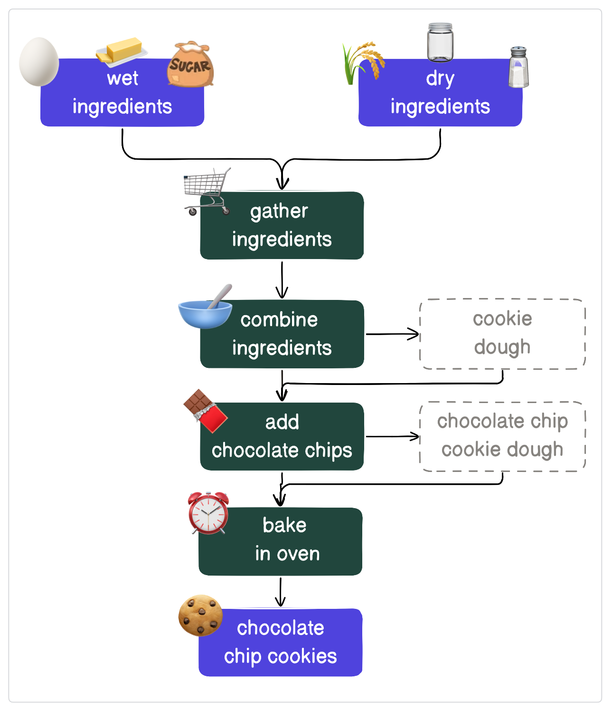
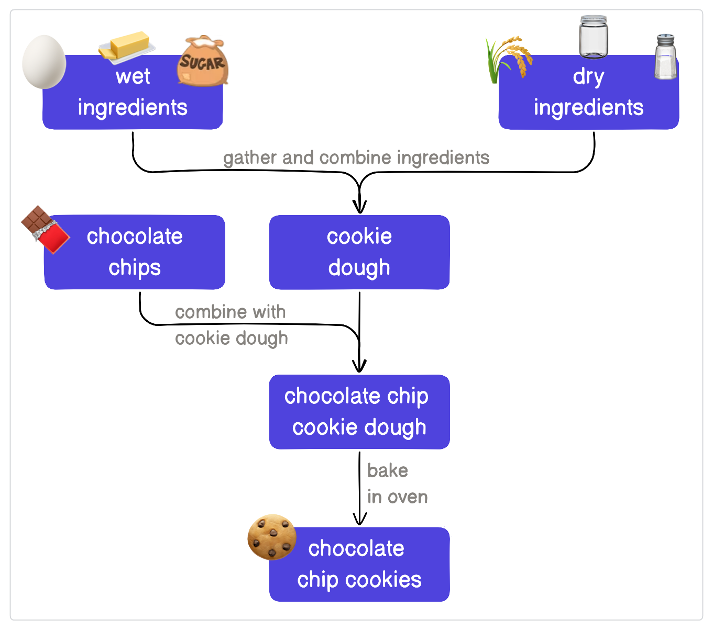
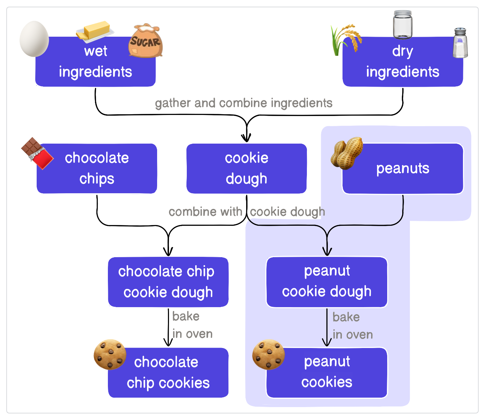

# 데이터 엔지니어링이란 무엇인가요?

데이터 엔지니어링은 데이터 수집, 저장 및 관리를 위한 소프트웨어를 설계하고 구축하는 분야입니다. 데이터 엔지니어링의 가장 일반적인 목표는 이해관계자(예: 제품 관리자, 마케팅, C-suite)가 데이터를 통해 정보에 입각한 결정을 내릴 수 있도록 하는 것입니다. 다른 일반적인 목표는 외부 사용자에게 데이터를 제공하거나, 기계 학습 모델을 위한 기능을 제공하거나, 애플리케이션이 이벤트에 반응할 수 있도록 하는 것입니다.

이러한 모든 워크플로우를 가능하게 하기 위해 데이터 엔지니어링을 수행하는 사람들은 필요할 때 데이터를 생성하기 위한 인프라와 프로세스를 만듭니다. 이러한 프로세스 중 상당수는 아래 언급된 어려움을 고려합니다.

- **분산되어 있는 경우**, 데이터를 쉽게 결합할 수 있도록 합니다(예: 택시 운행 및 날씨 데이터).
    
- **일관성이 없는 경우**, 이해관계자가 신뢰할 수 있도록 데이터를 정리하고 테스트합니다.
    
- **큰 경우**, 데이터 사용 방식을 최적화하여 시간과 비용을 절감합니다.
    

데이터 엔지니어링은 서로 다른 소스의 데이터를 관리하는 복잡성으로 인해 어렵고 시간이 많이 소요될 수 있습니다. 데이터가 커지고 복잡해짐에 따라 수동 워크플로우는 너무 많은 시간이 소요되고 신뢰할 수 없게 됩니다. 이때 데이터 실무자는 **오케스트레이터** 채택을 고려할 수 있습니다.

# 오케스트레이터란 무엇인가요?

오케스트레이터는 복잡한 워크플로우와 데이터 파이프라인을 관리하고 조정할 수 있는 도구입니다. 오케스트레이터 분야는 데이터 엔지니어링과 함께 계속 발전해 왔습니다. 예를 들어, 오케스트레이터는 다음과 같은 경우에 채택될 수 있습니다.

- ERP(전사적 자원 관리) 시스템의 데이터를 다운스트림 BI 보고를 위해 매일 데이터 웨어하우스로 가져와야 합니다. 매일 새로 고침을 트리거하는 대신 오케스트레이터가 자동으로 실행되도록 예약할 수 있습니다.
    
- 비디오 스트리밍 플랫폼이 새 콘텐츠가 플랫폼에 추가될 때마다 추천 알고리즘을 재훈련하려고 하며, 콘텐츠가 추가될 때마다 수동으로 알고리즘을 재훈련하고 싶지 않습니다.
    
- 금융 플랫폼이 5분마다 주가를 업데이트하려고 하며, 해당 빈도로 누군가가 수동으로 파이프라인 새로 고침을 트리거하는 것은 어려울 것입니다.
    

최초의 오케스트레이터는 간단한 문제를 해결하기 위해 만들어졌습니다. _특정 시간에 일련의 단계로 스크립트를 실행해야 합니다_. 각 단계는 이전 단계가 완료될 때까지 기다려야 시작할 수 있습니다. 시간이 지남에 따라 데이터 엔지니어링에서 가능한 것의 한계가 증가함에 따라 사람들은 오케스트레이터에 더 많은 것을 요구했습니다.

오늘날의 최신 오케스트레이터는 견고성과 탄력성을 만드는 데 사용됩니다. 무언가 고장났을 때, 오케스트레이터는 실무자가 어디서, 언제, 왜 고장났는지 이해할 수 있도록 합니다. 사용자는 오케스트레이터가 워크플로우를 모니터링하여 개별 단계와 전체 단계 시퀀스를 이해할 수 있도록 기대합니다. 한눈에 사용자는 성공했는지 또는 오류가 발생했는지, 각 단계가 실행하는 데 걸린 시간, 단계가 다른 단계와 어떻게 연결되는지 확인할 수 있습니다. 사용자에게 이 정보를 제공함으로써 사람들이 데이터 파이프라인을 더 빠르게 개발하고 문제를 보다 효율적으로 해결할 수 있으므로 데이터 엔지니어링이 더 쉬워집니다.

최초의 오케스트레이터는 사람이 특정 시간에 수동으로 스크립트를 실행할 필요성을 제거했습니다. 오늘날의 오케스트레이터는 계속해서 자동화하고 사람의 개입 필요성을 줄입니다. 오케스트레이터는 실패 시 단계를 재시도하고, 무언가 실패하면 알림을 보내고, 여러 단계가 동시에 데이터베이스를 쿼리하는 것을 방지하거나, 이전 단계의 결과에 따라 다른 단계를 수행할 수 있습니다.

오케스트레이터에는 여러 가지 유형이 있습니다. 오케스트레이터는 다양한 유형의 워크플로우를 수용하기 위한 범용일 수도 있고, 인프라, 마이크로서비스 또는 데이터 파이프라인을 다루는 특정 유형의 워크플로우를 위해 만들어질 수도 있습니다.

# 오케스트레이션 접근 방식

데이터 엔지니어는 오케스트레이션을 비즈니스 및 실제 사용을 위한 데이터 파이프라인을 견고하게 하는 핵심으로 봅니다. 이 섹션에서는 워크플로우 오케스트레이션에 대한 두 가지 다른 접근 방식과 각 방식의 장단점을 살펴보겠습니다.

하지만 먼저, 워크플로우란 무엇일까요?

> 워크플로우는 특정 순서로 발생하는 반복적인 프로세스와 작업을 관리하는 시스템입니다. 이는 사람과 기업이 작업을 수행하는 메커니즘입니다. - IBM

워크플로우는 워크플로우를 완료하는 데 필요한 단계를 나타내는 **방향성 비순환 그래프** 또는 **DAG**를 사용하여 시각화할 수 있습니다. 예를 들어, 매주 금요일 보고서 CSV를 이메일로 보내는 것은 다음과 같은 DAG를 가질 수 있습니다.

언급했듯이, 워크플로우를 오케스트레이션하는 데에는 여러 가지 접근 방식이 있으며, 우리는 **작업 중심** 및 **자산 중심**이라는 두 가지에 집중할 것입니다. 인기 있는 간식을 굽는 파이프라인인 **쿠키**를 사용하여 각 접근 방식의 예를 살펴보겠습니다.

---

## 작업 중심 워크플로우 오케스트레이션

작업 중심 오케스트레이션은 작업 실행을 관리하고 조정하는 데 중점을 둔 방법론입니다. 이는 **방법**에 중점을 두고 **무엇**에는 덜 중점을 둡니다.

예를 들어, 데이터 엔지니어는 종종 API에서 데이터를 가져오고, 정리하고, 분석을 위해 대상으로 로드하는 작업(ETL(추출, 변환, 로드)로 알려진 프로세스)을 수행합니다.

### 작업 중심 워크플로우의 예

이제 쿠키를 만들 시간입니다! 쿠키를 굽는 작업 중심 워크플로우를 설정한다면 다음과 같을 것입니다.

1. 재료 준비
    
2. 재료 혼합
    
3. 초콜릿 칩 추가
    
4. 오븐에 굽기
    
5. 갓 구운 **초콜릿 칩 쿠키** 즐기기
    

이 워크플로우는 쿠키를 만드는 데 필요한 **작업**에 중점을 둔 순차적인 워크플로우입니다. 모든 단계가 완료된 후에는 갓 구운 쿠키라는 한 가지 명확한 결과물만 있다는 점에 유의하십시오.

워크플로우를 따라 생성되는 다른 결과물인 **쿠키 반죽**과 **초콜릿 칩 쿠키 반죽**도 DAG에 추가했지만, 이 접근 방식은 작업에 중점을 두기 때문에 결과물이 어디서 또는 어떻게 생성되는지는 즉시 명확하지 않습니다.

---

## 자산 중심 워크플로우 오케스트레이션

무언가를 만드는 워크플로우(초콜릿 칩 쿠키든 데이터든)는 구축, 문제 해결 또는 확장이 필요할 때 작업 중심 워크플로우와 다른 요구 사항을 가집니다. _자산_은 워크플로우에 의해 생성되는 결과물을 의미합니다. 자산 중심 워크플로우는 **무엇**에 중점을 두고 **방법**에는 덜 중점을 두어 한눈에 쉽게 확인할 수 있도록 합니다.

### 자산 중심 워크플로우의 예

쿠키 워크플로우를 **자산 중심** 접근 방식을 사용하도록 재구성해 봅시다. 우리는 여전히 갓 구운 쿠키를 만들겠지만, 이번에는 DAG가 조금 다르게 보일 것입니다. 특히, 쿠키 그래프는 주로 **명사**와 더 적은 수의 **동사** 또는 지침을 포함할 것입니다.

자산 중심 접근 방식에서는 상위 자산이 다운스트림 종속성을 생성하기 위한 입력으로 사용됩니다. 예를 들어:

- **쿠키 반죽**을 만들려면 **젖은 재료**와 **마른 재료**를 혼합합니다.
    
- **초콜릿 칩 쿠키 반죽**을 만들려면 **초콜릿 칩**을 **쿠키 반죽**에 섞습니다.
    
- 마지막으로, **초콜릿 칩 쿠키 반죽**을 굽고 **갓 구운 초콜릿 칩 쿠키**를 만듭니다!
    

### 더 많은 자산을 추가하여 확장

자산 중심 접근 방식은 추가 자산을 추가하는 것도 간단하게 만듭니다. 예를 들어, **땅콩 쿠키**도 굽고 싶다고 가정해 봅시다. 이렇게 하려면 다음을 수행할 수 있습니다.

- **원재료**에 **땅콩**을 추가합니다.
    
- **땅콩 쿠키 반죽**을 만들려면 **땅콩**을 **쿠키 반죽**에 섞습니다.
    
- 마지막으로, **땅콩 쿠키 반죽**을 굽고 **갓 구운 땅콩 쿠키**를 만듭니다!
    

_Voila_! 하나의 추가 자산인 **땅콩**만 추가하여 기존 자산 중 일부를 사용하여 **땅콩 쿠키**라는 완전히 새로운 것을 최소한의 변경으로 만들 수 있었습니다. 오른쪽에 있는 DAG에 새로 추가된 부분(연한 보라색으로 강조 표시됨)을 확인하십시오.

그렇다면 이것이 실제 데이터 파이프라인에 어떻게 도움이 될까요? **재사용성.**

작업 중심 워크플로우에서는 자산이 자산을 생성하는 작업과 밀접하게 결합됩니다. 이는 자산이 초점이 아니라 부산물이기 때문에 자산 재사용을 어렵게 만들 수 있습니다.

자산은 완전히 관련이 없는 기존 워크플로우에 추가될 수 있어 기술적 부채를 유발할 수 있습니다. 또는 새로운 워크플로우에 추가될 수 있으며, 이는 기존 워크플로우를 실행해야 하므로 관찰 가능성, 이해 및 데이터 계보를 감소시킵니다.

# 자산 중심 오케스트레이션이 데이터 엔지니어링에 좋은 이유는 무엇인가요?

이 질문에 답하려면 쿠키 예제로 돌아가서 작업 중심 및 자산 중심 접근 방식 모두에 대해 다른 상황이 어떻게 보이는지 살펴보겠습니다.

---

## 상황 1: 데이터 계보 이해

||작업 중심|자산 중심|
|---|---|---|
|작업 중심 세계에서는 자산이 어떻게 생성되는지, 최신 상태인지, 다른 자산과 어떻게 관련되는지 파악하기 어려울 수 있습니다. 문제가 발생했을 때 문제를 해결하는 것뿐만 아니라 워크플로우에 대한 기본적인 이해를 얻기 위해서는 작업을 자산과 분리하는 것이 필요합니다.       반면에 자산 중심 워크플로우는 데이터가 어떻게 생성되는지보다는 생성되는 데이터에 중점을 둡니다. 이렇게 하면 변경 사항이 다른 자산에 어떤 영향을 미칠 수 있는지 쉽게 파악할 수 있으며, 이해관계자가 데이터가 어떻게 생성되는지 이해할 수 있습니다.       쿠키 예제로 돌아가서 작업 중심 및 자산 중심 접근 방식 모두에 대해 다른 상황이 어떻게 보이는지 살펴보겠습니다.|1. 워크플로우에서 쿠키 반죽이 생성되는 위치 파악    2. 땅콩을 추가하기 위한 분기 추가    3. 처음부터 끝까지 쿠키 다시 만들기|1. 새로운 자산 두 개 추가: 땅콩 및 땅콩 쿠키 반죽    2. 쿠키 반죽에 땅콩 추가    3. 결과는 땅콩 쿠키 반죽|

**결론**: 자산 중심 접근 방식을 사용하면 워크플로우를 직접 구축하지 않은 사람이라도 누구나 워크플로우와 생성되는 것을 쉽게 이해할 수 있습니다. 작업 중심 접근 방식에서는 자산이 프로세스에서 어떻게 그리고 언제 생성되는지 즉시 명확하지 않을 수 있습니다.

---

## 상황 2: 자산 재사용

||작업 중심|자산 중심|
|---|---|---|
|이미 가지고 있는 쿠키 반죽을 사용하여 다른 종류의 쿠키를 만들고 싶다고 가정해 봅시다.       실제 세계에서는 이것을 한 자산을 다른 자산의 입력으로 사용할 수 있는 능력으로 생각하십시오. 예를 들어, 여러 테이블을 사용하여 데이터베이스 테이블을 생성하는 것과 같습니다.|1. 워크플로우에서 쿠키 반죽이 생성되는 위치 파악    2. 땅콩을 추가하기 위한 분기 추가    3. 처음부터 끝까지 쿠키 다시 만들기|1. 새로운 자산 두 개 추가: 땅콩 및 땅콩 쿠키 반죽    2. 쿠키 반죽에 땅콩 추가    3. 결과는 땅콩 쿠키 반죽|

**결론**: 자산 중심 접근 방식을 사용하면 자산과 다른 자산 간의 종속성을 정의하여 자산을 쉽게 재사용할 수 있습니다. 작업 중심 접근 방식에서는 자산이 자산을 생성하는 작업과 밀접하게 결합되어 있으므로 추가 자산을 생성하기 위해 더 많은 변경이 필요할 수 있습니다.

---

## 상황 3: 데이터 신선도 확인

||작업 중심|자산 중심|
|---|---|---|
|굽기 전에 달걀의 신선도를 확인해야 합니다. 만료되었나요 아니면 아직 사용해도 괜찮나요?       실제 세계에서는 이것을 최신 데이터를 사용하는 자산을 생성하는 것으로 생각하십시오.|1. 재료를 모은 후 달걀의 날짜를 확인하는 단계 추가    2. 프로세스 시작    3. 만료된 경우 실패하고 프로세스 다시 시작|1. 젖은 재료의 개별 달걀 자산에 대한 마지막 업데이트 시간 확인    2. 프로세스 시작    3. 만료된 경우 진행하기 전에 달걀 새로 고침|

**결론**: 자산 중심 접근 방식을 사용하면 상위 자산이 오래되었는지 쉽게 파악하고 다운스트림 자산이 실행되기 전에 새로 고칠 수 있습니다. 작업 중심 접근 방식에서는 프로세스가 실패할 때까지 데이터가 오래되었음을 알지 못할 수 있습니다.

---

## 상황 4: 디버깅

||작업 중심|자산 중심|
|---|---|---|
|모든 것이 순조롭게 진행되었지만, 무언가 잘못되었습니다. 쿠키를 너무 많이 섞어서 질겨졌습니다.       실제 세계에서는 이것을 시간 초과 또는 데이터 불일치와 같은 문제를 디버깅하는 것으로 생각하십시오.|1. 워크플로우에서 실패한 단계 식별    2. 전체 파이프라인 다시 실행|1. 문제 자산(쿠키 반죽) 식별    2. 자산 다시 실행|

**결론**: 자산 중심 접근 방식을 사용하면 문제가 있는 자산을 쉽게 식별하고 해결한 다음 해당 자산만 다시 실행하면 됩니다. 작업 중심 접근 방식에서는 어떤 자산에 문제 해결이 필요한지 식별하는 데 더 많은 노력이 필요할 수 있으며, 해당 자산을 생성하는 단계도 마찬가지입니다. 또한, 수정 사항이 구현되면 전체 파이프라인을 다시 실행해야 할 수도 있습니다. 단일 단계를 다시 실행하는 것이 불가능할 수 있기 때문입니다.

---

## 요약

넘어가기 전에 워크플로우 구축을 위한 자산 중심 접근 방식의 이점을 요약해 봅시다.

- **컨텍스트 및 가시성.** 조직의 모든 사람이 데이터 계보와 데이터 자산이 서로 어떻게 관련되는지 이해할 수 있습니다.
    
- **생산성.** 전역적으로 어떤 데이터가 존재하고 왜 존재하는지 이해하는 DAG를 구축함으로써 자산 중심 워크플로우는 기존 작업 시퀀스를 변경하지 않고 자산을 재사용할 수 있도록 합니다.
    
- **관찰 가능성.** 상위 데이터가 늦거나 코드에 오류가 있는지 여부에 관계없이 자산이 왜 최신 상태가 아닌지 정확히 파악하기 쉽습니다.
    
- **문제 해결.** 모든 실행 및 계산은 데이터 생성을 목표로 하므로 로그와 같은 디버깅 도구는 생성되는 자산에 따라 다릅니다.
    

이러한 이점을 고려할 때, 이들이 각 유형의 파이프라인을 구축하고 관리하는 데 사용되는 도구에 어떻게 확장될까요? 사용하는 오케스트레이터 유형이 왜 중요할까요?

# 프로젝트 미리 보기

이 과정에서는 자산 인식 오케스트레이터와 이들이 데이터 파이프라인을 더 쉽게 관리할 수 있도록 하는 방법에 중점을 둘 것입니다. 오픈 소스 오케스트레이터인 Dagster를 사용하여 샘플 데이터 파이프라인을 구축할 것입니다.

NYC OpenData의 데이터를 사용하여 다음을 수행하는 데이터 파이프라인을 구축할 것입니다.

- Parquet 파일에 저장된 데이터를 NYC OpenData에서 추출합니다.
    
- 이를 DuckDB 데이터베이스로 로드합니다.
    
- 분석을 위해 변환하고 준비합니다.
    
- 변환된 데이터를 사용하여 시각화를 만듭니다.
    

막히거나 앞서 나가고 싶다면 GitHub의 [완료된 프로젝트](https://github.com/dagster-io/project-dagster-university/tree/main/dagster_university/dagster_essentials)를 확인하십시오.