## 개요

1과에서 우리는 데이터 파이프라인 작성에 있어 자산 중심 접근 방식이 당신과 당신의 팀에게 어떤 이점을 줄 수 있는지 간략하게 다루었습니다. 요약하자면, 자산에 집중하는 것은 다음을 개선합니다.

- **컨텍스트 및 가시성.** 조직의 모든 사람이 데이터 계보와 데이터 자산이 서로 어떻게 관련되는지 이해할 수 있습니다.
    
- **생산성.** 어떤 데이터가 존재하고 왜 존재하는지 전역적으로 이해하는 DAG를 구축함으로써, 자산 중심 워크플로우는 기존 작업 시퀀스를 변경하지 않고 자산을 재사용할 수 있도록 합니다.
    
- **관찰 가능성.** 상위 데이터가 늦거나 코드에 오류가 있는지 여부에 관계없이 자산이 왜 최신 상태가 아닌지 정확히 파악하기 쉽습니다.
    
- **문제 해결.** 모든 실행 및 계산은 데이터 생성을 목표로 하므로 로그와 같은 디버깅 도구는 생성되는 자산에 따라 다릅니다.
    

이 과정을 시작할 때 다루었던 쿠키 예제를 생각해 보세요. 파이프라인이 **작업 중심**일 때, 즉 파이프라인의 단계에 초점을 맞추고 생성되는 자산에는 초점을 맞추지 않을 때, 특정 자산이 어떻게 생성되었는지 파악하기 어려웠습니다. 그러나 파이프라인이 **자산 중심**일 때는 자산을 생성하는 데 필요한 단계가 **자산 자체 내에 포함**되어 있었기 때문에 자산이 어떻게 생성되었는지 쉽게 확인할 수 있었습니다.

Dagster에서 핵심 빌딩 블록은 **소프트웨어 정의 자산(SDA)**입니다. 소프트웨어 정의 자산을 사용하면 생성하는 자산에 중점을 두어 데이터 파이프라인을 작성할 수 있으므로 파이프라인을 더 쉽게 디버깅하고 접근할 수 있습니다. SDA는 Dagster 컨텍스트에서 일반적으로 **자산**이라고도 불립니다.

# 자산이란 무엇인가요?

자산은 세상에 대한 어떤 이해를 담고 있는 영구 저장소의 객체입니다. 기존 데이터 파이프라인이 있다면 이미 자산을 생성하고 있을 가능성이 높습니다. 예를 들어, 파이프라인에는 다음과 같은 객체가 포함될 수 있습니다.

- Google BigQuery 데이터 웨어하우스의 데이터베이스 테이블 또는 뷰
    
- 로컬 머신의 파일 또는 Amazon S3와 같은 BLOB 저장소의 파일
    
- TensorFlow 또는 PyTorch와 같은 머신러닝 모델
    
- dbt 모델 또는 Fivetran 커넥터와 같은 통합으로부터의 자산
    

자산은 위에 나열된 객체에만 국한되지 않습니다. 이것들은 단지 몇 가지 일반적인 예일 뿐입니다.

---

## 자산의 구성

자산을 생성하려면 존재하기를 원하는 자산과 해당 자산이 파생되는 다른 자산, 그리고 자산의 내용을 계산하는 함수를 설명하는 코드를 작성합니다.

특히, 자산에는 다음이 포함됩니다.

- **`@dg.asset` 데코레이터.** 이는 Dagster에게 함수가 자산을 생성한다고 알려줍니다.
    
- Dagster에서 자산을 고유하게 식별하는 **자산 키.** 기본적으로 함수 이름입니다. 그러나 자산 키는 파일이 폴더에 있거나 데이터베이스 테이블이 스키마에 있는 것과 유사하게 접두사를 가질 수 있습니다.
    
- 자산 키를 사용하여 참조되는 **상위 자산 종속성 세트.** 이는 자산 종속성에 중점을 둔 다음 과에서 더 자세히 다룰 것입니다.
    
- 자산이 계산되는 방식을 정의하는 **Python 함수.**
    

**이를 보여주기 위해 쿠키 예제를 살펴보겠습니다.** 다음 코드는 상위 `dry_ingredients` 및 `wet_ingredients` 자산에 의존하는 `cookie_dough` 자산을 생성합니다.

Python

```
@dg.asset
def cookie_dough(dry_ingredients, wet_ingredients):
    return dry_ingredients + wet_ingredients
```

자산 이름을 지정할 때는 **명사**, 특히 **생성되는 것의 설명**을 사용하고, 이를 생성하는 데 필요한 단계는 사용하지 않는 것이 가장 좋습니다.

예를 들어, 예제 자산은 `dry_ingredients` 및 `wet_ingredients` 자산을 결합하여 쿠키 반죽을 만듭니다. 우리는 자산이 생성하는 것이기 때문에 `cookie_dough`라고 이름을 지었지만, `combine_ingredients`와 같은 이름은 최종 결과가 아닌 동작에 초점을 맞춥니다.

---

## 자산 vs Dagster 컴포넌트

Dagster 1.11에 도입된 [Dagster Components](https://docs.dagster.io/guides/build/components/)는 다음과 같은 구조화되고 모듈화된 방법을 제공합니다.

- Dagster 프로젝트를 효율적으로 구성하고 스캐폴딩합니다.
    
- 사전 정의되거나 사용자 정의된 템플릿을 사용하여 일반적인 워크플로우 구성을 간소화합니다.
    
- 복잡한 오케스트레이션을 더 쉽게 관리하고 유지 관리할 수 있는 재사용 가능한 추상화를 가능하게 합니다.
    

컴포넌트는 Dagster에서 매우 강력한 추상화이며, [dg CLI](https://docs.dagster.io/api/dg)를 사용하여 프로젝트를 스캐폴딩하고 탐색하는 방법을 자세히 다룰 것입니다. 그러나 통합 또는 사용자 정의 워크플로우에 컴포넌트를 사용하는 모든 세부 사항은 Dagster 프로젝트의 기본 객체에 익숙해진 후에 더 이해하기 쉬울 것이므로 다루지 않을 것입니다. 이 과정은 주로 이러한 기본 사항에 중점을 둘 것입니다.

실제로 컴포넌트를 적용하는 방법에 대한 자세한 내용은 다음 자료를 참조하십시오.

- [ETL 튜토리얼 파이프라인](https://docs.dagster.io/etl-pipeline-tutorial/)
    
- [Dagster & ETL](https://courses.dagster.io/courses/dagster-etl)
    

# 첫 번째 자산 정의

이 과정에서는 [NYC OpenData](https://opendata.cityofnewyork.us/)의 데이터를 사용하여 뉴욕시 택시 운행을 분석할 것입니다. 정의할 첫 번째 자산은 [TLC Trip Record Data](https://www.nyc.gov/site/tlc/about/tlc-trip-record-data.page)의 데이터를 사용하며, 여기에는 여러 유형의 차량에 대한 운행 기록이 포함되어 있습니다. 그러나 이 자산에서는 노란색 택시 운행 데이터에 초점을 맞출 것입니다.

`taxi_trips_file`이라는 첫 번째 자산은 2023년 3월의 노란색 택시 운행 데이터를 검색하여 로컬 머신의 위치에 저장합니다.

## 프로젝트 구조

첫 번째 자산을 작성하기 전에 Dagster의 프로젝트 구조에 대해 잠시 이야기해 봅시다. 이전 과에서 `dg`와 그것이 프로젝트를 빠르게 시작하는 데 도움이 되는 많은 유용한 기능을 제공한다고 언급했습니다. `dg scaffold project`와 같은 명령을 사용하여 `uv` 가상 환경을 초기화할 수 있지만, 2과에서 이미 과정 설정을 할 때 이 작업을 완료했습니다.

하지만 `dg`를 사용하여 첫 번째 자산을 위한 파일을 스캐폴딩할 수 있습니다. 다음 명령을 실행하여 첫 번째 자산이 포함될 파일을 만드세요.

**참고:** `dg` 명령은 Dagster 프로젝트 특정 코스(이 경우 `dagster_university/dagster_essentials` 내)에서 실행해야 합니다. `dg` 명령은 프로젝트 내 어디에서든 실행할 수 있습니다.

Bash

```
dg scaffold defs dagster.asset assets/trips.py
```

이렇게 하면 `trips.py` 파일이 Dagster 프로젝트에 추가됩니다.

Code snippet

```
.
└── src
    └── dagster_essentials
        └── defs
            └── assets
                ├── __init__.py
                ├── constants.py # already present
                └── trips.py
```

**참고:** 처음부터 Dagster 프로젝트를 시작하는 경우 [`uvx create-dagster`](https://www.google.com/search?q=%5Bhttps://docs.dagster.io/getting-started/installation)를](https://www.google.com/search?q=https://docs.dagster.io/getting-started/installation)%EB%A5%BC) 사용하면 전체 Dagster 프로젝트 및 가상 환경 생성을 처리합니다. 하지만 이미 초기화된 저장소에서 작업하고 있으므로 이 단계를 건너뛸 수 있습니다.

`dg`를 사용하여 프로젝트를 스캐폴딩하면 파일이 올바른 위치에 배치됩니다. 또한 `dg`를 사용하여 모든 것이 올바르게 구성되었는지 확인할 수 있습니다.

Bash

```
> dg check defs
All components validated successfully.
All definitions loaded successfully.
```

이는 자산이 포함될 파일을 만들었지만 아직 코드를 포함하지 않았기 때문에 이해가 됩니다.

## 첫 번째 자산 정의

파일이 준비되었으므로 이제 첫 번째 자산을 추가할 수 있습니다.

1. 새로 생성된 `src/dagster_essentials/defs/assets/trips.py` 파일을 탐색하여 여세요. 여기에 자산 코드를 작성할 것입니다.
    
2. `trips.py` 파일 내에서 스캐폴딩에서 생성된 코드를 제거하고 다음 임포트로 바꿉니다.
    
```python
import requests
from dagster_essentials.defs.assets import constants
```
    
3. 임포트 아래에 입력이 없고 아무것도 반환하지 않는 (타입 주석 `None` 포함) 함수를 정의해 봅시다. `taxi_trips_file`이라는 이 함수를 생성하는 다음 코드를 추가하세요.
    
```python
def taxi_trips_file() -> None:
    """
    The raw parquet files for the taxi trips dataset. Sourced from the NYC Open Data portal.
    """
    month_to_fetch = '2023-03'
    raw_trips = requests.get(
        f"https://d37ci6vzurychx.cloudfront.net/trip-data/yellow_tripdata_{month_to_fetch}.parquet"
    )
    
    with open(constants.TAXI_TRIPS_TEMPLATE_FILE_PATH.format(month_to_fetch), "wb") as output_file:
        output_file.write(raw_trips.content)
```
    
4. 함수를 Dagster의 자산으로 전환하려면 두 가지를 수행해야 합니다.
    
    1. Dagster 라이브러리를 임포트합니다.
        
```python
import dagster as dg
```

	2. `taxi_trips_file` 함수 앞에 `@dg.asset` 데코레이터를 추가합니다. 이 시점에서 코드는 다음과 같아야 합니다.

```python
import requests
from dagster_essentials.defs.assets import constants
import dagster as dg
        
@dg.asset
def taxi_trips_file() -> None:
    """
    The raw parquet files for the taxi trips dataset. Sourced from the NYC Open Data portal.
    """
    month_to_fetch = '2023-03'
    raw_trips = requests.get(
        f"https://d37ci6vzurychx.cloudfront.net/trip-data/yellow_tripdata_{month_to_fetch}.parquet"
        )
        
    with open(constants.TAXI_TRIPS_TEMPLATE_FILE_PATH.format(month_to_fetch), "wb") as output_file:
         output_file.write(raw_trips.content)
```
        
그게 다입니다. 첫 번째 Dagster 자산을 만들었습니다! `@dg.asset` 데코레이터를 사용하면 기존 Python 함수를 Dagster 자산으로 쉽게 전환할 수 있습니다.

자산을 다시 확인하기 위해 `dg`를 사용할 수 있습니다.

Bash

```
> dg check defs
All components validated successfully.
All definitions loaded successfully.
```

**`-> None`에 대한 질문이 있나요?** 이것은 **타입 주석**이라는 Python 기능입니다. 이 경우 함수가 아무것도 반환하지 않는다는 의미입니다. 타입 주석에 대한 자세한 내용은 [Python 문서](https://docs.python.org/3/library/typing.html)에서 확인할 수 있습니다. 코드를 더 쉽게 읽고 이해할 수 있도록 타입 주석을 사용하는 것을 강력히 권장합니다.

# 자산 구체화

이제 코드로 자산을 정의했으므로 다음 단계는 자산을 **구체화**하는 것입니다. 자산이 구체화되면 Dagster는 자산의 함수를 실행하고 데이터 웨어하우스와 같은 저장소에 결과를 영구적으로 저장하여 자산을 생성합니다. 구체화가 시작되면 **실행**이 시작됩니다.

구체화가 어떻게 작동하는지 더 잘 이해하기 위해 방금 생성한 `taxi_trips_file` 자산과 해당 함수가 수행하는 작업을 다시 살펴보겠습니다.

```python
@dg.asset
def taxi_trips_file() -> None:
    """The raw parquet files for the taxi trips dataset. Sourced from the NYC Open Data portal."""
    month_to_fetch = "2023-03"
    raw_trips = requests.get(
        f"https://d37ci6vzurychx.cloudfront.net/trip-data/yellow_tripdata_{month_to_fetch}.parquet"
    )

    with open(
        constants.TAXI_TRIPS_TEMPLATE_FILE_PATH.format(month_to_fetch), "wb"
    ) as output_file:
        output_file.write(raw_trips.content)
```

1. 독스트링(`"""`)을 사용하여 자산에 대한 설명이 추가되었으며, 이는 Dagster UI에 표시됩니다.
    
2. 다음으로, `month_to_fetch`라는 변수가 정의됩니다. 값은 `2023-03` 또는 2023년 3월입니다.
    
3. `raw_trips`라는 두 번째 변수가 정의됩니다. 이 변수는 `requests` 라이브러리의 `get` 함수(`requests.get`)를 사용하여 NYC Open Data 포털 웹사이트에서 parquet 파일을 검색합니다.
    
    `month_to_fetch` 변수를 사용하면 파일을 검색할 URL이 `https://.../trip-data/yellow_tripdata_2023-03.parquet`가 됩니다.
    
4. 다음으로, 파일이 저장될 경로가 구성됩니다. 프로젝트의 `assets/constants.py` 파일에 저장된 `TAXI_TRIPS_TEMPLATE_FILE_PATH`의 값이 검색됩니다: `data/raw/taxi_trips_{}.parquet`
    
5. parquet 파일이 생성되어 `data/raw/taxi_trips_2023-03.parquet`에 저장됩니다.
    
6. 자산 함수의 실행이 성공적으로 완료됩니다. 이 완료는 Dagster에게 자산이 구체화되었음을 나타내며, Dagster는 UI를 업데이트하여 자산이 성공적으로 구체화되었음을 반영합니다.
    

구체화의 기본 사항을 다루었으므로 이제 `taxi_trips_file` 자산을 실제로 구체화하는 방법으로 넘어가겠습니다.

---

## Dagster UI를 사용하여 자산 구체화

아직 2과에서 Dagster UI를 실행하지 않았다면, 명령줄을 사용하여 Dagster 프로젝트의 루트(최상위 `dagster-university/dagster_essentials` 디렉토리)에서 다음 명령을 실행하십시오.

```bash
dg dev
```

브라우저에서 [`localhost:3000`](https://www.google.com/search?q=http://localhost:3000/)으로 이동하십시오. 페이지는 다음과 같아야 합니다. 그렇지 않다면 상단 탐색 바에서 **개요**를 클릭하십시오.

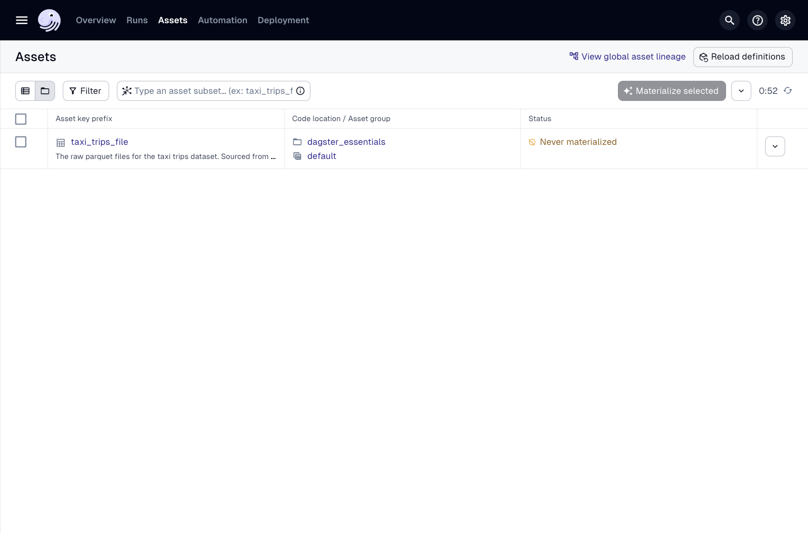

페이지는 현재 비어 있지만, 곧 더 흥미롭게 보일 것입니다. 자산 구체화를 시작해 봅시다.

1단계
상단 탐색 바에서 **자산**을 클릭하십시오. 열리는 페이지는 오른쪽에 있는 것과 같아야 합니다. 

**참고:** 이 페이지를 열었을 때 비어 있다면, **정의 다시 로드**를 클릭하십시오. 이것이 무엇을 하는지 나중에 더 자세히 설명하겠습니다. 

이 페이지에서는 프로젝트의 자산 목록과 다음과 같은 상위 수준 정보를 찾을 수 있습니다. 

- 자산이 속한 코드 위치 및 자산 그룹(나중에 다룰 것입니다) 
- 자산의 상태(이 경우 `taxi_trips_file`은 **한 번도 구체화되지 않음**) 

다음으로 **전역 자산 계보 보기** 링크를 클릭하십시오. 이것은 DAG를 볼 수 있는 전역 자산 그래프를 엽니다.


2단계
현재 자산이 하나뿐이므로 비어 있지만, 자산을 더 추가하고 종속성을 추가하면 더 흥미로워질 것입니다. 

또한, 자산의 독스트링에서 가져온 설명이 자산 내에 표시된다는 점에 유의하십시오!

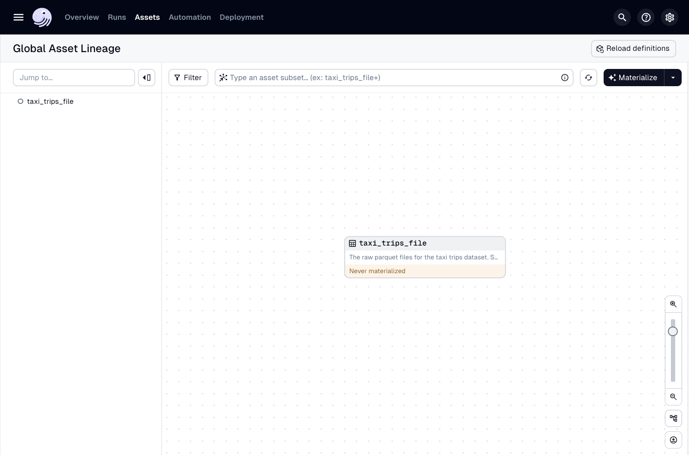

3단계
오른쪽 이미지에서 강조 표시된 **구체화** 버튼을 클릭하여 자산을 구체화하십시오. 이렇게 하면 자산 코드의 함수가 실행되어 자산이 생성됩니다.
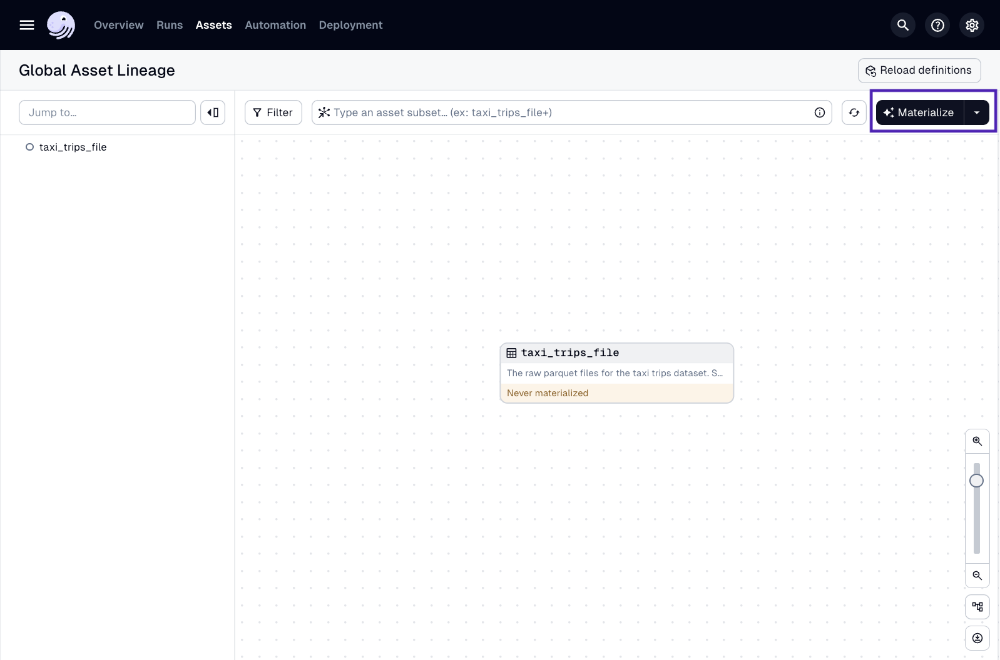

4단계
**구체화**를 클릭하면 오른쪽 이미지처럼 페이지 상단에 보라색 상자가 표시됩니다. 이는 실행이 성공적으로 시작되었음을 나타냅니다. 

**실행**은 하나 이상의 자산을 구체화하는 실행 인스턴스입니다.
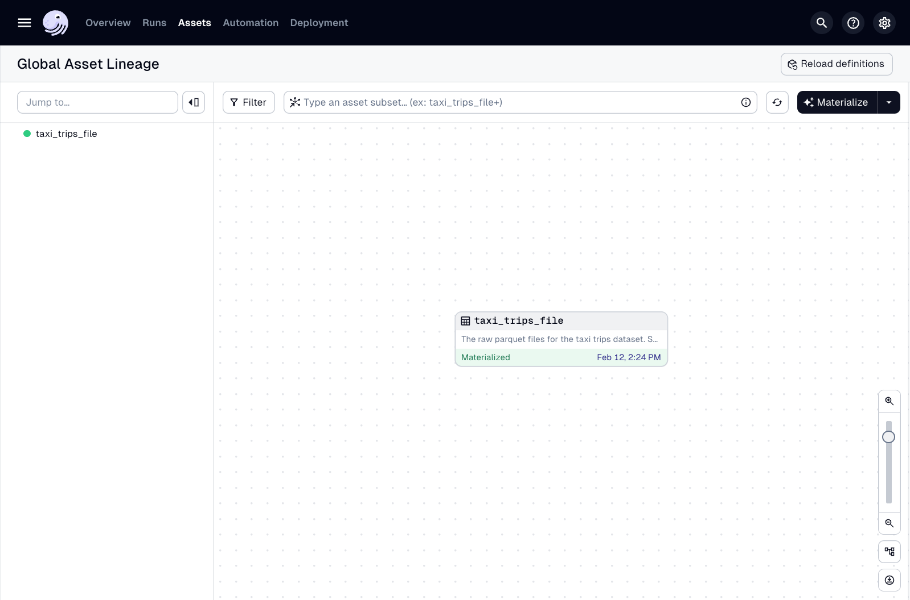

5단계
Dagster 프로젝트의 `data/raw`로 이동하여 자산 구체화에 의해 생성된 파일을 확인하십시오: `data/raw/taxi_trips_2023-03.parquet`

**참고:** 다운로드에 시간이 걸릴 수 있으므로 이 파일이 즉시 나타나지 않을 수 있습니다.
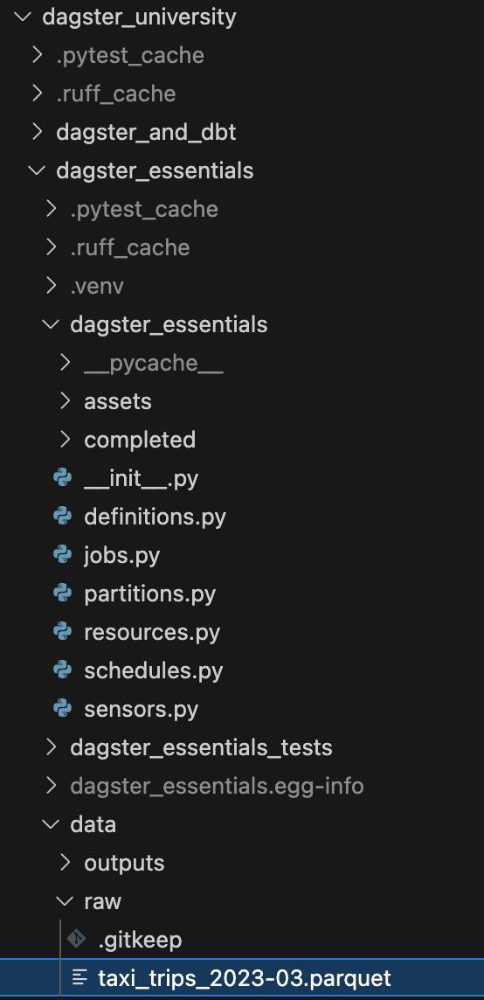

그게 다입니다! 첫 번째 자산을 성공적으로 구체화했습니다! 🎉

## `dg launch` vs `dg dev` 사용 시점

이제 자산을 시작하는 두 가지 다른 방법을 알게 되었습니다. 어떤 것을 사용해야 할지 궁금할 수 있습니다. 다행히 잘못된 답은 없습니다. 무언가를 빠르게 테스트해야 할 때 `dg launch`로 자산을 실행하는 것이 더 쉽다고 생각할 수 있지만, Dagster 프로젝트가 더 정교해짐에 따라 `dg dev`를 사용하고 싶을 수도 있습니다.

이 과정의 대부분에서는 Dagster의 더 많은 기능을 보여주기 위해 `dg dev`를 사용할 것입니다.

# 실행 세부 정보 보기

마지막 섹션에서는 Dagster UI를 사용하여 자산을 성공적으로 구체화했습니다. UI는 실행이 성공했다고 알려주었지만, 만약 실패했다면 어땠을까요? 어떤 모습일까요? 그리고 어떻게 문제를 해결할까요? 이 섹션에서는 Dagster UI에서 실행 정보를 찾는 방법과 이를 사용하여 문제를 정확히 찾아내는 방법을 보여줄 것입니다.

실패 문제 해결에 들어가기 전에, 방금 시작한 성공적인 실행의 세부 정보를 살펴보겠습니다.

세부 정보를 보려면 그래프에서 자산의 **Materialized - <날짜>** 부분을 찾으십시오. 다음 이미지에서 강조 표시된 **날짜**를 클릭하여 **실행 세부 정보** 페이지를 여십시오.

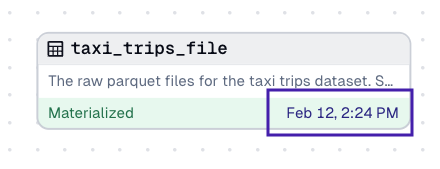

**실행 세부 정보** 페이지에는 세 가지 주요 섹션이 포함되어 있습니다.

- ID, 상태, 날짜, 기간과 같은 작업에 대한 상위 수준 통계
    
- 각 단계가 실행되고 기간이 표시되는 타임라인 보기
    
- 각 단계 및 실행에 대한 자세한 정보가 포함된 로그
    

각 섹션을 살펴보겠습니다.

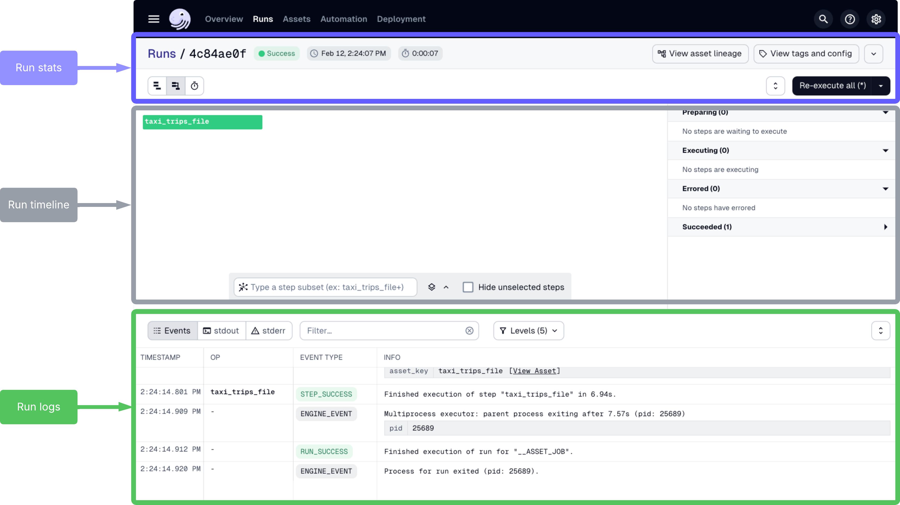

---

## 실행 통계

페이지 상단 부분부터 시작하겠습니다. 이 부분은 실행에 대한 상위 수준 통계를 제공합니다.

여기서 실행의 ID, 상태, 영향을 받은 자산의 이름, 실행 날짜 및 완료하는 데 걸린 시간을 찾을 수 있습니다. 또한 Launchpad 및 태그와 구성에 대한 버튼도 있는데, 이 부분은 과정 후반에 다룰 것입니다.

---

## 실행 타임라인

실행 통계 아래에는 실행 타임라인이 있습니다.

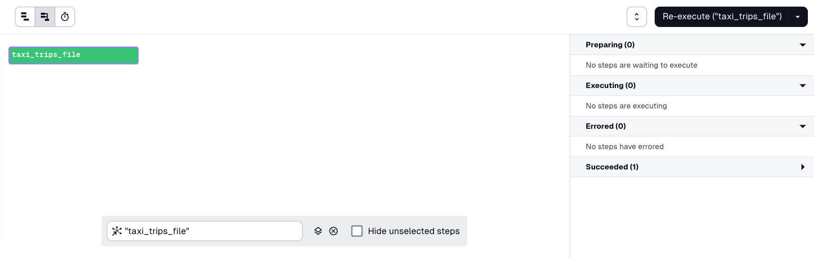

타임라인은 실행의 각 단계가 완료되는 데 걸린 시간과 성공적으로 완료되었는지 또는 오류가 발생했는지 시각적으로 보여줍니다. 이 예제에서는 `taxi_trips_file` 단계(이 특정 실행의 유일한 단계)가 녹색으로 강조 표시되어 성공적으로 완료되었음을 나타냅니다.

왼쪽 및 그래프 위의 토글을 사용하여 필요에 따라 표시 방식을 변경할 수 있습니다.

# 실패한 실행 문제 해결

이제 자산이 어떻게 구체화되고 실행 세부 정보를 어디서 찾을 수 있는지 알게 되었으므로 문제 해결에 집중해 봅시다. 문제 해결 방법을 보여주기 위해 `taxi_trips_file` 자산이 의도적으로 실패하도록 할 것입니다.

`assets/trips.py` 파일에서 `from dagster_essentials.defs.assets import constants` 줄을 주석 처리하여 다음과 같이 만드십시오.

```python
import requests
# from dagster_essentials.defs.assets import constants # <---- Import commented out here
import dagster as dg

@dg.asset
def taxi_trips_file() -> None:
    """
      The raw parquet files for the taxi trips dataset. Sourced from the NYC Open Data portal.
    """
    month_to_fetch = '2023-03'
    raw_trips = requests.get(
        f"https://d37ci6vzurychx.cloudfront.net/trip-data/yellow_tripdata_{month_to_fetch}.parquet"
    )

    with open(constants.TAXI_TRIPS_TEMPLATE_FILE_PATH.format(month_to_fetch), "wb") as output_file:
        output_file.write(raw_trips.content)
```

Dagster UI에서 **전역 자산 계보** 페이지로 이동하여 **구체화**를 다시 클릭하여 `taxi_trips_file` 자산을 구체화해 보십시오. 예상대로 실행이 실패하여 자산이 그래프에 다음과 같이 표시됩니다.

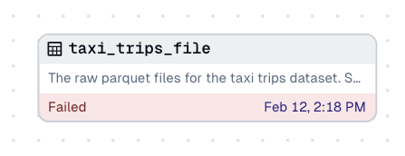

자산의 **날짜**를 클릭하여 **실행 세부 정보** 페이지를 다시 여십시오. 보시다시피, 이전에 보았던 행복한 녹색 성공과는 상당히 다르게 보입니다.

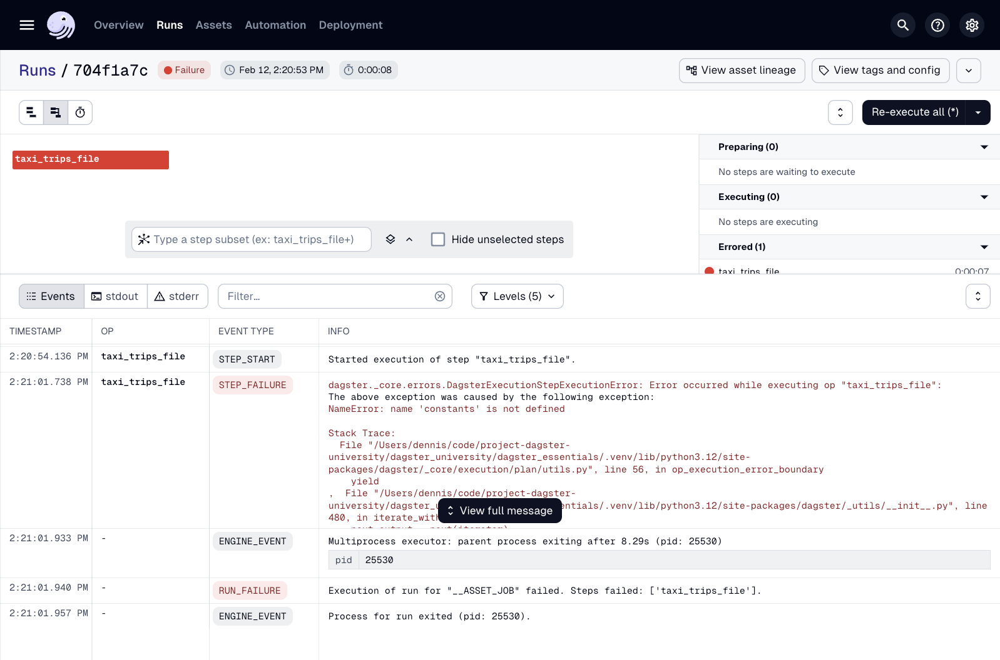

실행에서 오류가 발생하면 실행 세부 정보 페이지는 다음과 같이 문제가 발생했음을 나타냅니다.

- **실행 통계**에 **실패** 상태 표시
    
- **실행 타임라인**에서 문제 단계(또는 단계들)를 빨간색으로 강조 표시
    
- **실행 타임라인** 옆의 **오류 발생** 섹션에 문제 단계(들) 나열
    
- **실행 로그**에 문제 단계(들)에 대한 자세한 오류 정보 표시
    

무엇이 잘못되었는지 정확히 파악하려면 로그를 자세히 살펴보겠습니다. 이 예제에서는 로그의 **구조화된 보기**를 사용할 것입니다.

---

## 로그를 사용하여 문제 해결

1단계
로그에서 STEP_FAILURE 이벤트를 찾아 실패한 단계를 찾으십시오. 오른쪽 이미지에서 문제가 있는 단계를 강조 표시했습니다.
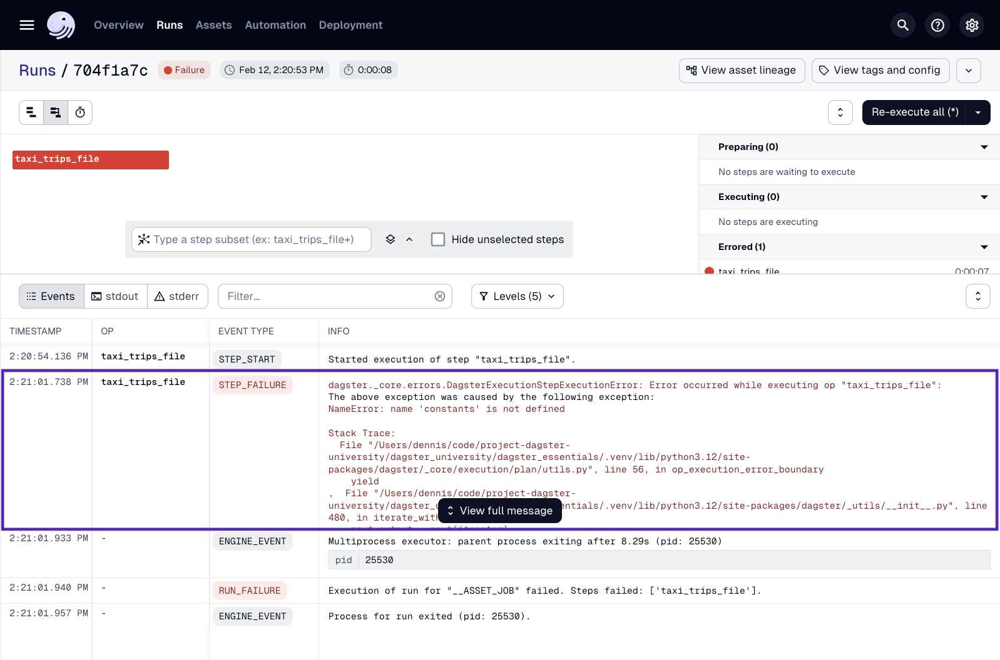

2단계
실패한 단계의 **정보** 열에서 전체 메시지 보기 버튼을 클릭하여 전체 스택 추적을 표시합니다. 오른쪽과 같은 팝업 창이 표시됩니다. 

이 시점에서 스택 추적을 사용하여 오류의 원인을 식별하고 수정할 수 있습니다. 이 경우 `constants`를 임포트하지 않아 정의되지 않았기 때문입니다.

이 문제를 해결하려면 `trips.py` 파일에서 `from dagster_essentials.defs.assets import constants` 줄의 주석을 해제하고 저장하십시오.

Dagster UI에서 **확인**을 클릭하여 실행 로그에서 팝업 창을 닫으십시오.
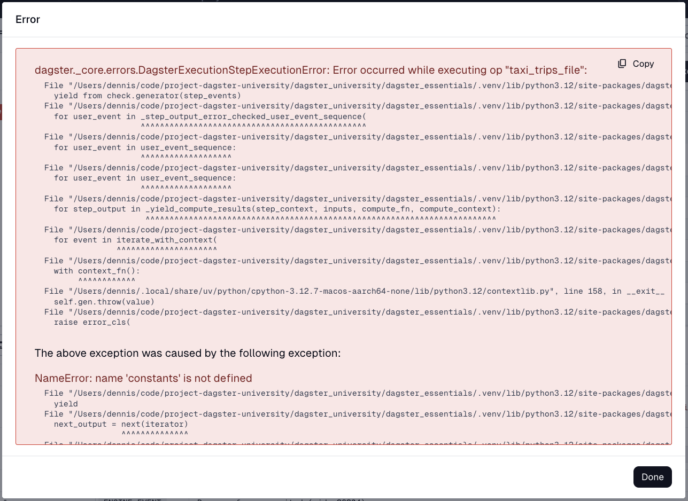

3단계
임포트를 다시 추가하고 `trips.py` 파일을 저장한 후 실행을 다시 실행할 것입니다.

실행 세부 정보 페이지에서 페이지 오른쪽 상단 근처에 있는 **모두 다시 실행(*)** 버튼을 찾아 클릭하십시오. 이렇게 하면 실행의 모든 단계가 다시 실행됩니다.
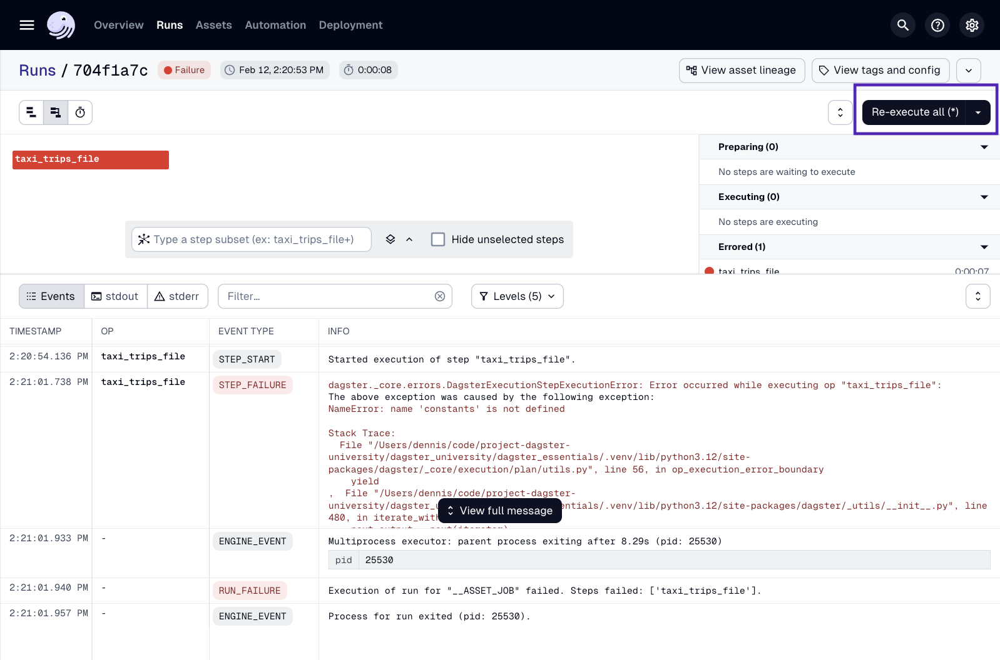

4단계
이 시점에서 실행은 자산을 성공적으로 구체화해야 합니다! 

실행 세부 정보 페이지는 오른쪽 이미지와 유사하게 표시되며, 루트(원래) 실행은 실패했지만 다시 실행은 성공했음을 나타냅니다.
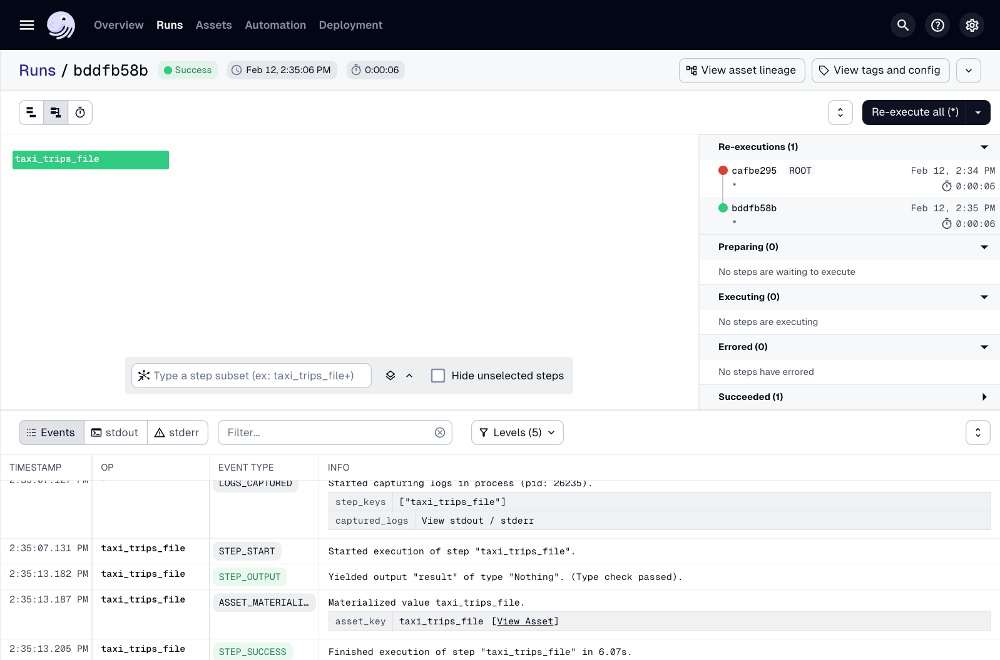

## 요약

이 과에서는 다음을 배웠습니다.

- `dg`를 사용하여 Dagster 프로젝트를 구축하는 방법
    
- 자산이란 무엇인지
    
- 자산을 구성하는 요소
    
- 자산을 정의하고 구체화하는 방법
    
- 실행 정보를 찾고 문제를 해결하는 방법
    

또한 첫 번째 자산인 `taxi_trips_file`과 `taxi_zones_file`을 작성했으며, 다음 과에서 이를 사용하여 더 많은 자산을 만들고 서로 종속되도록 할 것입니다.

> ‼️ 4과로 계속하기 전에 코드를 정답과 일치하는지 확인하세요!