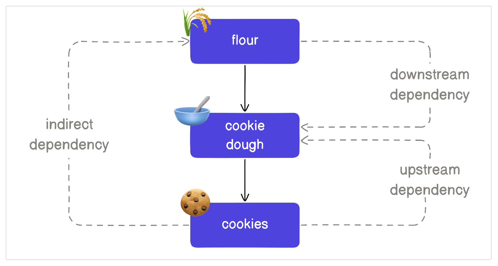
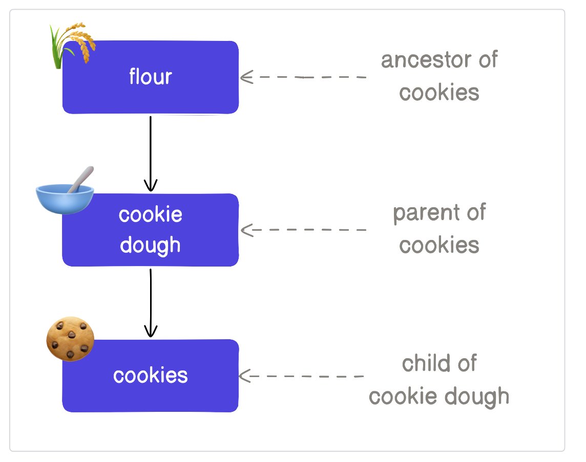
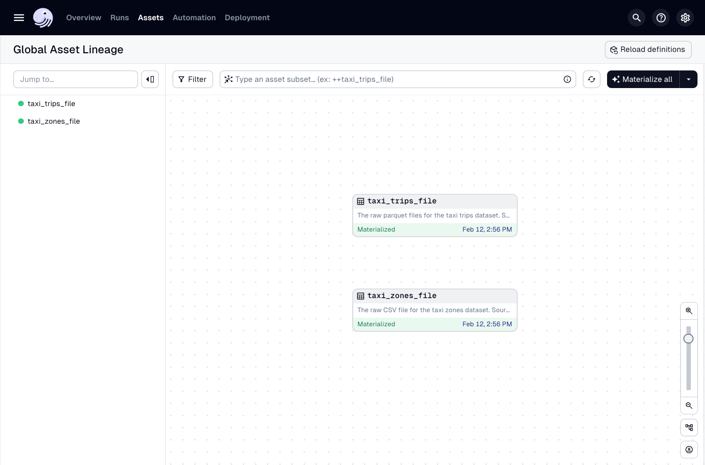
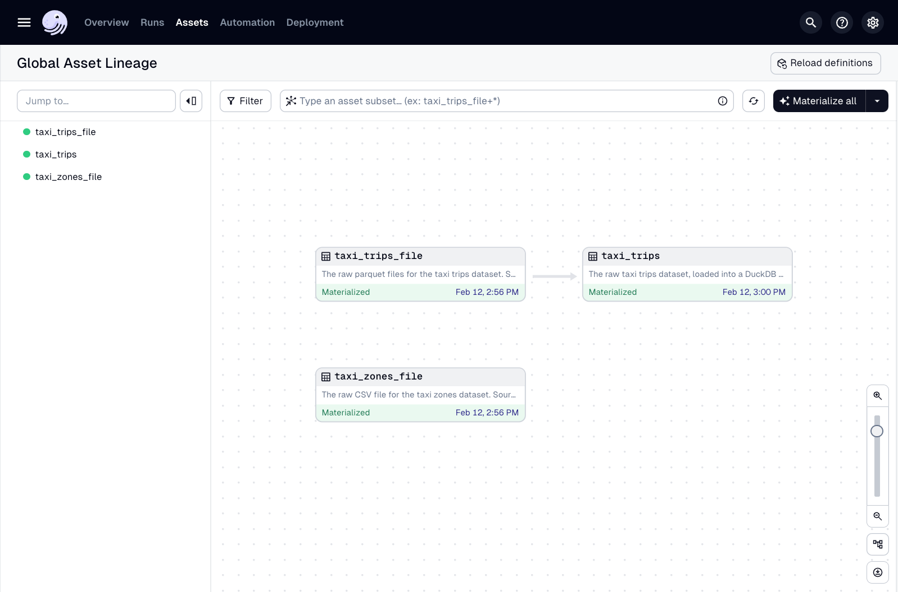
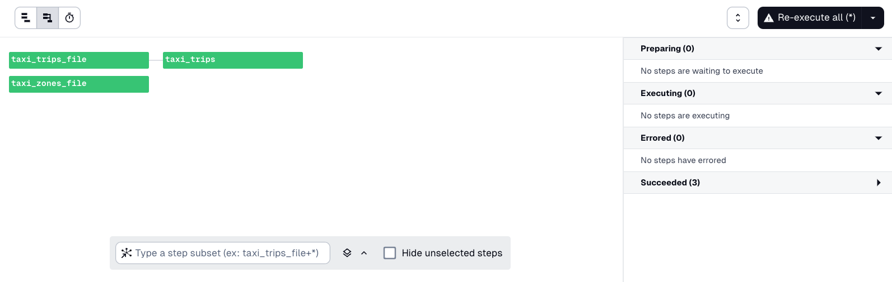
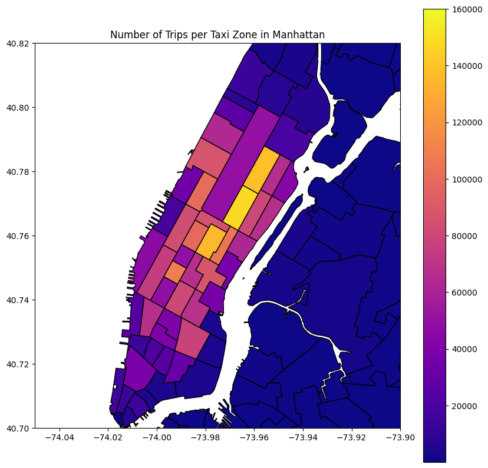

# 개요

이전 과에서 자산이 무엇인지 배우고 Dagster에서 첫 번째 자산을 생성하는 데 그 지식을 적용했습니다. 이제 Dagster 프로젝트를 확장하여 데이터 파이프라인을 생성하는 방법을 배울 것입니다.

데이터 파이프라인은 데이터 자산을 생성하는 일련의 이벤트입니다. [1과](https://www.notion.so/Lesson-1-Introduction-43c6dcd35f6b4a6bb0729d3fd185ce88?pvs=21)에서 소개했듯이, Dagster는 여러 자산을 생성하는 데이터 파이프라인을 효율적으로 생성할 수 있도록 지원합니다.

이제 다음을 수행하는 완전한 데이터 파이프라인을 구축할 것입니다.

- 다운로드한 파일을 데이터베이스에 로드
    
- 택시 운행에 대한 데이터를 결합하고 집계하여 지표를 생성
    
- 해당 지표를 시각화하고 보고서를 저장
    

이 과정에서 Dagster를 사용하여 파이프라인을 생성하기 위해 자산 간의 종속성을 정의하는 방법을 배울 것입니다.

# 종속성이란 무엇인가요?

**종속성**은 자산 간의 관계입니다. 자산 종속성은 다음과 같을 수 있습니다.

- **다운스트림**, 즉 자산이 다른 자산에 종속됨
    
- **업스트림**, 즉 자산이 다른 자산에 의해 종속됨
    

이를 설명하기 위해 쿠키 파이프라인의 일부를 살펴보겠습니다.

이 예에서 **밀가루**, **쿠키 반죽**, **쿠키**는 우리의 자산입니다. 여기에서 어떤 일이 일어나고 있는지 분석해 봅시다:  <br>  <br>- **쿠키 반죽**을 만들려면 **밀가루**가 필요합니다. 따라서 **쿠키 반죽**은 **밀가루**의 다운스트림(또는 종속)입니다.  <br>- **쿠키**를 만들려면 **쿠키 반죽**이 필요합니다. 따라서 **쿠키 반죽**은 **쿠키**의 업스트림(또는 종속성)입니다.



종속성을 설명하는 또 다른 방법은 **부모**, **자식**, **조상**이라는 용어를 사용합니다. 이러한 용어가 어떻게 적용되는지 보여주기 위해 쿠키 파이프라인을 다시 살펴보겠습니다. 이러한 용어는 개별 자산에 상대적이므로 **쿠키** 자산의 관점에서 이러한 용어를 적용할 것입니다.  <br>  <br>- **자식 자산**은 _부모_ 자산의 다운스트림입니다. 이 예에서 **쿠키**는 부모 자산인 **쿠키 반죽**의 자식입니다.  <br>- **조상**은 부모 자산의 부모입니다. 이 예에서 **밀가루**는 **쿠키**의 조상입니다. 이는 **밀가루**가 **쿠키 반죽**의 부모이고, **쿠키 반죽**이 **쿠키**의 부모이기 때문입니다.



# 자산 및 데이터베이스 실행

이전 과의 끝에서 서로 의존하지 않는 두 개의 자산(`taxi_trips_file`과 **연습 문제** 섹션의 `taxi_zones_file`)을 생성했습니다. 이 섹션에서는 이 자산들에 의존하는 추가 자산을 생성할 것입니다.

데이터 파일이 필요한 작업을 수행하기 전에 최적의 효율성과 스토리지를 위해 데이터베이스에 로드해야 합니다. 다행히 시작한 프로젝트 템플릿에는 DuckDB가 설치되어 있습니다.

DuckDB에는 파일에서 직접 쿼리하는 것과 같이 데이터를 수집하기 쉽게 만드는 여러 기능이 있습니다. `taxi_trips` 파일을 DuckDB 데이터베이스로 로드하려면 다음 SQL 쿼리를 실행할 수 있습니다.

```sql
create or replace table trips as (
    select
        VendorID as vendor_id,
        PULocationID as pickup_zone_id,
        DOLocationID as dropoff_zone_id,
        RatecodeID as rate_code_id,
        payment_type as payment_type,
        tpep_dropoff_datetime as dropoff_datetime,
        tpep_pickup_datetime as pickup_datetime,
        trip_distance as trip_distance,
        passenger_count as passenger_count,
        total_amount as total_amount
    from 'data/raw/taxi_trips_2023-03.parquet'
);
```

이 쿼리를 지금 실행하는 방법에 대해 걱정하지 마세요. 다음 섹션에서 다룰 것입니다.

# 데이터베이스에 데이터 로드

이제 자산을 생성하는 쿼리가 있으므로 Dagster를 사용하여 구체화를 관리해 봅시다. Dagster가 데이터 자산의 정의 및 구체화를 관리하게 함으로써 테이블이 변경되는 시점과 시간이 얼마나 걸리는지 쉽게 파악할 수 있습니다.

1. `trips.py` 파일 상단에서 `duckdb`와 `os`를 임포트하여 DuckDB 데이터베이스 파일이 저장되는 위치를 관리하고, `dagster._utils`에서 `backoff`를 임포트하여 DuckDB를 더 효과적으로 사용할 수 있도록 하세요.
    
```python
import duckdb
import os
import dagster as dg
from dagster._utils.backoff import backoff
```
    
2. 아래 코드를 복사하여 `trips.py` 파일 하단에 붙여넣으세요. 이 코드가 `taxi_trips_file` 및 `taxi_zones` 자산에 대한 자산 정의 코드와 유사하다는 점에 유의하세요.
    
```python
@dg.asset(
    deps=["taxi_trips_file"]
)
def taxi_trips() -> None:
    """
    The raw taxi trips dataset, loaded into a DuckDB database
    """
    query = """
	    create or replace table trips as (
	        select
                VendorID as vendor_id,
                PULocationID as pickup_zone_id,
                DOLocationID as dropoff_zone_id,
                RatecodeID as rate_code_id,
                payment_type as payment_type,
                tpep_dropoff_datetime as dropoff_datetime,
                tpep_pickup_datetime as pickup_datetime,
                trip_distance as trip_distance,
                passenger_count as passenger_count,
                total_amount as total_amount
              from 'data/raw/taxi_trips_2023-03.parquet'
            );
        """
    
    conn = backoff(
	    fn=duckdb.connect,
            retry_on=(RuntimeError, duckdb.IOException),
            kwargs={
                "database": os.getenv("DUCKDB_DATABASE"),
            },
            max_retries=10,
        )
    conn.execute(query)
```
    
    이 코드가 무엇을 하는지 살펴보겠습니다.
    
    1. `@dg.asset` 데코레이터를 사용하여 `taxi_trips`라는 자산이 생성됩니다.
        
    2. `taxi_trips_file` 자산은 `deps` 인수를 통해 `taxi_trips`의 종속성으로 정의됩니다.
        
    3. 다음으로, `query`라는 변수가 생성됩니다. 이 변수에는 `trips`라는 테이블을 생성하는 SQL 쿼리가 포함되어 있으며, 이 테이블은 `data/raw/taxi_trips_2023-03.parquet` 파일에서 데이터를 가져옵니다. 이 파일은 `taxi_trips_file` 자산에 의해 생성된 파일입니다.
        
    4. `conn`이라는 변수가 생성되며, 이는 프로젝트의 DuckDB 데이터베이스에 대한 연결을 정의합니다. 이를 위해 먼저 Dagster 유틸리티 함수 `backoff`로 모든 것을 래핑합니다. `backoff` 함수를 사용하면 여러 자산이 리소스를 잠그지 않고 DuckDB를 안전하게 사용할 수 있습니다. `backoff` 함수는 호출하려는 함수(이 경우 `duckdb` 라이브러리의 `.connect` 메서드), 재시도할 오류(`RuntimeError` 및 `duckdb.IOException`), 최대 재시도 횟수, 마지막으로 `.connect` DuckDB 메서드에 제공할 인수를 받습니다. 여기서는 DuckDB에 데이터베이스 위치를 알려주기 위해 `DUCKDB_DATABASE` 환경 변수를 전달하고 있습니다.
        
        프로젝트의 `.env` 파일에서 가져온 `DUCKDB_DATABASE` 환경 변수는 `data/staging/data.duckdb`로 확인됩니다. **참고**: 이 파일은 2과에서 설정했습니다. 다시 확인해야 하는 경우 이 과를 참조하세요. 이 파일이 올바르게 설정되지 않으면 구체화에서 오류가 발생합니다.
        
    5. 마지막으로, `conn`은 DuckDB `execute` 메서드와 쌍을 이루며, 여기에 SQL 쿼리(`query`)가 인수로 전달됩니다. 이는 자산이 구체화될 때 DuckDB 데이터베이스에 연결하여 `query`의 쿼리를 실행하도록 지시합니다.
        
3. 파일에 대한 변경 사항을 저장하십시오.
    
4. Dagster UI에서 **전역 자산 계보** 페이지로 이동하십시오.



    문제가 있는 것 같습니다. 새 `taxi_trips` 자산이 표시되지 않습니다. 이는 새로 추가된 자산을 반영하려면 **코드 위치**의 정의를 다시 로드해야 하기 때문입니다.
    
    코드 위치에 대해서는 나중에 자세히 다룰 것이지만, 지금은 페이지 오른쪽 상단 근처에 있는 **정의 다시 로드** 버튼을 클릭하여 수동으로 정의를 다시 로드할 수 있습니다.



다시 로드되면 `taxi_trips` 자산이 자산 그래프에 표시됩니다.

`taxi_trips_file` 자산에서 `taxi_trips` 자산으로의 화살표에 주목하세요. 이것은 `taxi_trips`가 `taxi_trips_file`에 대해 가지는 종속성을 나타냅니다.

> 💡 **정의는 언제 다시 로드해야 하나요?** `pip install -e ".[dev]"`로 종속성을 설치했다면, 새 자산이나 스케줄과 같은 다른 Dagster 객체를 프로젝트에 추가할 때만 정의를 다시 로드하면 됩니다. `-e` 편집 가능한 플래그 때문에 Dagster는 코드 위치를 다시 로드할 필요 없이 자산 함수의 코드 변경 사항을 인식할 수 있습니다.

---

## 파이프라인 구체화

그래프의 오른쪽 상단에 있는 **모두 구체화** 버튼을 클릭하여 모든 자산을 구체화하는 새 실행을 만드십시오. 실행이 시작되면 자산의 실행 링크를 클릭하여 **실행 세부 정보** 페이지를 여십시오. 이렇게 하면 진행 중인 실행을 볼 수 있습니다.

이 페이지에서 모든 세 가지 자산이 구체화되고 있는 것을 볼 수 있습니다. `taxi_trips_file` 및 `taxi_zones_file` 자산은 병렬로 구체화되어야 하며, `taxi_trips`는 `taxi_trips_file`이 완료될 때까지 구체화를 시작하지 않습니다.



이는 `deps=` 인수를 사용하여 `taxi_trips`가 `taxi_trips_file` 자산에 의존한다고 Dagster에 알렸기 때문입니다. 따라서 `taxi_trips` 자산은 `taxi_trips_file`이 최신 상태이고 구체화될 때까지 기다렸다가 자체적으로 구체화를 시도합니다.

### 선택 사항: 구체화 확인

`taxi_trips` 자산이 제대로 구체화되었는지 확인하려면 DuckDB의 새로 생성된 `trips` 테이블에 액세스할 수 있습니다. 새 터미널 세션에서 Python REPL을 열고 다음 스니펫을 실행하십시오.

```python
import duckdb
conn = duckdb.connect(database="data/staging/data.duckdb") # assumes you're writing to the same destination as specified in .env.example
conn.execute("select count(*) from trips").fetchall()
```

명령은 성공적으로 완료되고 수집된 택시 운행의 행 수를 반환해야 합니다. 완료되면 계속하기 전에 터미널 프로세스를 중지해야 합니다. 그렇지 않으면 오류가 발생할 수 있습니다. `Control+C` 또는 `Command+C`를 사용하여 프로세스를 중지하십시오.

축하합니다! API에서 데이터를 가져와 데이터베이스에 수집하는 간단한 데이터 파이프라인 작성을 마쳤습니다.

# 메모리 내 계산을 사용하는 자산

지금까지 자산을 작성할 때 데이터베이스에서 계산을 오케스트레이션하고 파일을 다운로드하는 것과 같은 가벼운 작업을 Python에서 수행했습니다. 이 섹션에서는 Python을 사용하여 데이터를 생성 및 변환하고 보고서를 구축하여 Python 기반 계산을 오케스트레이션하는 방법을 배울 것입니다.

### 자산을 사용하여 지표 생성

모든 자산을 한 파일에 보관하면 관리가 어려워집니다. 자산을 목적에 따라 분리하고 분석 중심 자산을 데이터를 수집하는 자산과는 다른 파일에 넣어 봅시다.

1. `dg`를 사용하여 지표 자산을 위한 새 파일을 생성하세요.
    
```bash
dg scaffold defs dagster.asset assets/metrics.py
```
    
2. `src/dagster_essentials/defs/assets/metrics.py` 파일 상단에 다음 임포트 문을 추가하세요.
    
```python
import dagster as dg
    
import matplotlib.pyplot as plt
import geopandas as gpd
    
import duckdb
import os
    
from dagster_essentials.defs.assets import constants
```
    
    익숙하지 않은 임포트가 있을 수 있지만, 사용할 때 다룰 것입니다.
    
3. 다음으로, `manhattan_stats` 자산과 그 종속성을 정의하세요. 다음 코드를 복사하여 `metrics.py` 끝에 붙여넣으세요.
    
```python
@dg.asset(
    deps=["taxi_trips", "taxi_zones"]
)
def manhattan_stats() -> None:
```
    
4. 이제 `manhattan_stats`를 계산하는 로직을 추가해 봅시다. 아래 변경 사항을 반영하도록 `manhattan_stats` 자산 정의를 업데이트하세요.
        
```python
@dg.asset(
    deps=["taxi_trips", "taxi_zones"]
)
def manhattan_stats() -> None:
    query = """
        select
            zones.zone,
            zones.borough,
            zones.geometry,
            count(1) as num_trips,
        from trips
        left join zones on trips.pickup_zone_id = zones.zone_id
        where borough = 'Manhattan' and geometry is not null
        group by zone, borough, geometry
    """
    
    conn = duckdb.connect(os.getenv("DUCKDB_DATABASE"))
    trips_by_zone = conn.execute(query).fetch_df()
    
    trips_by_zone["geometry"] = gpd.GeoSeries.from_wkt(trips_by_zone["geometry"])
    trips_by_zone = gpd.GeoDataFrame(trips_by_zone)
    
    with open(constants.MANHATTAN_STATS_FILE_PATH, 'w') as output_file:
        output_file.write(trips_by_zone.to_json())
```
    
    코드를 살펴보겠습니다. 다음을 수행합니다.
    
    1. `trips` 및 `zones` 테이블을 조인하고, 맨해튼 내의 운행만 필터링한 다음, 데이터를 집계하여 동네별 운행 횟수를 얻는 SQL 쿼리를 만듭니다.
        
    2. 다른 자산에서 데이터를 수집한 동일한 DuckDB 데이터베이스에 대해 해당 쿼리를 실행합니다.
        
    3. [GeoPandas](https://geopandas.org/en/stable/) 라이브러리를 활용하여 지저분한 좌표를 다른 라이브러리가 사용할 수 있는 형식으로 변환합니다.
        
    4. 변환된 데이터를 GeoJSON 파일로 저장합니다.
        

---

## 지표 구체화

UI에서 정의를 다시 로드하면 `manhattan_stats` 자산이 이제 자산 그래프에 표시되어야 합니다. 이를 선택하고 **선택된 항목 구체화** 버튼을 클릭하십시오.

구체화가 성공적으로 완료되면 `data/staging/manhattan_stats.geojson`에 (크지만) 유효한 JSON 파일이 있는지 확인하십시오.

---

## 지도 만들기

이 섹션에서는 `manhattan_stats`에 종속되고, 해당 GeoJSON 데이터를 로드하고, 이를 바탕으로 시각화를 생성하는 자산을 생성할 것입니다.

1. `metrics.py` 파일 하단에 다음을 복사하여 붙여넣으십시오.
    
```python
@dg.asset(
    deps=["manhattan_stats"],
)
def manhattan_map() -> None:
    trips_by_zone = gpd.read_file(constants.MANHATTAN_STATS_FILE_PATH)
    
    fig, ax = plt.subplots(figsize=(10, 10))
    trips_by_zone.plot(column="num_trips", cmap="plasma", legend=True, ax=ax, edgecolor="black")
    ax.set_title("Number of Trips per Taxi Zone in Manhattan")
    
    ax.set_xlim([-74.05, -73.90])  # Adjust longitude range
    ax.set_ylim([40.70, 40.82])  # Adjust latitude range
    
    # Save the image
    plt.savefig(constants.MANHATTAN_MAP_FILE_PATH, format="png", bbox_inches="tight")
    plt.close(fig)
```
    
    위의 코드는 다음을 수행합니다.
    
    1. `manhattan_stats`에 종속되는 `manhattan_map`이라는 새 자산을 정의합니다.
        
    2. GeoJSON 파일을 다시 메모리로 읽어들입니다.
        
    3. [Matplotlib](https://matplotlib.org/) 시각화 라이브러리를 사용하여 데이터 시각화로 지도를 생성합니다.
        
    4. 시각화를 PNG로 저장합니다.
        
2. UI에서 **정의 다시 로드**를 클릭하여 Dagster가 새 자산을 감지하도록 허용합니다.
    
3. 자산 그래프에서 `manhattan_map` 자산을 선택하고 **선택된 항목 구체화**를 클릭합니다.
    
4. `data/outputs/manhattan_map.png`에서 파일을 열어 구체화가 올바르게 작동했는지 확인하십시오. 파일은 다음과 같아야 합니다.

