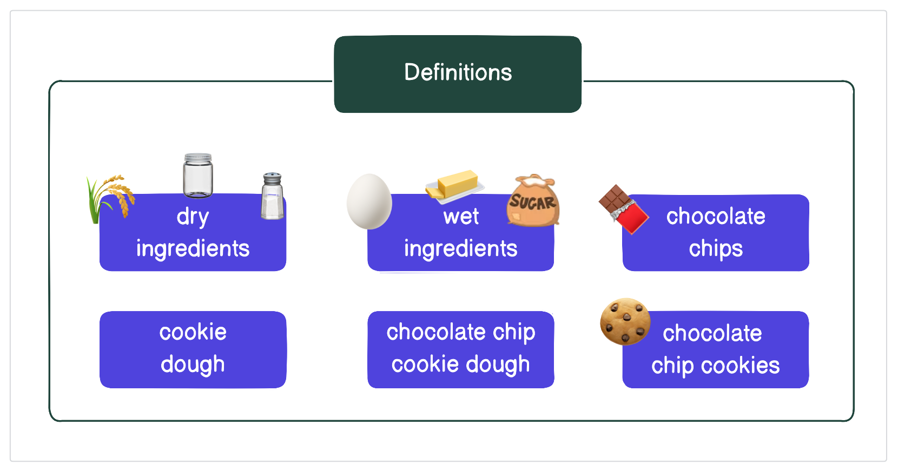
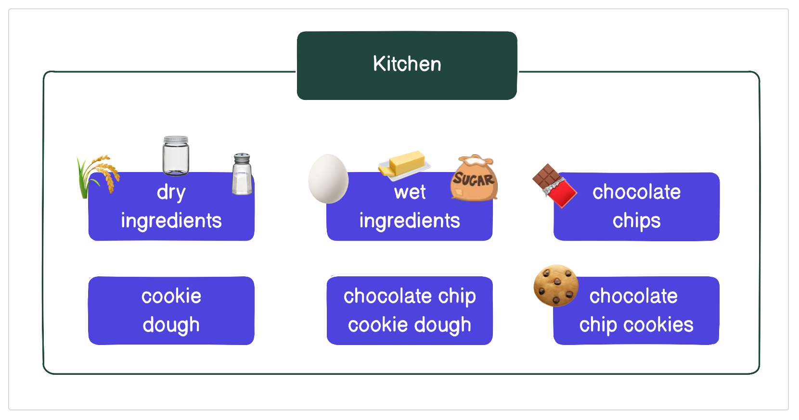
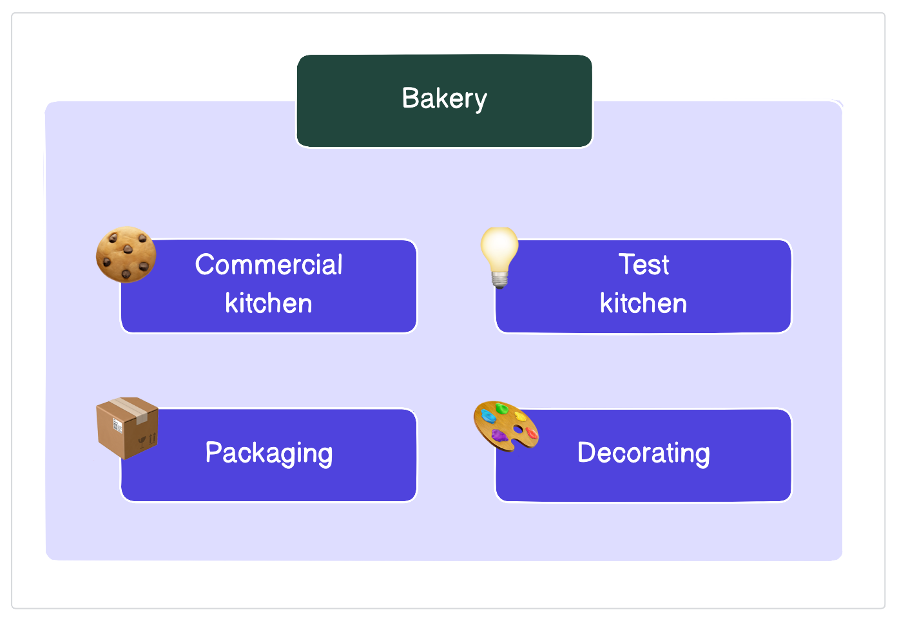
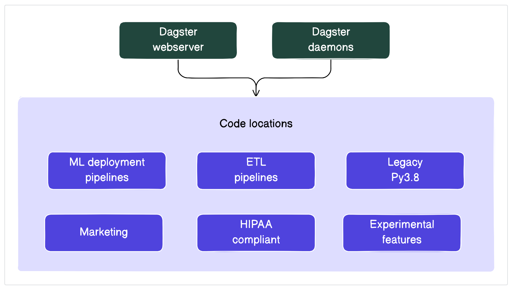
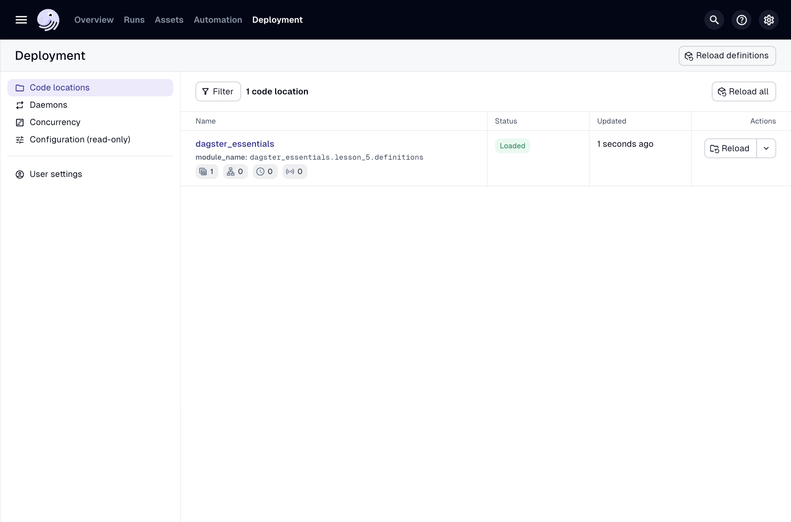
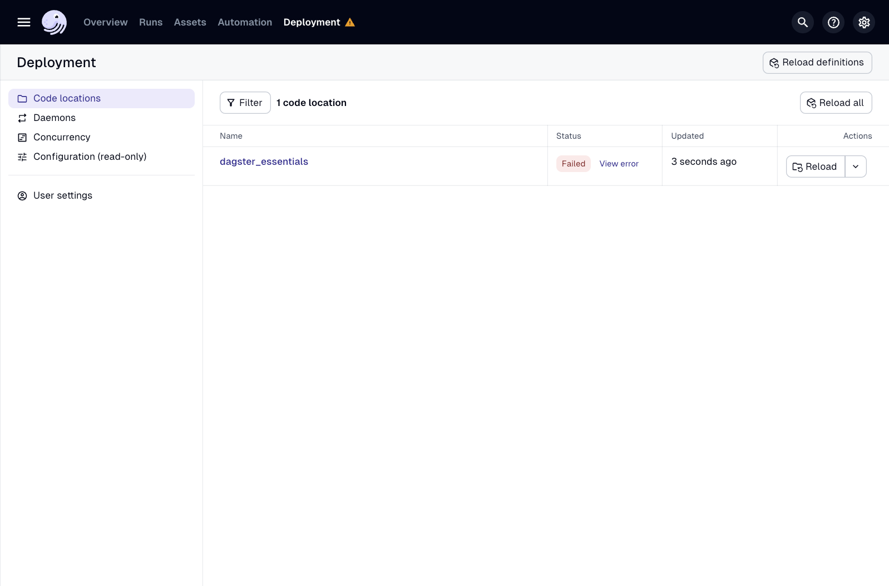
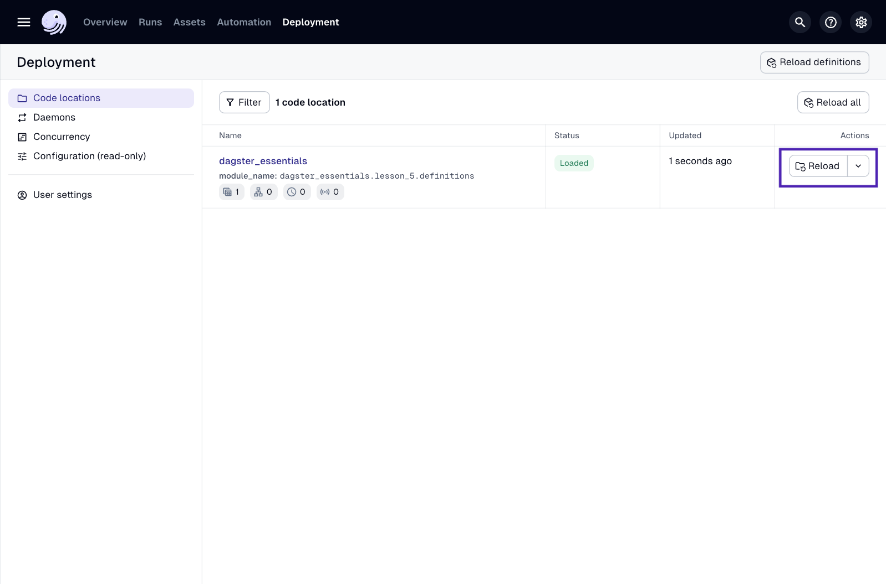

# 개요

이제 Dagster의 자산 기반 모델을 사용하여 데이터 파이프라인을 작성하는 방법을 배웠으므로 잠시 확대하여 Dagster가 어떻게 작동하는지 논의해 봅시다.

이 과에서는 다음을 배울 것입니다.

- `Definitions` 객체란 무엇인가
    
- 코드 위치란 무엇인가
    
- 코드 위치가 Dagster 아키텍처에 어떻게 적용되는가
    
- Dagster UI에서 코드 위치를 보고 관리하는 방법
    

# Definitions 객체란 무엇인가요?

Dagster 배포에서 자산, 리소스 또는 스케줄을 정의할 때마다 작업 중인 코드 위치의 `Definitions` 객체 일부여야 합니다. 각 코드 위치는 단 하나의 Definitions 객체만 가질 수 있습니다. 이 객체는 하나의 코드 위치에 매핑됩니다. 코드 위치를 통해 사용자는 여러 배포가 필요 없이 여러 Dagster 프로젝트를 서로 격리할 수 있습니다. 코드 위치에 대해서는 이 과의 뒷부분에서 더 자세히 알아볼 것입니다.

쿠키 예제를 사용하여 설명해 봅시다. 이 경우 건조 및 습식 재료, 쿠키 반죽, 초콜릿 칩 쿠키 반죽, 그리고 최종적으로 초콜릿 칩 쿠키와 같은 우리의 쿠키 자산은 모두 (쿠키) **정의**로 생각할 수 있습니다.



Dagster에서 `Definitions` 객체는 `definitions.py` 파일에 있습니다. 쿠키 정의에 대한 `Definitions` 객체를 만들려면 다음과 같이 보일 것입니다.

Python

```
import dagster_cookies.defs as defs

defs = dg.components.load_defs(defs)
```

## 자동 로드

`dg`가 도입된 후에는 더 이상 프로젝트의 모든 자산을 `Definitions` 객체 내에 명시적으로 나열할 필요가 없습니다. Dagster는 `defs` 모듈의 내용을 임포트하여 대부분의 객체를 자동으로 로드할 수 있습니다(나중에 자산 외에 다른 객체 유형도 있음을 알게 될 것입니다).

`dg scaffold`를 사용하면 모든 자산 파일이 `defs` 디렉토리 내에 배치된다는 점을 기억하십시오.

Code snippet

```
src
└── dagster_essentials
    ├── definitions.py
    └── defs
        └── assets
            ├── __init__.py
            ├── constants.py
            ├── metrics.py
            └── trips.py
```

이 과정에서는 하나의 코드 위치(따라서 하나의 `Definitions` 객체)만 사용하지만, 프로젝트가 커짐에 따라 새 정의를 포함하도록 `Definitions` 객체를 업데이트해야 합니다.

---

## Dagster가 Definitions 객체를 사용하는 방법

이제 `Definitions` 객체가 무엇인지 논의했으므로 Dagster가 이를 어떻게 사용하는지 살펴보겠습니다.

`dg dev`를 실행할 때 Dagster는 `pyproject.toml` 파일을 찾습니다. 이 파일에는 Dagster를 실행하는 데 필요한 모든 Python 종속성과 `Definitions` 객체가 로드되어야 하는 위치에 대한 Dagster 특정 설정이 포함되어 있습니다.

YAML

```
[tool.dg]
directory_type = "project"

[tool.dg.project]
root_module = "dagster_essentials"
registry_modules = [
    "dagster_essentials.components.*",
]
```

프로젝트에서 `dagster_university/dagster_essentials/src/dagster_essentials/definitions.py` 파일을 엽니다. 다음 코드와 같아야 합니다.

Python

```
from pathlib import Path

from dagster import definitions, load_from_defs_folder


@definitions
def defs():
    return load_from_defs_folder(project_root=Path(__file__).parent.parent.parent)
```

**참고** `definitions.py` 파일은 [`uvx`](https://www.google.com/search?q=%5Bhttps://docs.dagster.io/getting-started/installation)를](https://www.google.com/search?q=https://docs.dagster.io/getting-started/installation)%EB%A5%BC) 사용하여 새 Dagster 프로젝트를 스캐폴딩할 때 자동으로 생성됩니다.

# 코드 위치란 무엇인가요?

우리는 정의에 대해 많이 이야기했지만, 코드 위치는 어떻습니까? 이 두 가지는 어떻게 함께 작동합니까?

_코드 위치_는 자산과 같은 Dagster 정의의 모음입니다. Dagster에서 코드 위치는 두 가지 구성 요소로 이루어져 있습니다.

- `Definitions` 객체를 포함하는 Python 모듈
    
- 위 모듈을 로드할 수 있는 Python 환경
    

잠시 쿠키 예제로 돌아가 봅시다. 쿠키는 일반적으로 쿠키를 만드는 데 필요한 모든 것을 담고 있는 주방에서 구워집니다. 이전 섹션에서 쿠키 자산(예: 건조 재료, 초콜릿 칩)이 **정의**로 생각될 수 있다고 이야기했습니다.

베이킹을 단순화하려면 필요한 모든 것을 한 곳에 모아야 합니다. 이 예에서 주방은 _코드 위치_와 거의 동일한 방식으로 작동합니다. 즉, 모든 Dagster 정의를 한 곳에 모읍니다.



---

## 코드 위치는 어떻게 유용한가요?

소프트웨어 엔지니어링에서 **배포**는 애플리케이션을 최종 사용자에게 제공하는 메커니즘입니다. 예를 들어 Dagster 배포는 Python, `pandas`와 같은 패키지, Dagster UI 등 Dagster를 실행하는 데 필요한 모든 것을 포함하고 이를 클라우드 내의 견고한 환경에서 사용할 수 있도록 합니다.

코드 위치는 Dagster 배포가 확장됨에 따라 발생하는 문제를 해결하기 위해 존재합니다. 조직이 여러 팀으로 성장하여 데이터를 오케스트레이션할 때 단일 배포로는 복잡해질 수 있습니다.

전통적으로 이것은 다음과 같은 문제를 야기했습니다.

- 한 팀이 변경 사항을 배포하면 다른 팀의 다운타임이 발생합니다.
    
- 두 머신러닝 모델이 동일한 Python 패키지의 두 가지 다른 버전을 사용합니다.
    
- 최신 코드가 오케스트레이터와 동일한 종속성을 사용하기 때문에 오래된 오케스트레이터 버전에 갇히게 됩니다.
    
- 여러 팀이 수천 개의 자산을 기여하여 UI를 검색하고 탐색하기 어렵게 만듭니다.
    

역사적으로 많은 팀이 이러한 문제를 해결하기 위해 여러 배포를 시도했습니다. 그러나 이는 조직에 사일로를 만들고 회사의 데이터 자산에 대한 "단일 창"이 되는 것에 반합니다. 여러 배포는 또한 더 복잡한 인프라, 액세스 관리 및 업그레이드와 같은 추가적인 복잡성을 초래할 수 있습니다.

Dagster는 이러한 문제를 해결하기 위해 코드 위치를 사용합니다. 코드 위치를 통해 사용자는 여러 배포가 필요 없이 코드베이스를 격리할 수 있습니다.

잠시 쿠키로 돌아가 봅시다. 집에서 쿠키를 굽는 일이 성공하면 완전한 베이커리로 확장하고 싶을 수 있습니다. 실제 세계에서 이것은 Dagster의 배포가 될 수 있습니다.

확장함에 따라 다양한 목적으로 주방을 사용할 수 있습니다.

- 테스트 주방
    
- 포장
    
- 장식
    

순조롭게 진행되도록 하려면 각 목적이 베이커리 내에 자체 위치를 갖도록 해야 합니다. 각 목적에 자체 위치를 부여함으로써 위치가 서로에게 부정적인 영향을 미칠 가능성을 줄입니다. 예를 들어, 테스트 주방의 화재는 상업 주방의 핵심 비즈니스에 영향을 미치지 않습니다.



그러나 모든 위치가 서로 독립적임에도 불구하고 여전히 같은 건물에 있습니다. 이를 통해 베이커리의 모든 측면에서 무슨 일이 일어나고 있는지 항상 알 수 있습니다.

---

## 이것이 Dagster의 코드 위치와 어떻게 관련되나요?

다음 이미지에서 각 진한 보라색 상자는 코드 위치입니다. 코드 위치를 핵심 Dagster 서비스에서 분리함으로써 사용자 배포 코드는 안전하고 Dagster의 나머지 부분과 격리됩니다. 코드 위치를 통해 사용자는 자체 Python 버전 또는 종속성으로 코드를 실행할 수 있습니다.



코드 위치는 다음과 같은 범주별로 코드를 분리하는 데 사용될 수 있습니다.

- 팀(예: 마케팅 또는 제품)
    
- Python 버전(예: Python 3.9를 사용하는 레거시 코드 및 최신 Python 3.11 코드 위치)
    
- 종속성 버전(예: PyTorch v1을 사용하는 모델과 PyTorch v2를 사용하는 다른 모델)
    
- 기능(예: ETL, 모델링, BI 계층)
    
- 규정 준수 민감 데이터셋(예: HIPAA)
    

이러한 코드 위치는 모두 단일 Dagster 배포에서 유지 관리되며, 한 코드 위치에서 변경된 사항은 다른 코드 위치의 다운타임으로 이어지지 않습니다. 이를 통해 패키지 및 버전을 사일로화하면서도 필요에 따라 데이터 자산 간에 연결을 만들 수 있습니다. 예를 들어, 한 코드 위치의 자산은 다른 코드 위치의 자산에 종속될 수 있습니다.

# Dagster UI의 코드 위치

이 섹션에서는 Dagster UI의 코드 위치를 안내합니다.

| 모든 코드 위치 보기                                                                                                                                                                                                               |                                     |
| ------------------------------------------------------------------------------------------------------------------------------------------------------------------------------------------------------------------------- | ----------------------------------- |
| Dagster UI에서 코드 위치를 보려면 상단 탐색에서 **배포**를 클릭하십시오. 코드 위치 목록은 코드 위치 탭 아래에 상태, 마지막 업데이트 및 기타 정보와 함께 표시됩니다.  <br>  <br>기본적으로 코드 위치는 Dagster가 로드한 모듈의 이름을 사용하여 이름이 지정됩니다. 이 경우 `dagster_essentials`는 프로젝트가 포함된 폴더(또는 모듈)의 이름입니다. |  |

| 코드 위치 로드 오류 보기                                                                     |                                          |
| ---------------------------------------------------------------------------------- | ---------------------------------------- |
| 코드 위치에 문제가 있으면 상태가 **실패**로 나타납니다.  <br>  <br>**오류 보기**를 클릭하여 스택 추적을 보고 문제를 해결하십시오. |  |

| 정의 다시 로드                                                                                                                                                                                                                                                                   |                                         |
| -------------------------------------------------------------------------------------------------------------------------------------------------------------------------------------------------------------------------------------------------------------------------- | --------------------------------------- |
| 프로젝트에 정의를 추가하거나 변경할 때 코드 위치를 새로 고쳐야 할 수 있습니다. 정의를 다시 로드하면 Dagster에 프로젝트 파일의 마지막 저장된 버전을 검색하여 사용하도록 지시하는 것입니다.  <br>  <br>UI에서 정의를 다시 로드할 수 있습니다.  <br>  <br>- **배포 > 코드 위치**로 이동하여 코드 위치 옆에 있는 **다시 로드** 버튼을 클릭합니다.  <br>- **전역 자산 계보** 페이지로 이동하여 **정의 다시 로드 페이지**를 클릭합니다. |  |