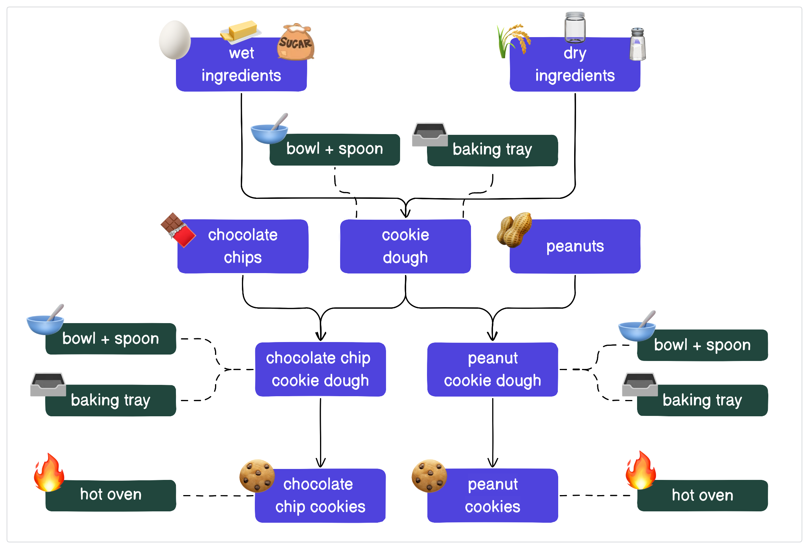
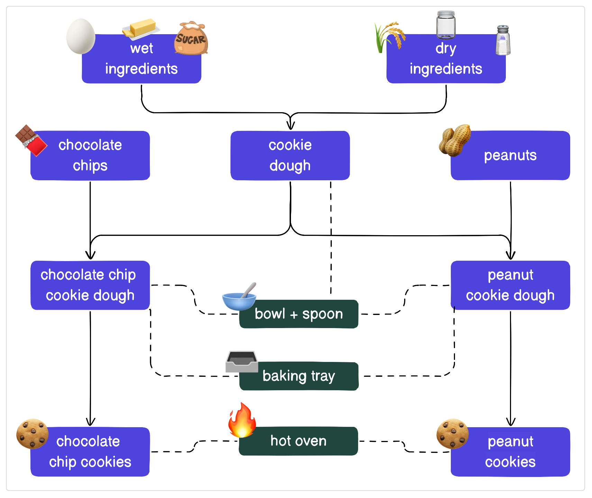
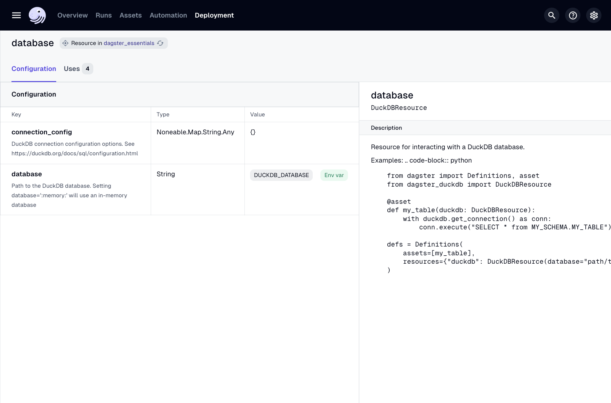
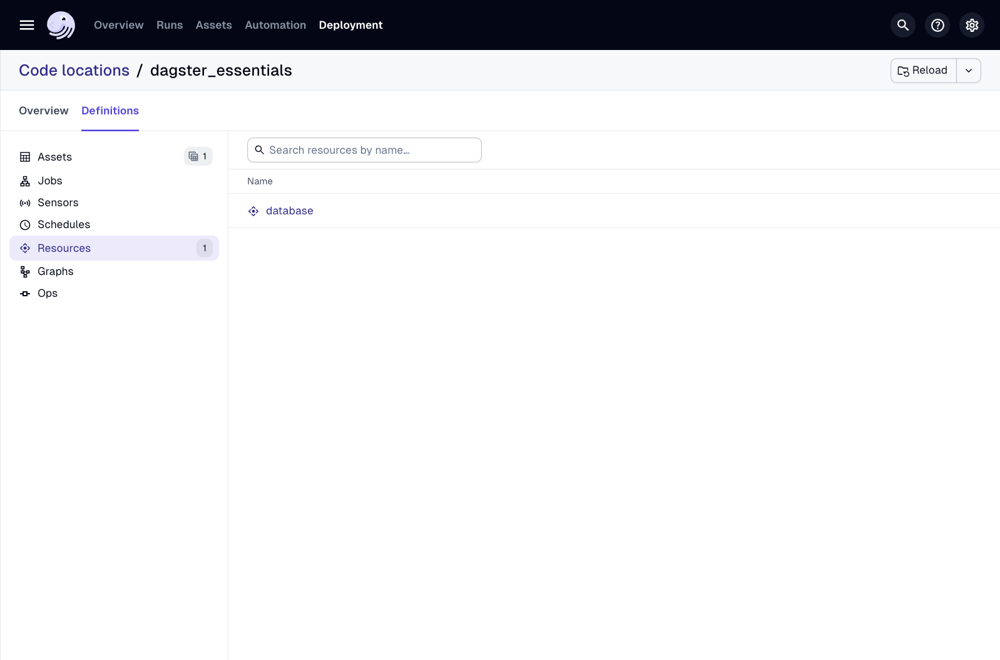
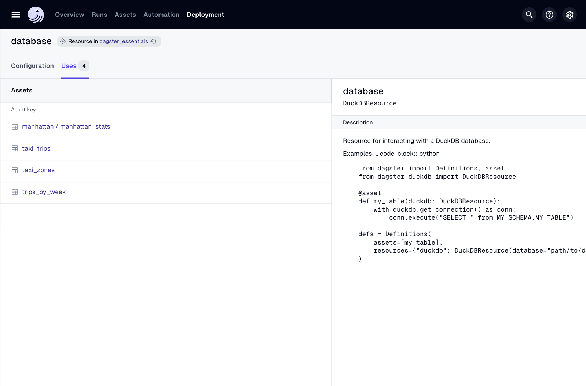

# 개요

이전 과에서는 자산, 자산을 연결하여 데이터 파이프라인을 나타내는 방법, 자산을 구체화하는 실행을 시작하는 방법에 대해 배웠습니다.

Dagster의 역할은 조직의 모든 데이터 파이프라인에 대한 단일 창이 되는 것입니다. 이를 가능하게 하려면 Dagster는 클라우드 저장소나 데이터 웨어하우스와 같이 데이터 파이프라인에서 사용되는 서비스와 시스템에 대해 알아야 합니다. 이 과에서는 소프트웨어 엔지니어링 모범 사례를 사용하여 이를 달성하는 방법을 보여줄 것입니다.

이를 염두에 두고, 이 과에서 중점을 둘 모범 사례는 **반복하지 마세요(Don't Repeat Yourself)**, 줄여서 **DRY**라고 불립니다. 이 원칙은 엔지니어가 한 번만 작업을 수행하고 중복을 줄이도록 권장합니다. 의도적이고 DRY 코드를 작성함으로써 버그 수를 줄이고, 프로젝트 코드베이스를 이해하는 능력을 높이며, 논리 및 기능이 사용되는 방식에 대한 관찰 가능성을 향상시킬 수 있습니다.

Dagster가 소프트웨어 엔지니어링 모범 사례를 수용하는 또 다른 방법은 개발 중 테스트를 가능하게 하는 것입니다. 복잡성이 증가함에 따라 파이프라인 개발 및 변경은 더욱 어려워집니다. 개발 중 테스트 및 변경 사항을 테스트할 수 있는 장소를 갖는 것은 코드가 프로덕션에 도달하기 전에 코드에 대한 신뢰를 구축하는 데 중요합니다. 이는 코드와 환경이 밀접하게 결합되어 데이터 엔지니어링에서 어려움이었습니다.

Dagster에서는 데이터베이스 연결을 로컬 데이터베이스와 교체할 수 있으며, 외부 연결은 각 환경에 따라 다르게 표현될 수 있습니다. 프로덕션 환경의 복제본을 모델링하고 개발에서 사용하여 파이프라인을 구축하고 변경하는 데 있어 추측을 없앨 수 있습니다.

# 리소스란 무엇인가요?

리소스는 자산을 만드는 데 사용하는 도구 및 서비스입니다. 이를 맥락화하는 데 도움이 되도록 쿠키에 대한 예제로 돌아가 봅시다.

베이킹할 때는 여러 주방 도구와 가전제품이 사용됩니다. 쿠키를 만들 때 재료를 담고 섞을 그릇과 숟가락, 쿠키를 올려놓을 트레이, 그리고 굽기 위한 오븐이 필요합니다. 이것들을 **리소스**라고 볼 수 있습니다.

이러한 리소스를 주방에 추가하면 쿠키 파이프라인은 다음과 같을 것입니다.



이 경우 그릇과 숟가락, 베이킹 트레이, 오븐은 다른 자산에 의해 여러 번 사용됩니다. 베이킹 트레이가 몇 개 필요한지 또는 어떤 자산에 오븐이 필요한지 파악하기 어려울 뿐만 아니라 **반복적**입니다. 이러한 리소스를 여러 개 가질 필요 없이 각 리소스를 하나씩 가지고 재사용할 수 있습니다.

접근 방식을 더 DRY하게 변경하면 파이프라인을 단순화하고 구성을 중앙 집중화할 수 있습니다. 이를 위해 리소스를 한 곳에 정의하고 사용되는 곳에 참조를 추가할 것입니다.



---

## Dagster의 리소스

베이킹과 마찬가지로 데이터 파이프라인을 만드는 데도 리소스가 필요합니다. 예를 들어, 간단한 ETL(추출, 변환, 로드) 파이프라인은 API에서 데이터를 가져와 데이터베이스에 수집하고 대시보드를 업데이트합니다. 이 파이프라인이 사용하는 외부 도구 및 서비스는 다음과 같을 수 있습니다.

- 데이터를 가져오는 API
    
- API 응답이 저장되는 AWS S3 버킷
    
- 데이터가 수집되는 Snowflake/Databricks/BigQuery 계정
    
- 대시보드를 만든 BI 도구
    

위의 모든 것은 리소스입니다. 데이터 엔지니어링에서 리소스는 작업을 수행하는 데 사용하는 외부 서비스, 도구 및 저장소입니다. 데이터 오케스트레이터는 사용되는 다양한 도구, 사용 위치 및 사용 방법을 알고 있어야 합니다.

이를 염두에 두고, Dagster 리소스는 이러한 도구에 대한 연결을 표준화하는 것을 촉진합니다. Dagster UI는 또한 리소스가 사용되고 구성되는 위치와 방법을 자세히 설명합니다.

이 과에서는 지금까지 가지고 있는 프로젝트를 약간 리팩토링하여 DuckDB 연결을 리소스로 관리할 것입니다.

# 데이터베이스 리소스 설정

이 모듈 전체에서 데이터를 저장하고 변환하는 데 DuckDB를 사용했습니다. 자산에서 DuckDB를 사용할 때마다 연결을 설정해야 했습니다. 예를 들어:

```python
@dg.asset(
    deps=["taxi_trips_file"],
)
def taxi_trips() -> None:
    ...
    conn = backoff(
        fn=duckdb.connect,
        retry_on=(RuntimeError, duckdb.IOException),
        kwargs={
            "database": os.getenv("DUCKDB_DATABASE"),
        },
        max_retries=10,
    )
    ...
```

DuckDB를 쿼리하는 모든 자산에는 `duckdb.connect` 줄이 포함되어 있습니다. 앞서 언급했듯이, 프로젝트가 사용되는 자산의 수나 연결의 복잡성(예: MotherDuck, 특정 S3 버킷 또는 확장 로드) 측면에서 성장함에 따라 이는 취약하고 오류가 발생하기 쉬워질 수 있습니다. 정확히 말하면, 이러한 취약성은 다음 자산 전반에 걸쳐 공유됩니다.

- `taxi_zones`
    
- `taxi_trips`
    
- `manhattan_stats`
    
- `trips_by_week`
    

Dagster 리소스를 사용하여 이 연결을 관리하고 사용하는 모든 자산에서 공유해 봅시다.

---

## 리소스 정의

`dg`를 사용하여 3과에서 자산을 스캐폴딩한 방식과 유사하게 리소스를 스캐폴딩할 수 있습니다.

```bash
dg scaffold defs dagster.resources resources.py
```

이렇게 하면 `dagster_essentials` 모듈 내에 `resources.py` 파일이 추가됩니다.

Code snippet

```
.
└── src
    └── dagster_essentials
        └── defs
            └── resources.py
```

새로 생성된 이 파일 안에 다음 코드를 추가하세요.

```python
from dagster_duckdb import DuckDBResource


database_resource = DuckDBResource(
    database="data/staging/data.duckdb"
)
```

이 코드 스니펫은 Dagster의 `dagster_duckdb` 통합 라이브러리에서 `DuckDBResource`라는 리소스를 임포트합니다. 다음으로, 해당 리소스의 인스턴스를 생성하고 `database_resource`에 저장합니다.

---

## 환경 변수 사용

다른 설정에서 작업하거나 비밀번호와 같은 보안 값으로 작업할 때 환경 변수는 구성 및 자격 증명을 저장하는 표준적인 방법입니다. Python에만 국한되지 않고, 환경 변수는 소프트웨어 외부에 저장되어 내부에서 사용되는 값입니다. Python의 환경 변수에 대한 기본 지식은 [블로그 게시물](https://dagster.io/blog/python-environment-variables)을 확인하십시오.

리소스를 구성할 때 환경 변수에서 프로그램으로 구성 및 비밀을 로드하는 것이 가장 좋습니다. 이 프로젝트의 일부인 `.env` 파일에서 환경 변수를 가져오기 위해 `os.getenv`를 사용하여 이 패턴을 따르고 있습니다. `.env` 파일은 프로젝트 수준 환경 변수에 대한 표준이며 암호 및 민감한 정보가 포함되어 있는 경우가 많으므로 Git에 커밋되어서는 **안 됩니다**.

하지만 이 프로젝트에서 `.env` 파일에는 `DUCKDB_DATABASE`라는 하나의 환경 변수만 포함되어 있습니다. 이 변수에는 DuckDB 데이터베이스 파일의 하드 코딩된 경로인 `data/staging/data.duckdb`가 포함되어 있습니다. Dagster의 `EnvVar` 유틸리티를 사용하여 이 코드를 정리해 봅시다.

`resources.py`에서 `database`의 값을 아래와 같이 `EnvVar`로 바꾸십시오.

```python
from dagster_duckdb import DuckDBResource
import dagster as dg

database_resource = DuckDBResource(
    database=dg.EnvVar("DUCKDB_DATABASE")      # replaced with environment variable
)
```

`EnvVar`는 사용하고 있는 `os.getenv` 메서드와 유사하지만, 중요한 차이점이 있습니다.

- `EnvVar`는 **실행이 시작될 때마다** 환경 변수의 값을 가져옵니다.
    
- `os.getenv`는 **코드 위치가 로드될 때** 환경 변수를 가져옵니다.
    

`os.getenv` 대신 `EnvVar`를 사용하면 리소스의 구성을 동적으로 사용자 지정할 수 있습니다. 예를 들어, Dagster 웹 서버를 다시 시작하지 않고도 사용 중인 DuckDB 데이터베이스를 변경할 수 있습니다.

---

## Definitions 객체 업데이트

이전 과에서 코드 위치, 작동 방식, `Definitions` 객체를 사용하여 자산 및 기타 Dagster 정의를 수집하는 방법에 대해 배웠습니다.

`dg`를 사용하여 프로젝트를 스캐폴딩하면 `Definitions`가 모듈 내의 모든 자산을 자동으로 로드하는 것을 보았습니다. 리소스도 마찬가지이지만 `resources.py`에 한 가지 추가 단계를 수행해야 합니다.

1. `resources.py`에 다음 줄을 추가하십시오.
    
```python
...
    
@dg.definitions
def resources():
    return dg.Definitions(resources={"database": database_resource})
```
    
    이는 Dagster에게 리소스를 특정 키 이름에 매핑하는 방법을 알려줍니다. 이 경우 방금 정의된 `database_resource` 리소스는 `database`라는 키 이름에 매핑됩니다.
    
    `resources.py` 파일은 이제 다음과 같아야 합니다.
    
```python
from dagster_duckdb import DuckDBResource
import dagster as dg
    
database_resource = DuckDBResource(
    database=dg.EnvVar("DUCKDB_DATABASE")
)
    
@dg.definitions
def resources():
    return dg.Definitions(resources={"database": database_resource})
```
    
2. Dagster UI에서 **배포**를 클릭하십시오.
    
3. **코드 위치** 탭에서 `dagster_essentials` 코드 위치 옆에 있는 **다시 로드** 버튼을 클릭하십시오.
    
4. 코드 위치를 클릭하여 여십시오.
    
5. 표시되는 코드 위치 페이지에서 **정의 탭**을 클릭하십시오.
    
6. 왼쪽 사이드 패널에서 **리소스**를 클릭하고 **database**라는 리소스를 선택하십시오.
    
    상단의 **사용량** 탭이 현재 **0**이라는 점에 유의하십시오. 이는 리소스가 정의되고 로드되었지만 코드 위치의 어떤 자산도 현재 이를 사용하고 있지 않기 때문입니다.
    

이제 리소스를 설정했으므로 프로젝트에서 사용할 차례입니다. 다음 섹션에서는 자산을 리팩토링하여 리소스를 사용하는 방법을 배울 것입니다.

# 자산에서 리소스 사용

이제 리소스를 정의했으니 `taxi_trips` 자산을 리팩토링하여 사용해 봅시다.

먼저 변경 전후를 살펴보겠습니다.

---

## 리소스 추가 전

다음 코드는 리소스 없이 `taxi_trips` 자산이 현재 어떻게 보이는지 보여줍니다.

```python
# assets/trips.py

import requests
import duckdb
import os
from dagster_essentials.defs.assets import constants
import dagster as dg

... # other assets

@dg.asset(
    deps=["taxi_trips_file"],
)
def taxi_trips() -> None:
    query = """
        create or replace table taxi_trips as (
          select
            VendorID as vendor_id,
            PULocationID as pickup_zone_id,
            DOLocationID as dropoff_zone_id,
            RatecodeID as rate_code_id,
            payment_type as payment_type,
            tpep_dropoff_datetime as dropoff_datetime,
            tpep_pickup_datetime as pickup_datetime,
            trip_distance as trip_distance,
            passenger_count as passenger_count,
            total_amount as total_amount
          from 'data/raw/taxi_trips_2023-03.parquet'
        );
    """

    conn = backoff(
        fn=duckdb.connect,
        retry_on=(RuntimeError, duckdb.IOException),
        kwargs={
            "database": os.getenv("DUCKDB_DATABASE"),
        },
        max_retries=10,
    )
    conn.execute(query)
```

---

## 리소스 추가 후

이제 리소스를 추가한 후 `taxi_trips` 자산은 다음 코드와 같습니다.

```python
# assets/trips.py

import requests
from dagster_duckdb import DuckDBResource
from dagster_essentials.defs.assets import constants
import dagster as dg

... # other assets

@dg.asset(
    deps=["taxi_trips_file"],
)
def taxi_trips(database: DuckDBResource) -> None:
    query = """
        create or replace table taxi_trips as (
          select
            VendorID as vendor_id,
            PULocationID as pickup_zone_id,
            DOLocationID as dropoff_zone_id,
            RatecodeID as rate_code_id,
            payment_type as payment_type,
            tpep_dropoff_datetime as dropoff_datetime,
            tpep_pickup_datetime as pickup_datetime,
            trip_distance as trip_distance,
            passenger_count as passenger_count,
            total_amount as total_amount
          from 'data/raw/taxi_trips_2023-03.parquet'
        );
    """

    with database.get_connection() as conn:
        conn.execute(query)
```

`taxi_trips`를 리팩토링하여 `database` 리소스를 사용하려면 다음을 수행해야 했습니다.

1. `duckdb` 임포트를 `from dagster_duckdb import DuckDBResource`로 교체했는데, 이는 Dagster 프로젝트에 타입 힌트를 추가하는 데 사용되었습니다.
    
2. `taxi_trips` 자산의 함수 정의를 `database: DuckDBResource`를 포함하도록 업데이트했습니다. 이 타입 힌트는 종속성이 자산이 아니라 리소스임을 Dagster에 알리는 데 필요합니다.
    
3. DuckDB에 연결하고 쿼리를 실행하는 줄을 교체했습니다.
    
```python
conn = backoff(
    fn=duckdb.connect,
    retry_on=(RuntimeError, duckdb.IOException),
    kwargs={
        "database": os.getenv("DUCKDB_DATABASE"),
    },
    max_retries=10,
)
conn.execute(query)
```
    
    `database` 리소스를 사용하는 다음 코드와 같습니다.
    
```python
with database.get_connection() as conn:
    conn.execute(query)
```
    
    더 이상 `backoff` 함수를 사용할 필요가 없다는 점에 유의하십시오. Dagster `DuckDBResource`가 이 기능을 처리합니다.
    

---

## 계속하기 전에

계속하기 전에 다음을 확인하십시오.

1. 리팩토링된 `taxi_trips` 자산 코드로 `defs/asset/trips.py`를 업데이트합니다.
    
2. Dagster UI에서 정의를 다시 로드합니다.
    
3. `taxi_trips` 자산을 다시 구체화합니다.
    

# Dagster UI를 사용하여 리소스 사용량 분석

앞서 **개요** 페이지의 **리소스** 탭에 대해 간략하게 언급했습니다. 이 페이지가 이전에는 유용하지 않았기 때문에 잠시만 살펴보았습니다. 이제 자산이 데이터베이스 리소스를 사용하고 있으므로 이를 사용하여 리소스에 대해 더 많이 이해할 수 있습니다.

리소스 탭 액세스
1. Dagster UI에서 **배포**를 클릭한 다음, `dagster_essentials` 코드 위치를 클릭하십시오.
2. 다음으로, **정의** 탭을 클릭한 다음, 사이드 탐색 패널에서 **리소스**를 클릭하십시오.  
3. **이름** 열에서 `database`를 클릭하십시오. 이제 자산이 `database` 리소스를 사용하도록 업데이트되었으므로 **사용량** 열에는 **4**가 표시됩니다.



리소스 세부 정보 보기
이 페이지에는 리소스 유형 및 구성과 같은 리소스에 대한 세부 정보가 포함되어 있습니다.



리소스 사용량 보기
**사용량** 탭을 클릭하여 리소스를 사용하는 자산에 대한 정보를 보십시오.  
  
이 페이지는 어떤 리소스를 사용할 수 있고 어떻게 사용되는지 이해하는 데 필수적입니다. 이 정보의 일반적인 사용 사례는 다음과 같습니다.  
  
- 데이터베이스 마이그레이션의 잠재적 영향 식별  
- 서비스 비용 증가 조사 및 성장이 어디에서 오는지 추적 시도


# 과 요약

Dagster는 많은 리소스와 통합 기능을 기본으로 제공합니다. 그러나 Dagster 내에서 도구를 사용하기 위해 통합 라이브러리가 필수는 아닙니다.

어떤 객체나 연결이든 코드 위치의 `Definitions`에 전달하고 리소스로 추가할 수 있습니다. 유일한 요구 사항은 자산 함수가 리소스를 참조하고 있음을 이해하도록 자산 인수의 타입 힌트에 `ResourceParam[<ClassName>]`을 추가해야 한다는 것입니다.

Dagster의 모든 통합에 대한 자세한 정보는 [Dagster 문서](https://docs.dagster.io/integrations)를 확인하십시오.

> ‼️ 계속하기 전에 코드를 연습 문제 정답과 일치하는지 확인하십시오!