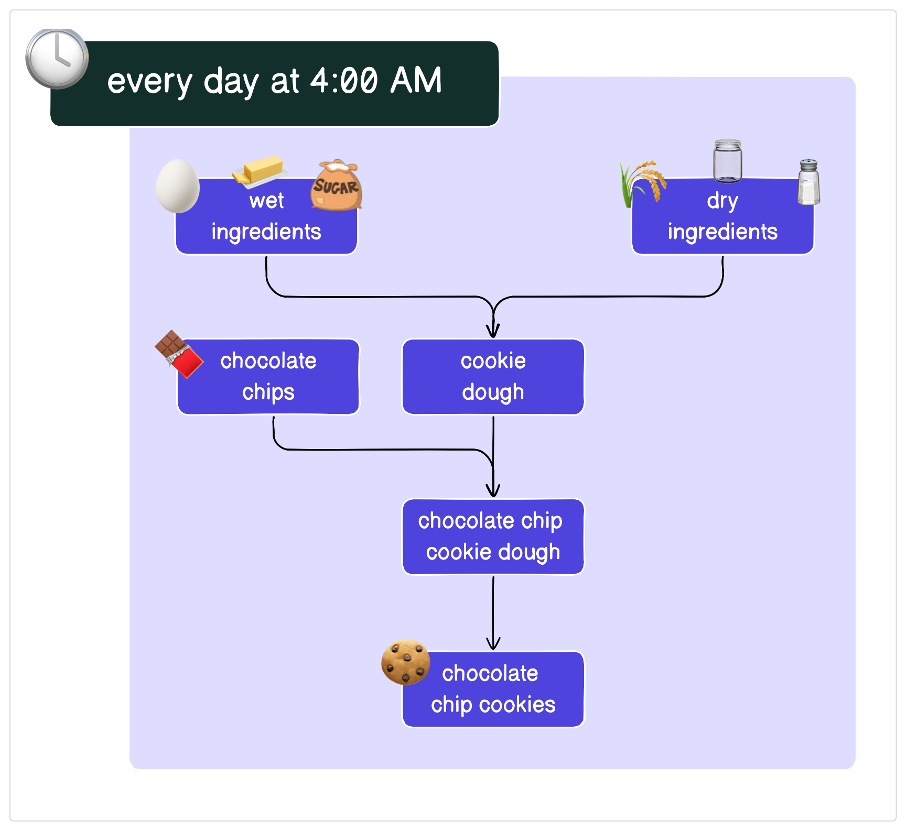
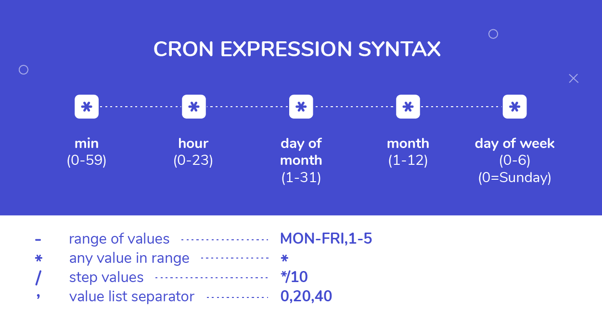
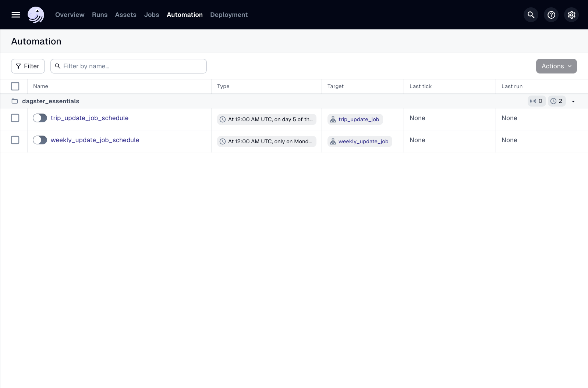
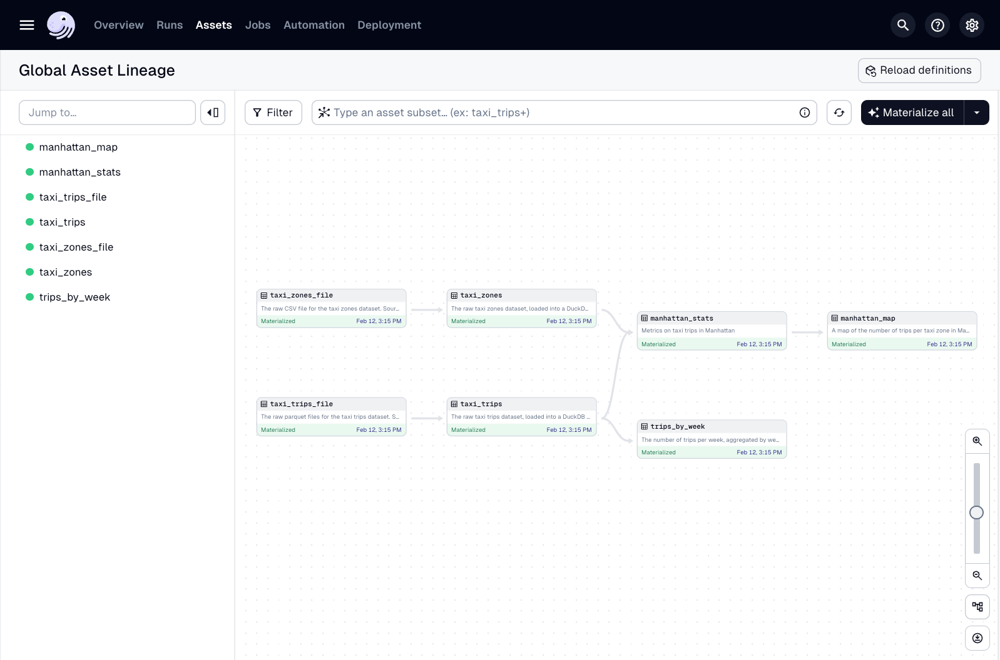
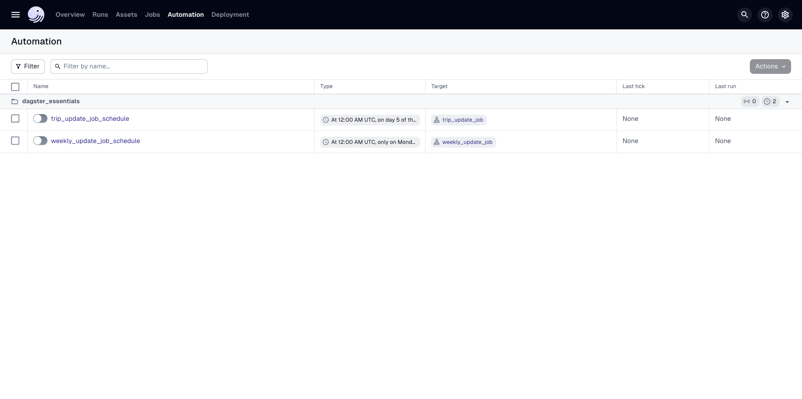
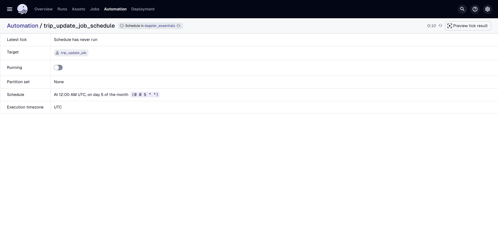
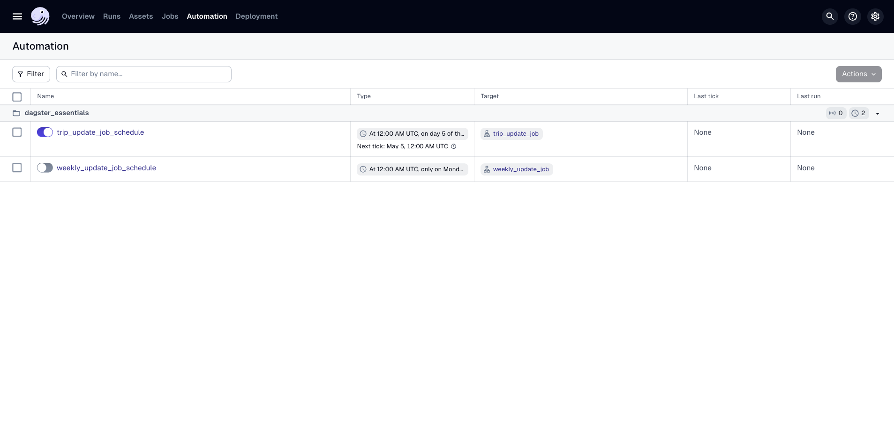
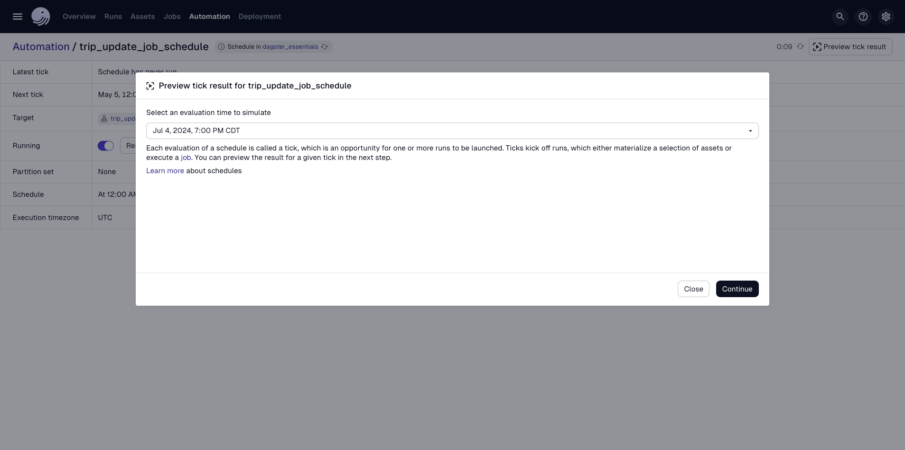
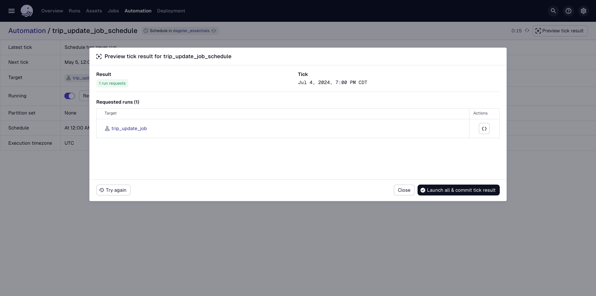
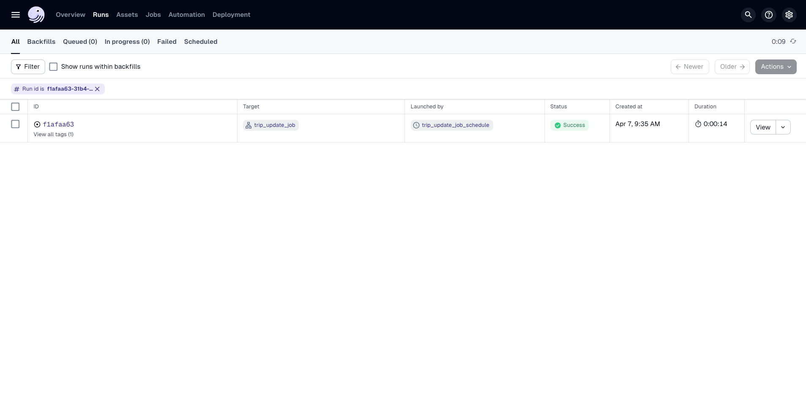

# 개요

지금까지 데이터 파이프라인을 구축하고 수동으로 구체화했습니다. 그러나 오케스트레이터의 주요 역할은 사람의 개입 없이 실행을 시작하는 것입니다.

이 강의에서는 자산의 정기적인 구체화를 자동화하는 가장 간단한 방법인 스케줄 사용법을 배웁니다.

# 스케줄이란 무엇입니까?

스케줄은 자산을 최신 상태로 유지하는 가장 전통적인 방법입니다. 스케줄은 파이프라인을 실행할 고정된 시간 간격(예: 매일, 매시간, 또는 월요일 오전 9시)을 정의합니다.

쿠키 예시로 돌아가서, 베이커리 사업이 정말 잘 되고 있다고 가정해 봅시다! 수요를 충족시키기 위해 모든 쿠키는 고객이 매일 아침 픽업하기 전에 갓 만들어져야 합니다. 대부분의 베이커리처럼 이것은 이른 아침에 발생하므로 매일 오전 4시에 빵 굽기를 시작하고 싶습니다.

예를 들어, 다음 이미지는 매일 오전 4시에 시작하여 구체화될 쿠키 자산을 강조합니다. 이는 매일 오전 4시에 **틱(tick)**이 생성되어 빵 굽기가 시작되어야 함을 나타냅니다. 틱은 **실행(run)**을 시작하며, 이는 베이킹 또는 자산 구체화의 단일 인스턴스입니다.



Dagster에서는 파이프라인이 얼마나 자주 실행되어야 하는지 표현하는 스케줄을 정의할 수 있습니다. Dagster는 이 스케줄을 사용하여 지정한 자산을 구체화하여 파이프라인을 실행합니다.

---

## 스케줄의 구성

스케줄을 사용하여 일련의 자산을 새로 고치는 데에는 여러 구성 요소가 있습니다. 이 강의에서 중점적으로 다룰 두 가지 구성 요소는 다음과 같습니다.

- 작업 (Job)
    
- Cron 표현식
    

다음으로, 스케줄의 각 부분을 살펴보고 대부분의 자산을 정기적으로 구체화하기 시작할 것입니다. 특히, 매월 자산을 업데이트하는 스케줄을 작성할 것입니다. 이는 NYC Taxi & Limo Commission (TLC)이 월별로 승차 데이터를 일괄적으로 공개하기 때문입니다.

### 작업 (Jobs)

대규모 자산 그래프를 사용할 때, 모든 실행에서 모든 자산을 구체화하고 싶지 않을 수 있습니다.

작업은 자산 그래프의 일부를 가져와 해당 자산의 구체화 실행에만 집중할 수 있는 Dagster 유틸리티입니다. Dagster에 대해 더 많이 배우면서 작업으로 구체화 및 실행을 사용자 지정하는 방법에 대해서도 더 많이 배울 것입니다. 예를 들어, 여러 작업을 사용하면 한 세트의 자산을 격리된 Kubernetes Pod에서 실행하고 다른 자산 선택을 단일 프로세스에서 실행할 수 있습니다.

자산과 리소스를 정의할 때 눈치챘을 수도 있겠지만, Dagster의 모범 사례는 정의를 자체 디렉토리/Python 하위 모듈에 저장하는 것입니다.

포함하려는 자산만 선택하려면 `AssetSelection` 클래스를 사용합니다. 이 클래스를 사용하면 코드 위치 전체에서 자산을 찾아 참조할 수 있습니다. 특히, 다음 두 가지 메서드를 사용할 것입니다.

- `AssetSelection.all()`: 코드 위치의 모든 자산 정의 목록을 제공합니다.
    
- `AssetSelection.assets([<string>, ...])`: 제공된 자산 키와 일치하는 자산 목록을 제공합니다.
    

자산 선택에 대한 자세한 내용은 [Dagster 문서의 자산 선택 구문 가이드](https://docs.dagster.io/concepts/assets/asset-selection-syntax)를 참조하십시오.

1. `dg`를 사용하여 `jobs.py`를 스캐폴딩합니다:
    
```bash
dg scaffold defs dagster.job jobs.py
```
    
2. `src/dagster_essentials/defs/jobs.py`에서 먼저 자산 선택을 정의해 봅시다. 다음 스니펫을 파일에 복사하여 붙여넣습니다.
    
```python
import dagster as dg
    
trips_by_week = dg.AssetSelection.assets("trips_by_week")
```
    
    이것은 `AssetSelection` 유틸리티를 사용하여 단일 자산인 `trips_by_week`를 참조합니다. 이것은 나머지 파이프라인과 함께 실행하고 싶지 않고 더 자주 실행해야 하므로 특별히 격리할 것입니다.
    
3. 다음으로, `AssetSelection.all()`을 사용하여 모든 자산을 선택한 다음 해당 선택을 빼서 `trips_by_week`를 생략하는 `trip_update_job`이라는 작업을 생성합니다.
    
```python
trip_update_job = dg.define_asset_job(
    name="trip_update_job",
    selection=dg.AssetSelection.all() - trips_by_week
)
```
    
4. 변경 사항을 저장하고 계속합니다.
    

`src/dagster_essentials/defs/jobs.py`의 최종 코드는 다음과 같아야 합니다.

```python
import dagster as dg

trips_by_week = dg.AssetSelection.assets("trips_by_week")

trip_update_job = dg.define_asset_job(
    name="trip_update_job",
    selection=dg.AssetSelection.all() - trips_by_week
)
```

### Cron 표현식

Cron 구문은 스케줄과 시간 간격이 정의되는 데 있어 표준입니다. Cron은 1970년대쯤 컴퓨터 프로그래밍에서 원래 스케줄링 유틸리티로 시작되었습니다.

이후 많은 스케줄러와 오케스트레이터가 cron 프로그램을 대체했지만, 스케줄과 간격을 표현하는 구문은 오늘날에도 여전히 사용됩니다. 이 구문을 Dagster에서 사용하여 자산을 구체화하는 스케줄을 정의할 수 있습니다.



다음 예시를 고려해 봅시다.

Code snippet

```
15 5 * * 1-5
```

이 표현식은 `매월 월요일부터 금요일까지 오전 5시 15분`으로 번역됩니다.

cron 스케줄을 더 쉽게 만들려면 [Crontab Guru](https://crontab.guru/)와 같은 온라인 도구를 사용할 수 있습니다. 이 도구를 사용하면 cron 표현식을 사람이 읽을 수 있는 형식으로 생성하고 설명하며, 표현식에서 생성된 실행 날짜를 테스트할 수 있습니다.

**참고**: 이 도구는 일반적인 cron 표현식 테스트에 유용하지만, Dagster에서 스케줄을 항상 테스트하여 결과가 예상대로인지 확인하십시오.

# 스케줄 생성

이제 스케줄을 구성하는 요소를 알았으니, 하나를 만들어 봅시다. 이를 위해 `ScheduleDefinition` 클래스를 사용할 것입니다.

`dg`를 다시 사용하여 스케줄을 스캐폴딩할 수 있습니다. 먼저 다음을 실행합니다.

```bash
dg scaffold defs dagster.schedule schedules.py
```

이렇게 하면 `src/dagster_essentials/defs/schedules.py`에 파일이 생성되며, 여기에 다음 스케줄 코드를 추가할 수 있습니다.

```python
import dagster as dg
from dagster_essentials.defs.jobs import trip_update_job

trip_update_schedule = dg.ScheduleDefinition(
    job=trip_update_job,
    cron_schedule="0 0 5 * *", # 매월 5일 자정에
)
```

이 코드가 하는 일을 살펴봅시다.

1. `ScheduleDefinition` 클래스를 임포트합니다.
    
2. `jobs` 모듈에서 `trip_update_job` 작업을 임포트합니다.
    
3. `ScheduleDefinition`을 사용하여 다음을 수행하는 스케줄을 생성했습니다.
    
    - `trip_update_job` 작업에 연결됩니다.
        
    - `0 0 5 * *`의 cron 표현식을 가집니다.
        

## 정의에 작업 및 스케줄 추가

자산과 유사하게, 스케줄과 작업은 모듈의 나머지 부분과 함께 `Definitions` 객체로 로드됩니다. 그리고 특정 리소스 키에 매핑해야 했던 리소스와 달리 작업과 스케줄은 자동으로 포함됩니다.

# Dagster UI의 작업 및 스케줄

다른 Dagster 정의와 마찬가지로 작업과 스케줄은 Dagster UI에서 보고 관리할 수 있습니다. UI에는 작업 및 스케줄이 사용되는 위치에 대한 정보와 켜고 끄는 기능이 포함되어 있습니다.

UI에서 작업 및 스케줄을 보고 관리하는 것 외에도 `dg dev`를 실행하면 `dagster-daemon`도 시작됩니다. `dagster-daemon`은 스케줄을 실행해야 하는지 또는 센서가 틱되어야 하는지 시간을 확인하는 등의 작업을 수행하는 장기 실행 프로세스이며, 이는 다음 강의에서 더 자세히 다룰 것입니다.

작업 및 스케줄이 표시되는지 확인하려면 계속하기 전에 **정의를 다시 로드**하십시오.

---

## UI의 작업

작업 액세스
UI에서 작업을 보려면 다음을 수행할 수 있습니다.  
  
- 상단 탐색 모음에서 **Jobs**를 클릭하거나  
- **Deployment**를 클릭한 다음 코드 위치를 클릭합니다. **Definitions** 탭을 클릭한 다음 측면 탐색 모음에서 **Jobs**를 클릭합니다.  
  
**Jobs** 탭의 테이블에는 다음 정보가 포함되어 있습니다.  
  
- **Name** - 작업의 이름  
- **Schedules/sensors** - 작업에 연결된 스케줄 및/또는 센서(활성화 여부 포함)  
- **Latest run** - 작업이 마지막으로 실행된 시점  
- **Run history** - 작업 실행에 대한 기록 정보



작업의 자산 보기
특정 작업을 선택하면 작업의 자산이 포함된 자산 그래프를 볼 수 있습니다.



---

## UI의 스케줄

스케줄 액세스
UI에서 스케줄을 보려면 다음을 수행할 수 있습니다.  
  
- 상단 탐색 모음에서 **Automation**을 클릭하거나  
- **Deployment**를 클릭한 다음 코드 위치를 클릭합니다. **Definitions** 탭을 클릭한 다음 측면 탐색 모음에서 **Schedules**를 클릭합니다.  
  
**Automation** 탭의 테이블에는 다음 정보가 포함되어 있습니다.  
  
- **Name** - 스케줄의 이름(스케줄이 현재 켜져 있는지 꺼져 있는지 나타내는 토글 포함)  
- **Type** - 스케줄의 빈도  
- **Target** - 스케줄이 실행할 작업  
- **Last tick** - 스케줄이 마지막으로 시작된 시점  
- **Last run** - 스케줄이 마지막으로 실행된 시점



스케줄 세부 정보 보기
스케줄에 대한 기록 정보를 보려면 **Schedules** 탭에서 스케줄을 클릭합니다. **Schedule details** 페이지에는 스케줄의 틱 및 실행 기록 보기가 포함되어 있습니다.



스케줄 시작 및 중지
스케줄을 시작하거나 중지하려면 페이지 왼쪽 상단 모서리에 있는 **스케줄 이름 옆의 토글**을 사용하십시오. 스케줄이 켜져 있으면 **Next tick**도 표시됩니다.



스케줄 테스트
스케줄을 테스트하려면 페이지 오른쪽 상단 모서리에 있는 **Test Schedule** 버튼을 사용하십시오. 이 기능은 스케줄이 자주 실행되지 않거나 스케줄이 제대로 작동하는지 확인하려는 경우 유용할 수 있습니다.



모의 평가 시간 선택
버튼을 클릭하면 모의 평가 시간을 선택하라는 메시지가 표시됩니다.  
  
**Evaluate**를 클릭하여 테스트를 실행합니다.



스케줄 테스트 결과 보기
테스트가 완료되면 평가 결과가 표시됩니다.


