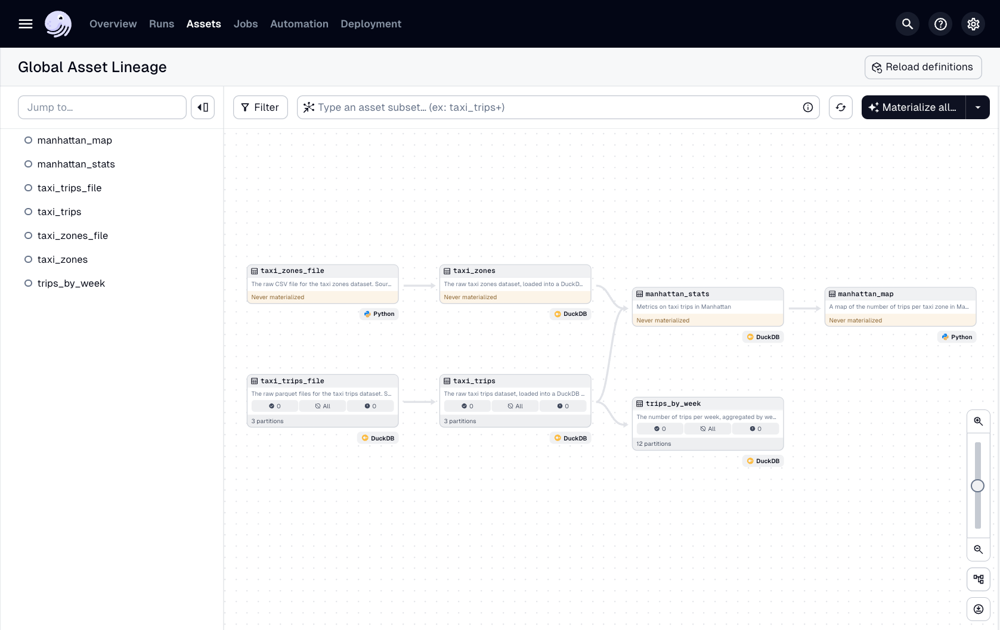
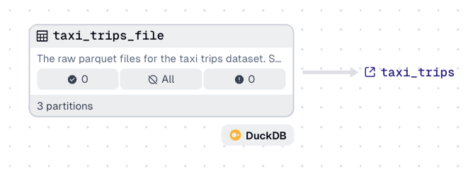
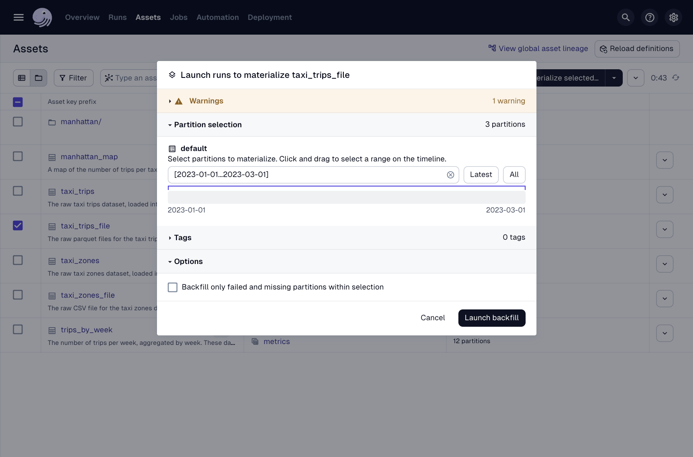
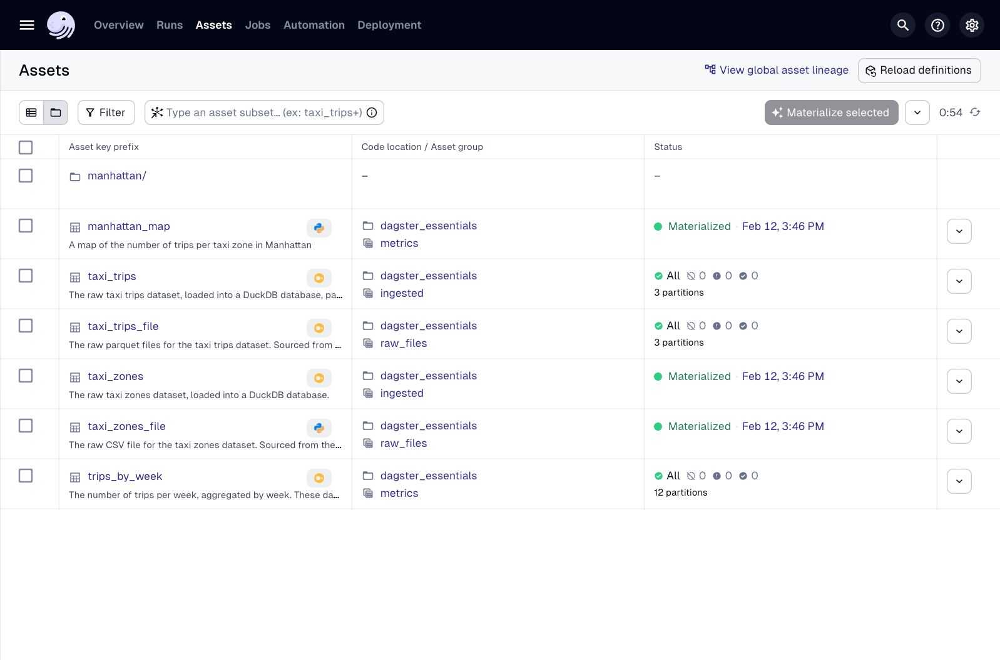
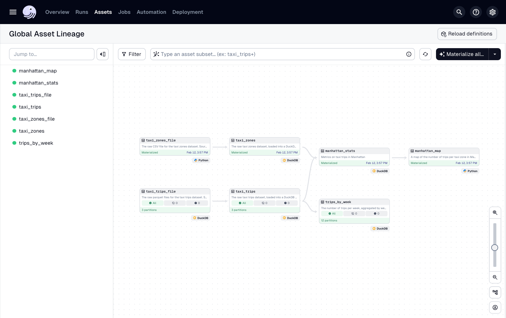
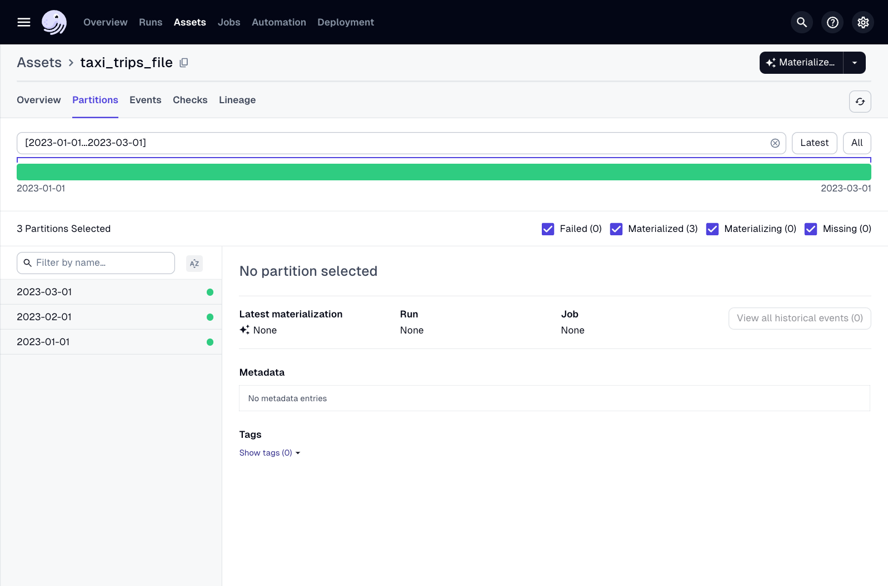

# 개요

이전 강의에서는 스케줄과 파이프라인 정기 실행에 대해 배웠습니다. 쿠키 비유로 돌아가서, 쿠키 사업이 번창하여 미리 주문을 받기 시작했다고 상상해 봅시다. 각 주문이 들어올 때마다 모든 쿠키를 만드는 것은 문제를 야기할 수 있습니다. 예를 들어, 오늘의 주문은 다음 주 주문보다 더 긴급합니다. 한편, 어떤 날에는 100개의 주문을 받을 수 있지만, 다른 날에는 주문이 없을 수도 있습니다.

따라서 주문을 픽업 예정일별로 묶습니다. 매일 아침, 당일 처리할 주문을 확인하고 해당 주문에 대한 쿠키만 만듭니다.

매일을 한 번에 살펴보는 것은 주문을 **분할(partitioning)**하는 것입니다. 이 강의에서는 데이터 자산을 분할하는 이유와 Dagster에서 택시 운행 데이터를 분할하여 이를 수행하는 방법을 배웁니다.

# 파티션과 백필이란 무엇입니까?

파티션과 백필이 정확히 무엇인지 논의하는 것으로 시작하겠습니다.

---

## 파티션

파티션은 데이터를 더 작고 사용하기 쉬운 청크로 분할하는 방법입니다. 데이터를 청크로 나누면 다음과 같은 이점을 얻을 수 있습니다.

- **비용 효율성**: 필요한 데이터만 실행하고 슬라이스에 대한 세분화된 제어를 얻을 수 있습니다. 예를 들어, 최근 주문은 핫 스토리지에 저장하고 오래된 주문은 더 저렴한 콜드 스토리지에 저장할 수 있습니다.
    
- **계산 속도 향상**: 대규모 데이터 세트를 더 작고 관리하기 쉬운 부분으로 나누어 쿼리 속도를 높일 수 있습니다.
    
- **확장성**: 데이터가 증가함에 따라 여러 서버 또는 스토리지 시스템에 분산하거나 한 번에 여러 파티션을 병렬로 실행할 수 있습니다.
    
- **동시 처리**: 병렬 처리로 계산 속도를 높여 데이터 처리 작업의 시간과 비용을 크게 줄입니다.
    
- **디버깅 속도 향상**: 더 큰 범위의 데이터를 실행하기 전에 개별 파티션에서 테스트합니다.
    

파티션은 정신적 모델이자 물리적 표현입니다. 쿠키 주문 예시에서 주문은 자산입니다. 우리의 정신적 모델과 Dagster UI에서는 주문을 얼마나 많은 일수로 분할하든 상관없이 단 하나의 `orders` 자산만 존재합니다. 물리적으로 저장되는 방식은 다를 수 있습니다. 쿠키 주문을 데이터베이스의 테이블로 나타낸다면 단일 `orders` 테이블로 표현될 수 있습니다. 그러나 Amazon Web Services (AWS) S3에 파케이 파일로 덤프되는 경우, 일/파티션당 새 파케이 파일을 생성하는 것이 모범 사례를 더 잘 준수할 것입니다.

요약하자면, Dagster의 파티션을 사용하면 개별 슬라이스에서 계산할 수 있지만, 저장소에서 읽거나 쓰는 방법은 유연합니다.

---

## 백필

백필은 특정 범위에 대해 작업을 실행하는 프로세스입니다. 예를 들어, 자산에서 아직 처리되지 않았거나 업데이트해야 하는 파티션에 대해 백필을 실행할 수 있습니다.

백필은 파이프라인을 처음 설정할 때 일반적입니다. 구체화하려는 자산에 자산을 최신 상태로 유지하기 위해 구체화해야 하는 과거 데이터가 있을 수 있습니다. 백필을 실행하는 또 다른 일반적인 이유는 자산에 대한 로직을 변경하고 새 로직으로 과거 데이터를 업데이트해야 할 때입니다.

# 파티션 생성

이전 강의에서는 자산을 구체화하기 위해 월별 및 주별 스케줄을 생성했습니다. 이제 택시 운행 데이터를 분할하고 예약된 모든 실행에서 새 파티션을 추가하도록 자산을 수정할 것입니다.

다행히 운행 데이터는 월별로 구분된 파케이 파일로 저장되지만, NYC OpenData에는 2009년까지 거슬러 올라가는 과거 택시 정보가 있습니다. 이 예시에서는 계산 리소스와 시간을 고려하여 2023년 초부터의 데이터만 수집하고 분할합니다.

---

## 파티션 정의 구성

자산을 분할하는 첫 번째 단계는 `PartitionDefinition`을 설정하는 것입니다. Dagster에는 날짜 분할 데이터에 대해 미리 구축된 시간별, 일별, 주별, 월별 파티션이 있습니다. Dagster의 프로젝트 구조에 대한 모범 사례에 따라 모든 파티션은 `partitions` 폴더에 있어야 합니다. 이 프로젝트에서는 모든 파티션이 `defs/partitions.py` 파일에 있을 것입니다.

또한, Dagster 프로젝트에는 `assets/constants.py` 파일이 있습니다. 이 파일에는 함께 사용될 때 데이터 파이프라인으로 가져올 운행 데이터의 날짜 범위를 정의하는 `START_DATE` 및 `END_DATE` 변수가 포함되어 있습니다.

이제 파티션 구축을 시작하는 데 필요한 모든 정보가 있으므로, 예시를 살펴보겠습니다.

```python
import dagster as dg
from dagster_essentials.defs.assets import constants

start_date = constants.START_DATE
end_date = constants.END_DATE

monthly_partition = dg.MonthlyPartitionsDefinition(
    start_date=start_date,
    end_date=end_date
)
```

Dagster의 `MonthlyPartitionDefinition`을 사용하여 `monthly_partition`이라는 파티션을 생성하고 시작 날짜와 종료 날짜를 사용하여 함수의 매개변수를 설정했습니다.

---

## 기존 저장소 정리

계속하기 전에 기존 자산의 Dagster 구체화 기록을 먼저 삭제해야 합니다. 이 작업은 로컬에서 실행할 때만 수행하면 됩니다.

터미널에서 `Ctrl+C`로 실행 중인 서버를 중지한 다음 `dagster dev` 명령을 다시 실행하여 다시 시작합니다. 이렇게 하면 이 기록이 삭제됩니다.

# 자산에 파티션 추가

이 섹션에서는 `src/dagster_essentials/defs/assets/trips.py`의 자산을 업데이트하여 파티션을 사용하도록 할 것입니다.

`taxi_trips_file`부터 시작하여 자산 코드는 현재 다음과 같아야 합니다.

```python
@dg.asset
def taxi_trips_file() -> None:
    """
      The raw parquet files for the taxi trips dataset. Sourced from the NYC Open Data portal.
    """
    month_to_fetch = '2023-03'
    raw_trips = requests.get(
        f"https://d37ci6vzurychx.cloudfront.net/trip-data/yellow_tripdata_{month_to_fetch}.parquet"
    )

    with open(constants.TAXI_TRIPS_TEMPLATE_FILE_PATH.format(month_to_fetch), "wb") as output_file:
        output_file.write(raw_trips.content)
```

이 자산에서 `month_to_fetch`는 2023년 3월의 운행 데이터를 검색하도록 `'2023-03'`으로 설정됩니다. `monthly_partition`을 사용하여 자산을 업데이트하여 파티션을 사용하여 3개월의 데이터를 검색할 수 있습니다.

자산에 파티션을 추가하려면:

1. `src/dagster_essentials/defs/assets/trips.py` 상단에 다음을 추가하여 `partitions` 폴더에서 `monthly_partition`을 임포트합니다.
    
```python
from dagster_essentials.defs.partitions import monthly_partition
```
    
2. 자산 데코레이터 (`@dg.asset`)에서 `partitions_def` 매개변수를 `monthly_partition`과 같게 추가합니다.
    
```python
@dg.asset(
    partitions_def=monthly_partition
)
```
    
3. Dagster에서 `context` 인수는 현재 구체화에 대한 메타데이터를 제공합니다. 이에 액세스하려면 자산 정의 함수의 첫 번째 인수로 포함하십시오. 함수 서명에 `dg.AssetExecutionContext`를 추가하여 이에 대한 타입 힌트를 활성화할 수 있습니다. 예를 들어, 업데이트된 자산 정의는 다음과 같아야 합니다.
    
```python
@dg.asset(
    partitions_def=monthly_partition
)
def taxi_trips_file(context: dg.AssetExecutionContext) -> None:
```
    
    **참고**: `context` 인수는 파티션에만 국한되지 않습니다. 그러나 Dagster University에서 처음 사용하는 것입니다. `context` 인수는 Dagster가 자산을 실행하고 구체화하는 방법에 대한 정보를 제공합니다. 예를 들어, Dagster가 어떤 파티션을 구체화하고 있는지, 어떤 작업이 구체화를 트리거했는지, 또는 이전 구체화에 어떤 메타데이터가 첨부되었는지 확인할 수 있습니다.
    
4. 원래 자산 코드에서 로직은 2023년 3월 데이터 (`'2023-03'`)를 특별히 가져오도록 하드코딩되었습니다. `context` 인수의 `partition_key` 속성을 사용하여 특정 파티션의 월 데이터를 동적으로 가져옵니다.
    
```python
@dg.asset(
    partitions_def=monthly_partition
)
def taxi_trips_file(context: dg.AssetExecutionContext) -> None:
    partition_date_str = context.partition_key
```
    
5. NYC OpenData 소스 시스템에서 택시 운행 파일은 `YYYY-MM` 형식으로 구성됩니다. 그러나 `context.partition_key`는 구체화되는 파티션의 날짜를 `YYYY-MM-DD` 형식의 문자열로 제공합니다. 소스 시스템에서 예상하는 형식과 일치하도록 문자열을 슬라이스하고 `month_to_fetch` 변수의 기존 선언을 대체합니다.
    
```python
@dg.asset(
    partitions_def=monthly_partition
)
def taxi_trips_file(context: dg.AssetExecutionContext) -> None:
    partition_date_str = context.partition_key
    month_to_fetch = partition_date_str[:-3]
```
    

위 단계를 따른 후 `taxi_trips_file` 자산은 아래 코드 스니펫과 유사해야 합니다.

```python
from dagster_essentials.defs.partitions import monthly_partition

@dg.asset(
    partitions_def=monthly_partition
)
def taxi_trips_file(context: dg.AssetExecutionContext) -> None:
  """
      The raw parquet files for the taxi trips dataset. Sourced from the NYC Open Data portal.
  """

  partition_date_str = context.partition_key
  month_to_fetch = partition_date_str[:-3]

  raw_trips = requests.get(
      f"https://d37ci6vzurychx.cloudfront.net/trip-data/yellow_tripdata_{month_to_fetch}.parquet"
  )

  with open(constants.TAXI_TRIPS_TEMPLATE_FILE_PATH.format(month_to_fetch), "wb") as output_file:
      output_file.write(raw_trips.content)
```

# 날짜 기반 파티션으로 스케줄 생성

이전 강의에서는 대부분의 자산을 업데이트하는 `trip_update_job` 작업을 생성했습니다. 이 작업은 매월 5일 자정에 자산을 업데이트하는 스케줄에 설정되었습니다.

이제 관련 자산을 분할했으므로, 스케줄을 변경하여 최신 월의 데이터만 가져오고 자산 전체를 새로 고치지 않도록 할 수 있습니다. 이는 모범 사례이며 새로운 데이터만 수집하도록 제한하여 계산 시간을 절약합니다.

현재 `jobs.py`의 `trip_update_job`은 다음과 같아야 합니다.

```python
trips_by_week = dg.AssetSelection.assets("trips_by_week")

trip_update_job = dg.define_asset_job(
    name="trip_update_job",
    selection=dg.AssetSelection.all() - trips_by_week
)
```

작업에 파티션을 추가하려면 다음 변경 사항을 적용하십시오.

1. `partitions`에서 `monthly_partition`을 임포트합니다.
    
```python
from dagster_essentials.defs.partitions import monthly_partition
```
    
2. 작업에 `partitions_def` 매개변수를 `monthly_partition`과 같게 추가합니다.
    
```python
partitions_def=monthly_partition,
```
    

작업은 이제 다음과 같아야 합니다.

```python
import dagster as dg
from dagster_essentials.defs.partitions import monthly_partition

trips_by_week = dg.AssetSelection.assets("trips_by_week")

trip_update_job = dg.define_asset_job(
    name="trip_update_job",
    partitions_def=monthly_partition, # 파티션이 여기에 추가됨
    selection=dg.AssetSelection.all() - trips_by_week
)
```

# Dagster UI의 파티션 및 백필

이제 파티션을 생성하고, 자산에서 해당 파티션을 사용하고, 파티션이 있는 작업을 업데이트하여 분할된 스케줄을 생성했으므로 Dagster UI에서 어떻게 보이는지 확인해 봅시다. `dagster dev`가 여전히 실행 중인 경우 파티션이 표시되도록 **정의를 다시 로드**해야 합니다.

---

## 파티션을 사용하여 자산 보기 및 구체화

1단계
**Assets**로 이동한 다음 **Asset lineage**로 이동합니다. 자산 그래프에서 보듯이 `taxi_trips` 자산은 이제 파티션 정보를 가집니다.



2단계
`taxi_trips_file` 자산을 자세히 살펴보면 파티션에 포함된 3개월을 나타내는 3개의 파티션이 있습니다.

- **✓⃝ 0** - 0개의 파티션이 성공적으로 구체화되었음을 나타냅니다.  
- **⃠ All** - 모든 (세 개의) 파티션이 아직 구체화되지 않았음을 나타냅니다.  
- **!⃝ 0** - 실패한 파티션이 0개임을 나타냅니다.  
  
이 정보는 자산의 상태를 빠르게 파악하는 데 유용합니다.



3단계
**Materialize all**을 클릭하면 파티션 정보가 포함된 팝업이 표시됩니다.  
  
이를 통해 구체화할 파티션을 선택하거나 한 번에 여러 파티션을 구체화할 수 있는 백필을 시작할 수 있습니다.



---

## 백필 시작

1단계
백필을 시작하려면 마지막 섹션의 팝업 창에서 **Launch backfill**을 클릭합니다. 기본적으로 날짜 범위는 선택되지 않습니다. 전체 날짜 범위를 선택하려면 **All** 버튼을 클릭합니다.  
  
다음으로 **Overview > Backfills**를 클릭하여 백필 정보를 봅니다.


2단계
백필을 클릭하여 세부 정보 페이지를 엽니다. 이 페이지에서는 백필에서 구체화되는 각 자산과 해당 상태를 볼 수 있습니다.




3단계
**Global Asset Lineage** 페이지(**Assets > Asset lineage**)로 다시 이동합니다.  
  
자산 그래프에서 분할된 자산과 분할되지 않은 자산의 상태가 업데이트된 것을 볼 수 있습니다.



---

## 자산 파티션 세부 정보 보기
1단계
자산 그래프에서 `taxi_trips` 자산을 클릭하고 **Asset Catalog**에서 봅니다. 각 월은 검사할 수 있는 파티션으로 나열됩니다.



2단계
특정 파티션을 보려면 **2023-03-01**을 선택합니다. 여기에서 원본 데이터에 대한 lineage를 포함하여 해당 자산의 특정 파티션에 대한 정보를 볼 수 있습니다. 이 경우 `taxi_trips_file`입니다.


# 요약

이 강의에서는 데이터를 시간별로 분할했습니다. 그러나 Dagster를 사용하면 모든 차원으로 데이터를 분할할 수 있습니다. 정적 차원 목록 또는 로직을 정의하는 동적 목록으로 분할할 수 있습니다.