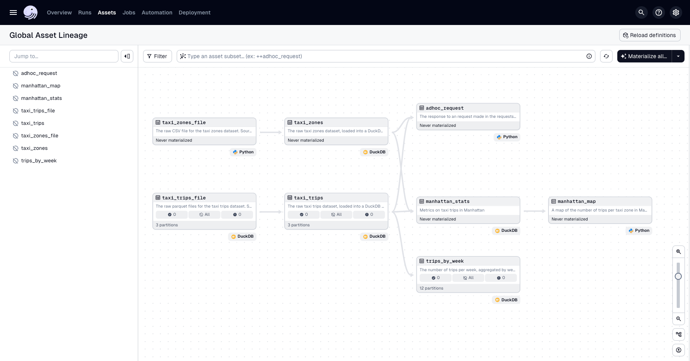
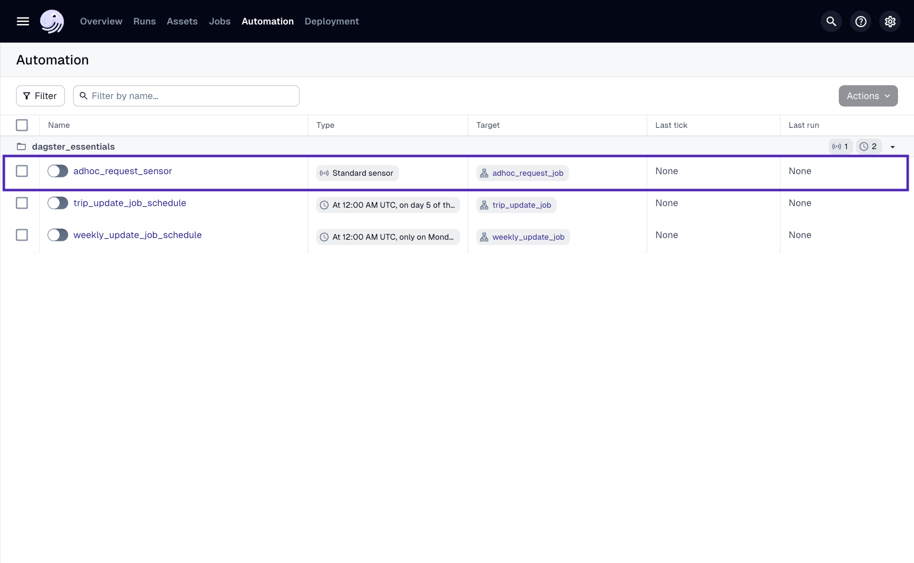
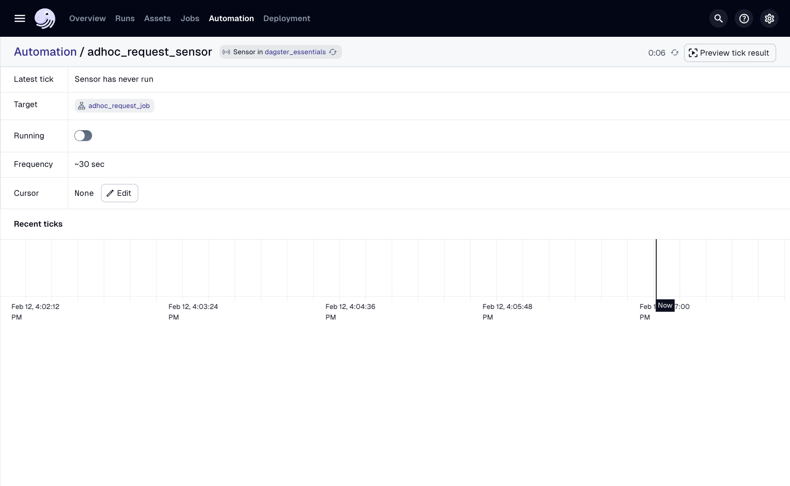
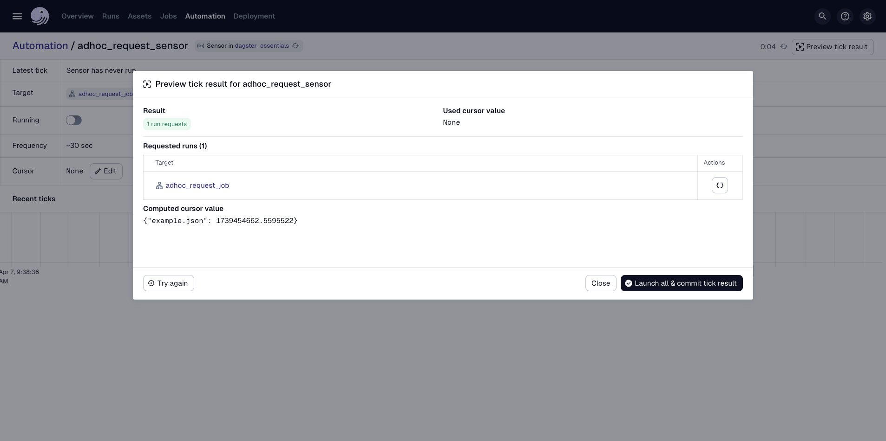
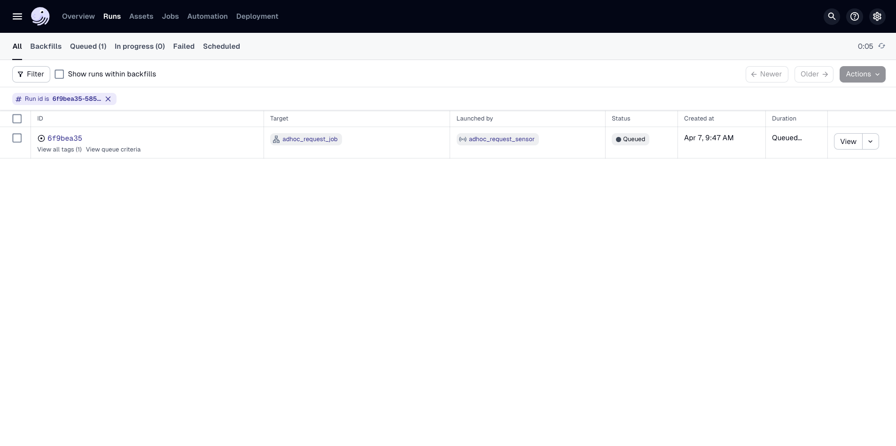
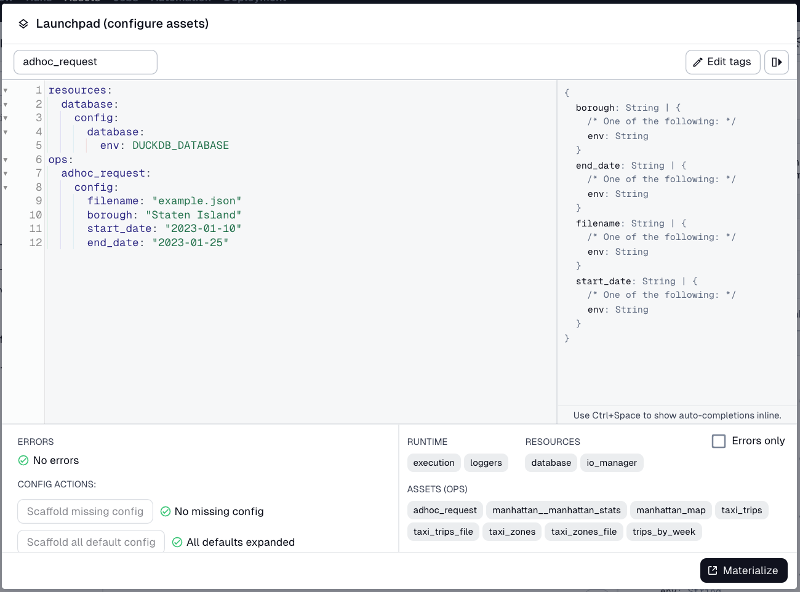
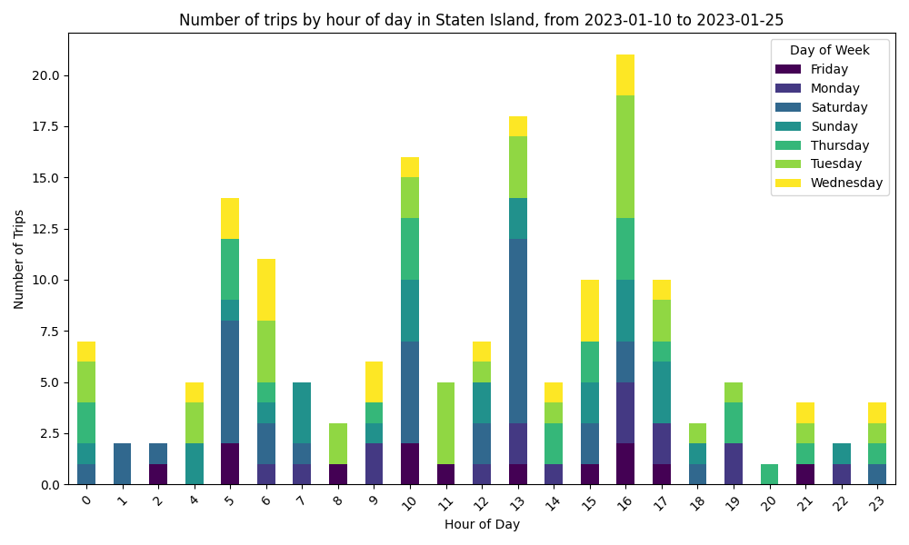

# 개요

7강에서는 매월 파이프라인을 실행하는 스케줄을 작성했습니다. 스케줄을 사용하는 것은 Dagster에서 자산 구체화를 트리거하는 다양한 방법 중 하나일 뿐입니다.

이벤트 기반 실행은 실제 생활에서 흔합니다. 제과점을 운영할 때 재료를 배달받아 주방으로 옮겨야 할 수 있습니다. 쿠키를 굽는 것과 마찬가지로 데이터 파이프라인도 이벤트에 반응하고 대응해야 할 수 있습니다. Dagster에서는 이러한 상황에 대비하여 파이프라인을 자동화하기 위해 **센서**를 사용할 수 있습니다.

# 센서란 무엇입니까?

센서는 특정 이벤트를 프로그래밍 방식으로 모니터링하고 이를 기반으로 실행을 생성하는 방법입니다. 센서는 실행을 시작해야 하는지 여부를 알기 위해 논리를 지속적으로 확인하고 실행합니다. 기본적으로 Dagster의 센서는 30초마다 폴링합니다. 센서는 다음과 같은 상황에서 자산을 구체화하려는 경우에 일반적으로 사용됩니다:

- 새 파일이 Amazon S3와 같은 특정 위치에 도착한 경우
    
- 다른 자산이 다른 곳에서 구체화된 경우
    
- 외부 시스템에서 작업자 슬롯을 확보한 경우
    

---

## 이 강의에서

이 강의에서는 가상의 시나리오를 가정합니다. 택시 운행 보고서에 대한 이해관계자들이 특정 시간 범위 동안 특정 자치구(예: 맨해튼 또는 브루클린)에서 얼마나 많은 운행이 발생하는지에 대한 임시적이고 탐색적인 분석을 수행하고 있다고 가정합니다. 그들은 다음과 같은 질문에 답하고 싶어 합니다.

> "12월 연휴가 맨해튼의 출퇴근 시간 동안 승차율에 어떤 영향을 미칩니까?"

그들은 비슷한 질문을 계속하고 있으며, 이는 많은 시간과 대역폭을 소모하고 있습니다. 따라서 이해관계자를 위한 셀프 서비스 보고를 가능하게 하기 위해 이 프로세스를 자동화하려고 합니다.

요청과 함께 구조화된 JSON을 생성하고 이를 Dagster 프로젝트의 `data/requests` 디렉토리에 삽입하는 요청 접수 양식을 만들었습니다. 이제 센서가 들어오는 새 요청을 수신하도록 하여 이러한 임시 요청에 대한 응답을 자동화할 것입니다. 요청을 나타내는 새 JSON 파일이 디렉토리에 도착하면 센서가 트리거되고 자산을 구체화합니다. 센서가 디렉토리의 모든 업데이트된 파일에 대한 보고서를 이미 구체화한 경우 센서는 구체화를 시작하지 않습니다.

위 요구 사항을 충족하기 위해 다음을 수행합니다.

1. 요청당 자산 구체화를 사용자 지정하는 방법을 작성합니다.
    
2. 요청당 보고서를 생성하는 새 자산을 작성합니다.
    
3. 들어오는 요청을 수신하는 센서를 추가합니다.
    

# 자산 생성 구성

자산 생성 구성은 센서에만 해당되는 것은 아니지만, 자산을 구체화할 때 실행 방식에 따라 로직의 일부를 사용자 지정해야 할 수 있습니다. 예를 들어, 독자의 이름으로 독자에게 보낼 이메일을 사용자 지정하고 독자의 주소로 보낼 수 있습니다.

이러한 맥락에서 이해관계자가 요청한 자치구 및 날짜 범위에 따라 자산 구체화를 사용자 지정하려고 합니다.

이러한 구성은 일반적으로 실행 수준에서 추가되며 스케줄 및 센서에 전달될 수 있습니다. 또한 수동으로 실행을 시작할 때 Dagster UI에서 실행을 사용자 지정할 수 있습니다.

자산 구체화를 사용자 지정하는 데 사용할 수 있는 새 구성을 작성해 보겠습니다.

1. `dg`를 사용하여 새 자산 위치를 스캐폴딩합니다:
    
```bash
dg scaffold defs dagster.asset assets/requests.py
```
    
2. 파일 (`defs/assets/requests.py`) 상단에 다음 임포트를 추가합니다:
    
```python
import dagster as dg
```
    
3. 다음으로, 다음 `str` 속성을 사용하는 `AdhocRequestsConfig`라는 새 서브클래스를 정의합니다:
    
    - `filename`: 요청 JSON 파일의 이름
        
    - `borough`: 분석할 뉴욕시 자치구. 값은 `Manhattan`, `Brooklyn`, `Queens`, `Bronx` 또는 `Staten Island` 중 하나여야 합니다.
        
    - `start_date`: 요청 날짜 범위의 시작일 (YYYY-MM-DD 형식)
        
    - `end_date`: 요청 날짜 범위의 종료일 (YYYY-MM-DD 형식)
        

`requests.py` 파일은 아래 코드 스니펫과 같아야 합니다:

```python
import dagster as dg

class AdhocRequestConfig(dg.Config):
    filename: str
    borough: str
    start_date: str
    end_date: str
```

`Config`는 사용자 지정 구성을 만들 때 기본 클래스로 사용됩니다.

# 센서에 의해 트리거되는 자산 생성

이제 자산이 어떻게 구체화될 수 있는지 정의했으므로, 임시 보고서 자산을 만들어 봅시다.

1. `defs/assets/requests.py`에 다음 임포트를 추가합니다:
    
```python
import dagster as dg
from dagster_duckdb import DuckDBResource
    
import matplotlib.pyplot as plt
    
from dagster_essentials.defs.assets import constants
```
    
2. 다음 인수를 사용하여 `adhoc_request`라는 새 자산을 생성합니다:
    
    1. `config`, `AdhocRequestConfig`로 타입 주석이 달린
        
    2. 종속성으로 `taxi_zones` 및 `taxi_trips` 자산
        
    3. `database`, DuckDB를 쿼리할 수 있도록 `DuckDBResource`로 타입 주석이 달린
        
    
    이 시점에서 자산은 다음과 같아야 합니다:
    
```python
@dg.asset(
    deps=["taxi_zones", "taxi_trips"]
)
def adhoc_request(config: AdhocRequestConfig, database: DuckDBResource) -> None:
```
    
3. 보고서가 파일에 작성될 때 요청과 유사한 이름을 가져야 합니다. `defs/assets/constants.py`에 `REQUEST_DESTINATION_TEMPLATE_FILE_PATH`라는 템플릿이 제공되었습니다.
    
    템플릿을 사용하고 요청 파일 이름에서 `.json` 확장자를 제거하여 파일 이름을 생성합니다:
    
```python
file_path = constants.REQUEST_DESTINATION_TEMPLATE_FILE_PATH.format(config.filename.split('.')[0])
```
    
4. 다음으로, 다음을 수행하는 SQL 쿼리를 작성합니다:
    
    - 주어진 날짜 범위 동안 명명된 자치구에서 시작되지 않은 운행을 필터링합니다
        
    - 운행이 시작된 요일 및 시간별로 데이터를 집계합니다
        
    
    예시:
    
```python
query = f"""
  select
    date_part('hour', pickup_datetime) as hour_of_day,
    date_part('dayofweek', pickup_datetime) as day_of_week_num,
    case date_part('dayofweek', pickup_datetime)
      when 0 then 'Sunday'
      when 1 then 'Monday'
      when 2 then 'Tuesday'
      when 3 then 'Wednesday'
      when 4 then 'Thursday'
      when 5 then 'Friday'
      when 6 then 'Saturday'
    end as day_of_week,
    count(*) as num_trips
  from trips
  left join zones on trips.pickup_zone_id = zones.zone_id
  where pickup_datetime >= '{config.start_date}'
  and pickup_datetime < '{config.end_date}'
  and pickup_zone_id in (
    select zone_id
    from zones
    where borough = '{config.borough}'
  )
  group by 1, 2
  order by 1, 2 asc
"""
    ```
    
5. 다음으로, DuckDB에서 쿼리를 실행하고 결과를 DataFrame으로 저장합니다:
    
```python
with database.get_connection() as conn:
    results = conn.execute(query).fetch_df()
```
    
6. 이제 쿼리 데이터가 `results` 변수에 DataFrame으로 저장되었으므로, Matplotlib 라이브러리를 사용하여 요일별로 계층화된 자치구에 대한 각 시간의 운행 빈도를 시각화합니다:
    
```python
fig, ax = plt.subplots(figsize=(10, 6))

# Pivot data for stacked bar chart
results_pivot = results.pivot(index="hour_of_day", columns="day_of_week", values="num_trips")
results_pivot.plot(kind="bar", stacked=True, ax=ax, colormap="viridis")

ax.set_title(f"Number of trips by hour of day in {config.borough}, from {config.start_date} to {config.end_date}")
ax.set_xlabel("Hour of Day")
ax.set_ylabel("Number of Trips")
ax.legend(title="Day of Week")

plt.xticks(rotation=45)
plt.tight_layout()
```
    
7. 마지막으로, 이전에 선언한 `file_path` 변수로 지정된 대상 파일에 보고서를 저장합니다:
    
```python
plt.savefig(file_path)
plt.close(fig)
```
    

`requests.py` 파일이 아래 코드와 같은지 확인하십시오:

```python
import dagster as dg
from dagster_duckdb import DuckDBResource

import matplotlib.pyplot as plt

from dagster_essentials.defs.assets import constants

class AdhocRequestConfig(dg.Config):
    filename: str
    borough: str
    start_date: str
    end_date: str

@dg.asset(
    deps=["taxi_zones", "taxi_trips"]
)
def adhoc_request(config: AdhocRequestConfig, database: DuckDBResource) -> None:
    """
      The response to an request made in the `requests` directory.
      See `requests/README.md` for more information.
    """

    # strip the file extension from the filename, and use it as the output filename
    file_path = constants.REQUEST_DESTINATION_TEMPLATE_FILE_PATH.format(config.filename.split('.')[0])

    # count the number of trips that picked up in a given borough, aggregated by time of day and hour of day
    query = f"""
        select
          date_part('hour', pickup_datetime) as hour_of_day,
          date_part('dayofweek', pickup_datetime) as day_of_week_num,
          case date_part('dayofweek', pickup_datetime)
            when 0 then 'Sunday'
            when 1 then 'Monday'
            when 2 then 'Tuesday'
            when 3 then 'Wednesday'
            when 4 then 'Thursday'
            when 5 then 'Friday'
            when 6 then 'Saturday'
          end as day_of_week,
          count(*) as num_trips
        from trips
        left join zones on trips.pickup_zone_id = zones.zone_id
        where pickup_datetime >= '{config.start_date}'
        and pickup_datetime < '{config.end_date}'
        and pickup_zone_id in (
          select zone_id
          from zones
          where borough = '{config.borough}'
        )
        group by 1, 2
        order by 1, 2 asc
    """

    with database.get_connection() as conn:
        results = conn.execute(query).fetch_df()

    fig, ax = plt.subplots(figsize=(10, 6))

    # Pivot data for stacked bar chart
    results_pivot = results.pivot(index="hour_of_day", columns="day_of_week", values="num_trips")
    results_pivot.plot(kind="bar", stacked=True, ax=ax, colormap="viridis")

    ax.set_title(f"Number of trips by hour of day in {config.borough}, from {config.start_date} to {config.end_date}")
    ax.set_xlabel("Hour of Day")
    ax.set_ylabel("Number of Trips")
    ax.legend(title="Day of Week")

    plt.xticks(rotation=45)
    plt.tight_layout()

    plt.savefig(file_path)
    plt.close(fig)
```

# 작업 생성

다음으로, 새 `adhoc_request` 자산을 구체화하는 작업을 생성합니다. 이 작업은 7강의 작업과 거의 동일합니다.

`defs/jobs.py` 파일로 이동하여 `trip_update_job` 위에 다음 줄을 추가하여 임시 요청에 대한 작업을 생성합니다:

```python
adhoc_request = dg.AssetSelection.assets(["adhoc_request"])

adhoc_request_job = dg.define_asset_job(
    name="adhoc_request_job",
    selection=adhoc_request,
)
```

기존 작업인 `trip_update_job`도 업데이트해야 합니다. 이 작업이 사용하는 초기 `AssetSelection.all()`은 새 `adhoc_request` 자산을 선택하지만, 우리는 그것을 원하지 않습니다. 자산 선택에서 `trips_by_week` 자산을 생략한 것처럼, 아래와 같이 `adhoc_request` 자산도 생략해 봅시다:

```python
trip_update_job = dg.define_asset_job(
    name="trip_update_job",
    partitions_def=monthly_partition,
    selection=dg.AssetSelection.all() - trips_by_week - adhoc_request
)
```

# 센서 구축

새 자산과 구성이 설정되었으므로, `adhoc_request` 자산을 구체화하여 이벤트에 반응하는 센서를 만들어 봅시다.

높은 수준의 개요로, `data/requests` 디렉토리의 JSON 파일로 새 요청을 수신하고, 파일에 유효한 값이 있다고 가정하고, 요청의 값으로 구성된 `adhoc_request_job`의 실행을 트리거합니다. 이 실행의 구성은 `adhoc_request` 자산이 구체화되는 동안 사용할 수 있습니다.

---

## 센서 커서

그러나 구축에 뛰어들기 전에 센서 **커서**에 대해 잠시 논의해 봅시다.

커서는 센서의 상태를 관리하는 데 사용되는 저장된 값입니다. 구축할 센서는 커서를 사용하여 이미 보고서를 만든 요청을 추적합니다. 커서의 다른 사용 사례는 마지막으로 가져온 레코드의 ID를 저장하거나 계산이 마지막으로 중단된 위치를 저장하는 것입니다.

센서는 `data/requests` 디렉토리의 모든 파일 이름을 검색하고, 이미 살펴보고 상태 저장 커서에 저장한 파일 목록과 비교하고, 새 파일로 커서를 업데이트하고, 각 파일에 대해 새 실행을 시작합니다.

대부분의 센서는 유사한 수명 주기를 따릅니다.

1. 커서 읽기
    
2. 새 관찰을 수행하고 커서와 비교
    
3. 변경 사항이 있으면 각 새 변경 사항에 대해 실행
    
4. 변경 사항을 반영하도록 커서 업데이트
    

---

## 센서 작성

이제 커서가 설명되었으므로 센서 작성을 시작해 봅시다.

1. 센서 위치를 스캐폴딩합니다:
    
```bash
dg scaffold defs dagster.sensor sensors.py
```
    
2. 모든 것이 올바른지 확인합니다:
    
```bash
dg check defs
```
    
3. 파일 상단에 다음 임포트를 추가합니다:
    
```python
import dagster as dg
import os
import json
    
from dagster_essentials.defs.jobs import adhoc_request_job
```
    
    이러한 임포트를 자세히 살펴보겠습니다:
    
    - `os` 표준 라이브러리는 `data/requests` 디렉토리의 파일을 살펴보는 데 사용됩니다.
        
    - `json` 표준 라이브러리는 필요에 따라 요청의 JSON 파일을 읽는 데 사용됩니다.
        
    - `adhoc_request_job`은 센서가 이 작업에서 실행을 생성하도록 지정하는 데 사용됩니다.
        
4. 센서를 정의하려면 `context`를 매개변수로 사용하는 새 함수 정의를 생성합니다. 자산 정의에 `AssetExecutionContext` 타입의 컨텍스트 인수가 있었던 것과 유사하게, 센서 정의에도 현재 실행 중인 센서에 대한 정보와 메타데이터를 제공하기 위한 유사한 `SensorEvaluationContext`가 있습니다. 코드는 아래 스니펫과 같아야 합니다:
    
```python
import dagster as dg
    
@dg.sensor
def adhoc_request_sensor(context: dg.SensorEvaluationContext):
```
    
5. `@dg.sensor` 데코레이터로 함수에 주석을 달고 `adhoc_request_job`을 작업 매개변수에 대한 인수로 전달합니다. 이 시점에서 코드는 다음과 같아야 합니다:
    
```python
@dg.sensor(
    job=adhoc_request_job
)
def adhoc_request_sensor(context: dg.SensorEvaluationContext):
```
    
6. 함수의 본문을 채워 봅시다. 센서가 관찰할 디렉토리인 `data/requests` 디렉토리로 확인되는 변수를 생성합니다:
    
```python
@dg.sensor(
    job=adhoc_request_job
)
def adhoc_request_sensor(context: dg.SensorEvaluationContext):
    PATH_TO_REQUESTS = os.path.join(
    os.path.dirname(__file__),
     "../../../",
    "data/requests",
)
```
    
7. 다음으로, 커서를 정의합니다. 다음 코드를 센서의 함수 본문에 복사하여 붙여넣고, 그 다음 어떤 작업을 하는지 논의해 봅시다:
    
```python
previous_state = json.loads(context.cursor) if context.cursor else {}
current_state = {}
```
    
    이것이 무엇을 하는지 잠시 살펴보겠습니다. `context` 인수는 센서가 이미 살펴본 내용을 상태로 관리하는 데 사용되는 커서를 저장합니다. 센서가 이전에 틱을 실행했는지 여부에 따라 커서가 존재할 수도 있고 존재하지 않을 수도 있습니다.
    
    이를 수용하기 위해 `context.cursor`가 존재하는지 확인하고 존재하면 해당 문자열 값을 JSON으로 변환합니다. 또한 `current_state`를 빈 객체로 초기화하며, 이는 디렉토리를 읽은 후 커서를 재정의하는 데 사용됩니다.
    
8. 다음으로, `runs_to_request`라는 빈 목록을 초기화합니다. 이는 실행을 생성하려는 새 요청을 저장하는 데 사용됩니다:
    
```python
runs_to_request = []
```
    
9. 다음을 센서에 복사하여 붙여넣은 다음, 어떤 작업을 하는지 논의해 봅시다:
    
```python
for filename in os.listdir(PATH_TO_REQUESTS):
	file_path = os.path.join(PATH_TO_REQUESTS, filename)
	if filename.endswith(".json") and os.path.isfile(file_path):
		last_modified = os.path.getmtime(file_path)

		current_state[filename] = last_modified

		# if the file is new or has been modified since the last run, add it to the request queue
		if filename not in previous_state or previous_state[filename] != last_modified:
			with open(file_path, "r") as f:
				request_config = json.load(f)

				runs_to_request.append(dg.RunRequest(
					run_key=f"adhoc_request_{filename}_{last_modified}",
					run_config={
						"ops": {
							"adhoc_request": {
								"config": {
									"filename": filename,
									**request_config
								}
							}
						}
					}
				))
```
    
    **참고**: 센서에 붙여넣을 때 들여쓰기가 올바른지 확인하십시오. 그렇지 않으면 Python 오류가 발생합니다.
    
    이 예시는 다음을 수행합니다:
    
    - `os.listdir`을 사용하여 `data/requests` 디렉토리를 반복하여 모든 JSON 파일을 살펴보고 이전에 `previous_state`에서 업데이트되었거나 살펴봤는지 확인합니다.
        
    - 파일이 업데이트되었거나 보고서가 이전에 실행되지 않은 경우 파일에 대한 `RunRequest`를 생성합니다.
        
    - 파일 이름과 마지막으로 수정된 시간을 포함하는 고유한 `run_key`를 구성합니다.
        
    - `run_config` 인수를 사용하여 `run_key`를 `RunRequest`의 구성으로 전달합니다. `adhoc_request` 키를 사용하면 `adhoc_request` 자산이 제공된 구성을 사용해야 함을 지정합니다.
        
10. 센서는 트리거할 실행과 새 커서와 같은 센서에 대한 모든 정보가 포함된 `SensorResult`를 반환할 것으로 예상합니다. 센서 함수 끝에 다음을 추가합니다:
    
```python
return dg.SensorResult(
    run_requests=runs_to_request,
    cursor=json.dumps(current_state)
)
```

모든 것을 합치면 `sensors.py`에 다음 코드가 있어야 합니다:

```python
import dagster as dg
import os
import json

from dagster_essentials.defs.jobs import adhoc_request_job

@dg.sensor(
    job=adhoc_request_job
)
def adhoc_request_sensor(context: dg.SensorEvaluationContext):
    PATH_TO_REQUESTS = os.path.join(
        os.path.dirname(__file__),
        "../../../",
        "data/requests",
    )
    previous_state = json.loads(context.cursor) if context.cursor else {}
    current_state = {}
    runs_to_request = []

    for filename in os.listdir(PATH_TO_REQUESTS):
        file_path = os.path.join(PATH_TO_REQUESTS, filename)
        if filename.endswith(".json") and os.path.isfile(file_path):
            last_modified = os.path.getmtime(file_path)

            current_state[filename] = last_modified

            # if the file is new or has been modified since the last run, add it to the request queue
            if filename not in previous_state or previous_state[filename] != last_modified:
                with open(file_path, "r") as f:
                    request_config = json.load(f)

                    runs_to_request.append(dg.RunRequest(
                        run_key=f"adhoc_request_{filename}_{last_modified}",
                        run_config={
                            "ops": {
                                "adhoc_request": {
                                    "config": {
                                        "filename": filename,
                                        **request_config
                                    }
                                }
                            }
                        }
                    ))

    return dg.SensorResult(
        run_requests=runs_to_request,
        cursor=json.dumps(current_state)
    )
```

# 정의 객체 업데이트

다시 한번, 센서는 `Definitions`에서 모듈의 일부로 자동으로 로드될 수 있습니다. 즉, 변경할 필요가 없습니다.

센서 생성을 축하합니다! 센서를 활성화하는 방법은 잠시 후에 논의하겠지만, 먼저 Dagster UI를 살펴보겠습니다.

# Dagster UI의 센서

이제 센서가 구축되었으므로 Dagster UI를 둘러보겠습니다.

1단계
**Global Asset Lineage** 페이지로 이동하면 새 자산 `adhoc_request`가 표시되어야 합니다.

**참고:** 자산이 표시되지 않으면 먼저 **Reload definitions**를 클릭하십시오.



2단계
**Automation**을 클릭합니다. 이 탭에는 이전에 생성된 스케줄과 함께 `adhoc_request_sensor`가 표시됩니다.

**Running** 토글 버튼에 센서가 꺼짐으로 표시되어 있음을 확인합니다. 기본적으로 모든 센서와 스케줄은 처음 로드될 때 꺼져 있습니다.



3단계
`adhoc_request_sensor`를 클릭하여 **Sensor details** 페이지를 엽니다.  
  
이 페이지에서는 센서를 사용하는 작업, 틱 및 실행 기록 등을 포함하여 센서에 대한 자세한 정보를 찾을 수 있습니다.



# 센서 활성화

센서는 기본적으로 꺼져 있으므로 사용하려면 센서를 활성화해야 합니다. 이 섹션에서는 Dagster UI에서 센서를 켜는 방법을 안내합니다.

1단계
`data/requests`에는 센서 트리거 지침이 포함된 `README`가 있습니다. `README`의 예시 `.json`을 사용하여 오른쪽에 코드가 포함된 `january-staten-island.json`이라는 새 파일을 생성합니다.

```
{
  "start_date": "2023-01-10",
  "end_date": "2023-01-25",
  "borough": "Staten Island"
}
```

2단계
Dagster는 UI에서 직접 센서를 테스트할 수 있는 기능을 제공하며, 이는 너무 자주 또는 충분히 자주 트리거되지 않는 센서를 시뮬레이션하는 데 도움이 될 수 있습니다.  
  
1. `adhoc_request_sensor`에 대한 **Sensor details** 페이지에서 이동했다면 계속하기 전에 다시 이동하십시오.  
  
2. 이 페이지에서 페이지 오른쪽 상단 근처에 있는 **Preview tick result** 버튼을 클릭합니다. 이를 통해 센서를 켜지 않고도 단일 틱을 생성할 수 있습니다.  
  
3. **Continue**를 클릭한 다음 **Launch all & commit tick result**를 클릭하여 테스트를 시작합니다.



3단계
테스트가 완료되면 결과가 표시됩니다. **Open in Launchpad** 버튼을 클릭하여 `adhoc_request_job`으로 이동합니다.



4단계
`launchpad`가 `january-staten-island.json` 파일의 구성으로 미리 채워져 있음을 확인하십시오.

페이지 하단에서 **Launch Run**을 클릭하여 실행을 제출합니다.



5단계
실행이 완료되면 프로젝트 디렉토리의 `data/outputs`로 이동하여 자산이 출력 파일을 저장한 위치를 확인합니다. 오른쪽과 같은 막대 차트가 표시되어야 합니다.

